## UE中Actor的BeginPlay时序

|导语 作为一名新进的Unreal开发者， 近期一直负责玩法的相关开发工作， 虽然在此之前已经学习了UE的GamePlay架构知识， 但在实际的开发过程中还是踩了很多坑。究其根源， 绝大多数与Actor的Begin Play时序相关， 笔者尝试在网上寻找相关的资料， 但可惜的是没有找到特别全面的讲解， 无奈只能自己硬着头皮从源码中寻找线索， 结合引擎的堆栈信息对Begin Play时序有了较 清晰的理解。也借此机会整理分享出来，对自己来说能达到常读常新的效果，也希望UE的开发者们能够少走些弯路。笔者项目 目前使用的是5.0.3的引擎版本，若本文中有任何纰漏之处，恳请指正。

#### 前言 

在开发玩法规则时，常常要仔细思考客户端登录后的初始化逻辑的实现，因为对于一些服务端创建的可复制的 Actor来说， 是经由网络复制的过程将Actor同步到客户端的， **不同的Actor在同步时的先后顺序无法保证**， 也就意味着这些**Actor在客户端的Begin Play顺序不是固定的**， 这对玩法逻辑的开发造成很大的困扰。 再者， UE引擎区分了Standalone、Listen Server、Dedicate Server等网络模式， 不同的模式下某些Actor的 Begin Play顺序也不同， 简直让开发者头秃。所以， 了解Actor的Begin Play时序原理至关重要， 本文尝试从UE引 擎加载流程的角度解答以下几类问题：

- Actor是如何Begin Play的? 
- 服务端创建的Actor同步到客户端后如何Begin Play? 
- 部分核心的Actor类的Begin Play顺序， 比如Game State与Character谁先Begin Play? 

#### Actor 

在UE的世界里， 万物皆UObject， 借着UObject提供的元数据、反射生成、GC垃圾回收、序列化、编辑器可见， CDO等能力， UE才得以构建一个基于U Object运行的庞大世界。为了将这个世界变得丰富多彩， UE在UObject的基础上派生出了一种Actor类， 它扮演着这个世界里的“演员”的角色， 各类演员同台演出才得以为玩家提供一场精彩的表演， 可以说Actor是UE里最重要的角色之一 。

#### 各类Actor

为了赋予Actor不同的职责以及为了方便管理， UE将Actor细分成不同的子类， 由这些子类组装成完整的Level。

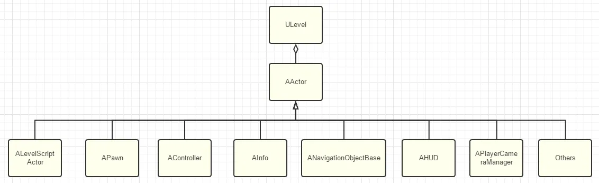

Actor对象不仅是放置在场景中类似石头、树木这样的静态对象， 也可以是动态创建出来的， 例如登录游戏后创建出玩家可控制的角色(Character) ， 又或者在某些时刻创建出一架飞机等等， 这些都是派生自AActor类。当然， Actor未必一定是可见的对象实例，也可以是代表某种信息/状态的不可见对象， 例如AInfo类派生出的GameMode和GameState，它们分别负责整个游戏世界的规则运行和全局游戏数据的管理。

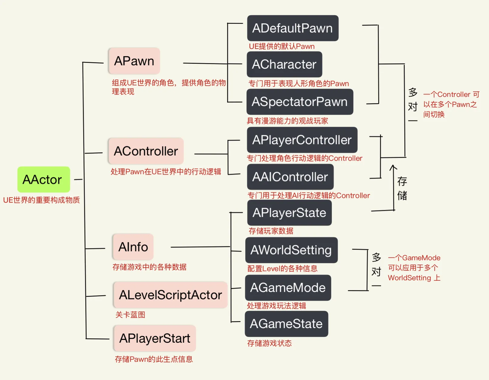

#### Actor生命周期 

UE官方文档给出了Actor生命周期图以概述Actor的实例化及销毁的过程

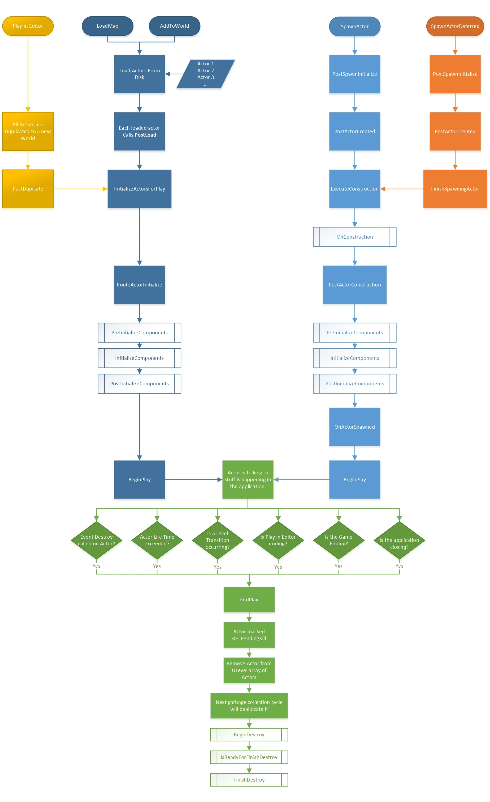

从图中可以看出主要有两类Actor：静态资源Actor和动态生成的Actor， 虽然两者的实例化路径不同， 但在BeginPlay之前具有相同的创建组件的步骤：

- PrelnitializeComponents：在初始化Actor的组件前执行的准备工作 
- InitializeComponent：执行Actor组件初始化的地方， 为每个组件的创建定义辅助函数
- PostInitializeComponents：组件初始化后调用 

在此提及Actor组件创建的步骤并不是想深究Component的复杂机制， 而是为了引出几类核心Actor的创建时机。

#### Game Mode初始化

从上文可知， GameMode负责处理游戏玩法逻辑， 是世界规则的裁判， 同时它也承担了Class登记、游戏进度、Level切换等多项职责， 其中Class登记是登记了游戏里基本需要的类型信息， 这些类型是游戏中非常核心的Actor 类，关系到整个游戏的运行和玩家的体验。

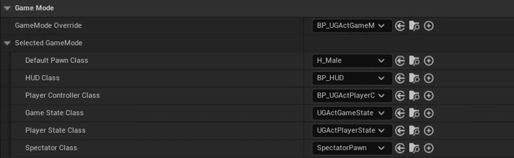

既然负责了登记，那也就需要负责对应类型的实体的创建，这些实体创建的时机各不相同，在后文的讲解中会逐步介绍。其中Game State是在Game Mode的组件初始化过程中创建出来的， 在PreInitializeComponents过程中产生了GameState和GameNetworkManager：

- GameState：存储全局游戏状态相关数据的地方， 由于所有的玩家都需要了解当前游戏状态， 所以它会复制到所有的客户端 
- GameNetworkManager：配置作弊检测和运动预测等内容， 只存在于服务端

#### PlayerController初始化

UE从Actor分化出AController类来控制角色， 而玩家需要通过某种媒介来控制游戏里角色的行动， 为此UE在AController的基础上再次抽象分化出一种APlayerController类， 以此来上接玩家的输入、下承角色的控制， 可以把Player Controller理解成是玩家与游戏世界的链接器。

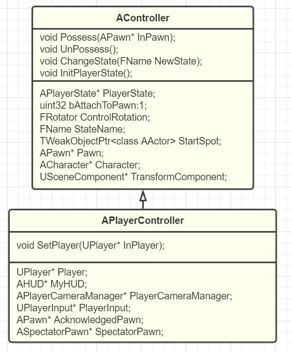

由于Player Controller是与玩家直接交互的逻辑类， 所以它是包含很多重要功能模块的非常复杂的Actor类之一， 包括角色的控制权管理、相机的管理、Input系统、HUD显示、Level的切换等等， 其中Player Camera Manager、 Player State和HUD类是在Player Controller的Post Initialize Components过程中创建的：

- Player Camera Manager：摄像机管理类， 用来方便的切换摄像机， 控制玩家的视角 
- Player State：存储当前关卡中的玩家状态数据 
- HUD：负责UI的显示 

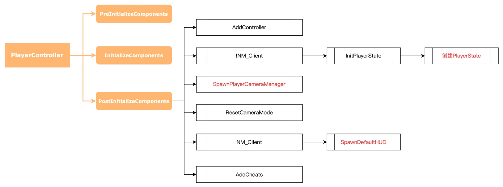

#### BeginPlay

当Actor实例化完成后会调用Begin Play， 可以认为Begin Play是Actor真正生效并可以启动GamePlay逻辑的地方，功能上看起来与构造函数类似，但在实际的开发时还是需要做区分。 UE引擎会为每个标记为UCLASS的类构造一个CDO， 这个类默认对象是该类默认状态下的记录， 用作进一步继承的原型， 也就是说构造函数只是为了建立类的通用细节， 所以不应该包含GamePlay相关的逻辑。通常会把 Actor的属性设置和创建组件(CreateDefaultSubobject) 这类方法的调用放在构造函数中。

启动该类的GamePlay相关的逻辑放在Begin Play中， 毕竟从字面上理解， Begin Play代表着该Actor正式开始游戏 (工作)的含义，至于需要做什么工作就跟游戏逻辑相关联了

#### 存在的问题

正因为Begin Play是启动GamePlay逻辑的入口， 所以很容易产生对象依赖的现象。试想一个场景：A对象在 Begin Play的时候需要变更B对象的某些属性， 这样就存在一个假设：B对象必须在A对象Begin Play之前同步下 来，显然对于DS模式下的客户端来说无法保证这一点。要想解决这个问题，可以用属性回调的方式，在A里保存 指向B对象的同步指针属性，当执行属性回调时，可以安全地对B进行操作了。 当然，属性回调并不能解决所有对象依赖的问题，比如B对象中还有C对象的指针，回调的时候C还没同步过来， 此时如果去访问C对象又会是空指针.

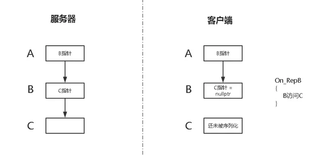

目前尚没有完美的解决方案， 所以需要在开发过程中尽量避免这种情况。通过了解Begin Play的时序原理可以帮 助我们理清逻辑设计上的思路， 尽量规避部分Actor类对象依赖的问题。

#### 引擎加载流程 

Actor是依托于World而存在于游戏世界中的， 无论是静态资源型的Actor还是动态创建的Actor， 都会由World统一 管理，所以可以联想到 Actor的Begin Play理应也取决于World。World由引擎系统创建出来， 在UE中对应的是UEngine类， 它是所有引擎类(UGameEngine与 UEditorEngine) 的抽象基类， 在创建World之前自然得先初始化并启动U Engine实例， 因此先简单介绍下启动UEngine的过程。 

#### 启动UEngine

Game Loop(游戏循环) 是游戏运行的主心骨， 任何一款游戏引擎都有自己的Game Loop， 它用于游戏运行过程中 对用户输入处理和时间处理的解耦，一个最简化的Game Loop逻辑如下图， 其实也就是在Main函数里实现游戏过程的持续运转：

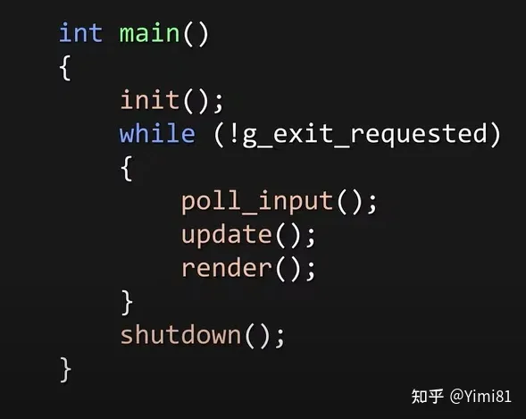

UE把Game Loop放在一个名为FEngineLoop的类中实现， 它位于Launch模块， 不同的平台入口函数不同， 下面 以Guarded Main函数为例， 简化后的Guarded Main函数逻辑如下所示

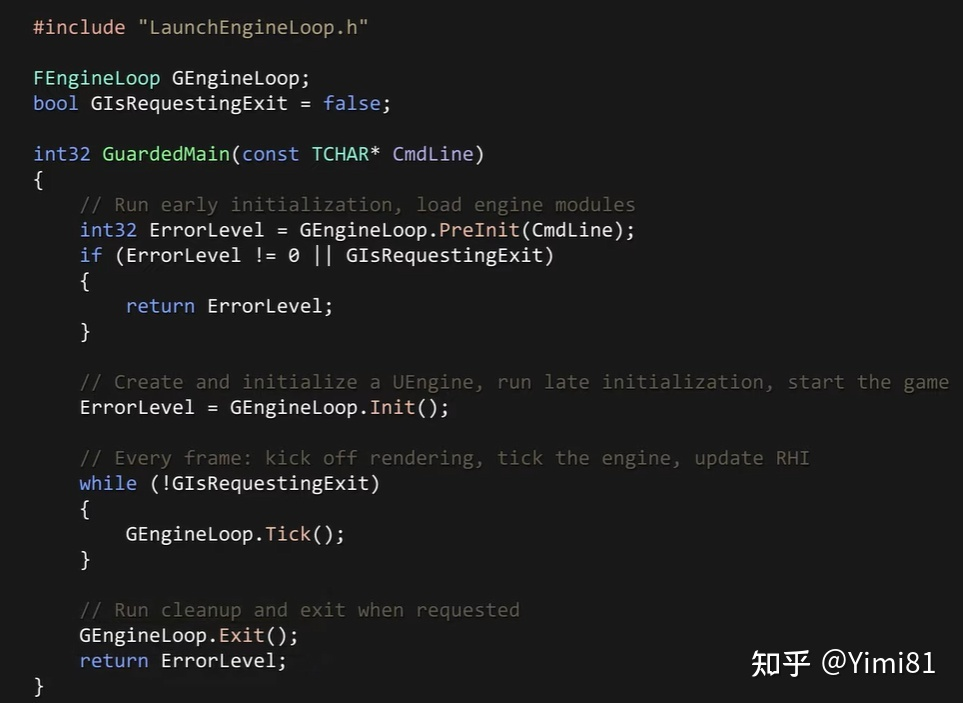

可以看到， GameLoop中的Init过程被细分成了EnginePrelnit和Editor Init/Engine Init两个步骤， Engine Tick对应的 是循环里的过程， 所以UE把用户输入的处理、游戏逻辑(状态) 的更新以及画面渲染的更新都放在引擎的Tick里来驱动， Editor Exit/Engine Exit对应资源的释放关闭过程。

GEngineLoop.Prelnit

 Prelnit完成所有模块加载的过程， 从低级模块到更高级别的引擎模块， 在所有基本引擎功能加载完和初始化后会加载自定义的游戏模块。

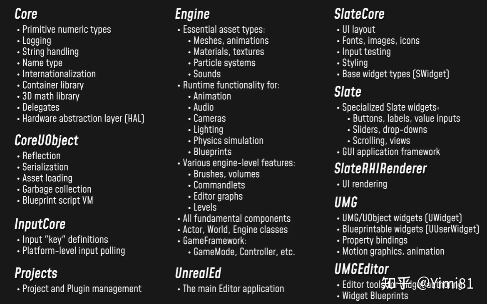

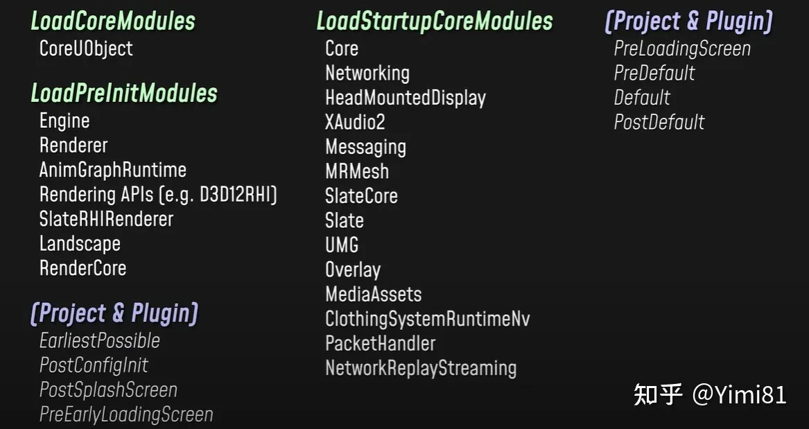

#### EngineLoop.Init

虽然UE针对编辑器模式区分了Editorlnit和Enginelnit两个入口， 但实际上EditorInit经由IEngineLoop接口转发到 了FEngineLoop上， 因此本质上两个入口最终都是执行相同的逻辑。

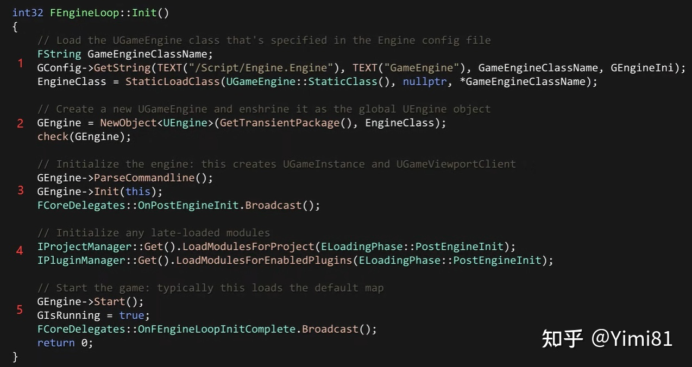

以上同样是简化后的Init逻辑， UE根据不同的模式创建出对应的UEngine类的实例(UGameEngine或者 UEditorEngine) ， 并将其作为全局UEngine实例， 随即通过GEngine.Init(this) 对引擎进行了初始化， 在这个过程中会创建几个重要的实例对象：Gamelnstance， GameViewportClient和Local Player

- Game Instance：运行游戏实例的高级管理器对象， 在游戏创建时生成， 直到游戏实例关闭才被销毁 

- Game Viewport Client：渲染、音频和输入系统的高级接口， 表示用户和引擎之间的接口

- Local Player：代表坐在屏幕前的用户， 也就是玩家自身

  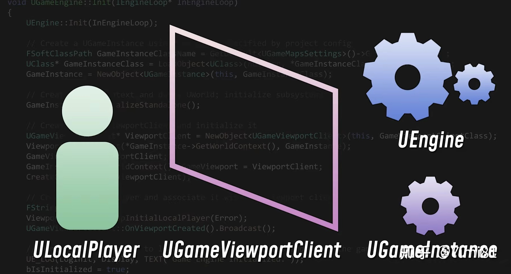

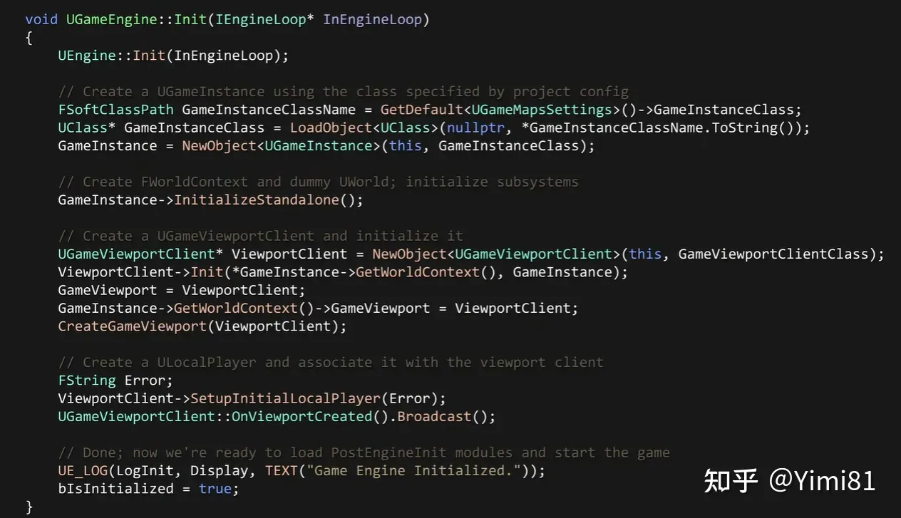

Init最后调用了UEngine的Start函数，本质上是通过GameInstance来触发UEngine的Browse， 引擎通过指定的URL来决定加载哪张地图， 这个URL既可以是客户端想要连接的服务器的地址， 也可以是本地加载的地图的名称。

确定了URL就可以Browse到对应的地图， 具体的加载过程在Load Map中， 在地图加载完成后将会拥有一个完整的World， 其中包含了GamePlay所需要的各类Actor， 它们构成了整个Game Framework的核心。 

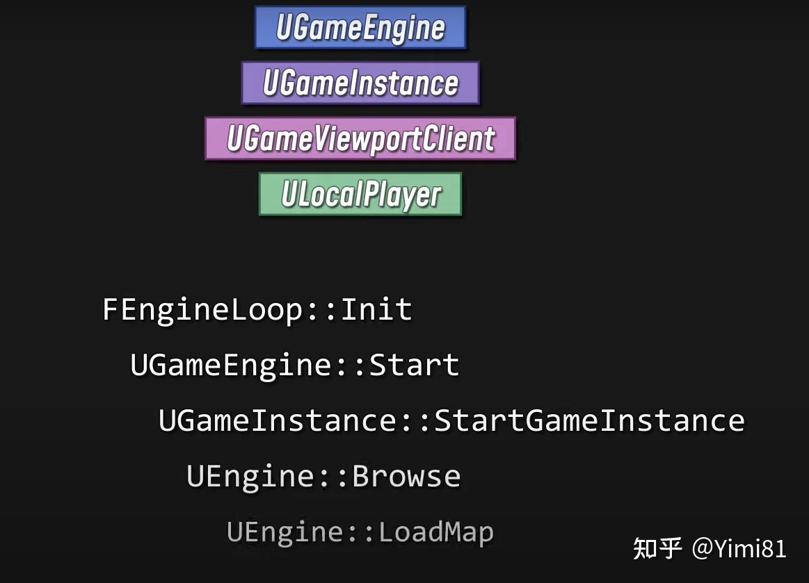

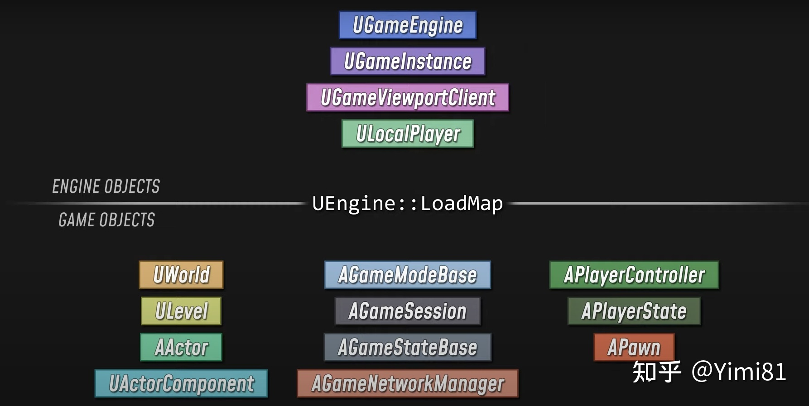

#### Load Map流程

上述通过Gamelnstance触发Browse加载地图的方式只是其中一种路径， 适用于独立进程启动的场景， 实际上Standalone模式和PIE模式都与之不同。虽然触发路径不一样， 但本质上都是调用的同一个Load Map函数， 只是针对不同模式有些许逻辑上的差异，下面就对各种模式下加载地图的流程进行阐述。 笔者的项目对游戏启动的过程进行了定制化的开发，触发路径上可能和官方存在略微的差异，所以以下的流程都 是基于笔者的项目， 但Load Map本身的逻辑是无差别的 

#### Standalone

在Standalone模式下， 通过调用UGameplayStatics::Open Level修改了Context.TraveluRL的值， 而引擎的Tick 在UEngine::Tick World Travel里会判断该值的有效性， 不为空就会调用Browse函数， 进而触发Load Map。以下是 Standalone模式下的Load Map加载流程图， 由于Load Map功能过于复杂， 因此图中仅标注了比较重要的过程步骤，其他模式也如此。

主要分为六个核心过程：

1.卸载已有的地图：引擎会触发一个全局委托以指示地图即将更改，如果此时已经加载了一个地图，会被卸载和清理掉，此过程适用于大世界地图无缝迁移的场景 

2.创建并初始化World：

- 实例化：World关联的所有关卡地图以及放置在地图上的Actor会被序列化为一个MapPackage， 该 MapPackage会以.umap文件的形式写入磁盘， 引擎会找到该MapPackage并加载它， 之后World及其关卡地 图以及各类Actor(包括World Settings) 都被加载到内存中， 此时拥有了一个UWorld， 接着将World设置到 World Context中， 初始化其世界类型并添加到根集中防止被GC 
- 初始化：由于Standalone模式实际也是PIE的一种， 所以是通过Post Create PIEWorld触发World的初始化函 数InitWorld， 除了初始化SubSystem子系统外， 还会设置物理、导航、A I和音频等系统

3.SetGameMode：World此时会要求**GameInstance创建出GameMode**，一旦GameMode出现， 引擎就会确保任何始终加载的子关卡地图和引用的资源都会被加载完成 

4.**InitializeActorsForPlay**：首先向World中每个Acto**r注册ActorComponent组件**， 然后调用Game Mode的 InitGame函数产生一个GameSession， 接下来对地图里所有的Actor执行生命周期函数RouteActorInitialize， 也就是在此过程中创建出Game State和Game NetworkManager， 对应上文提到的Game Mode组件初始化过程。之后对关卡里的所有Actor进行排序， 如果存在AI系统的话， 还会调用Al System的Initialize Actors For Play

5.Spawn Play Actor：由于Standalone模式不涉及网络登录流程，所以在这个过程里执行Game Mode的Login和 Post Login流程， 其中Login流程里创建出了Player Controller， 进而产生了Player State； Post Login里根据出生点创建出Character， 并且将Player Controller设置为Character的控制者 

6.BeginPlay：World终于BeginPlay了， 从图中可以看到由World驱动且经由一系列路径调用后最终由 World Settings来通知所有Actor的Begin Play， Begin Play里会注册Actor及其Component的Tick函数， 并带动 Actor Component的BeginPlay 

以上是从地图加载到World开始Begin Play的流程， 虽然知道Actor是由World驱动Begin Play的， 但流程里似乎没 有体现Begin Play的时序， 那Actor的Begin Play顺序到底是谁来决定的呢?要回答这个问题， 必须再次提及 IntializeActorsForPlay中对关卡里的Actor排序的方法ULevel::SortActorList。 首先， ULevel类中保存了一个Actors数组， 这个数组里存储了本关卡地图里所有的Actor实例对象， 所以对于静态资源Actor来说必定都存储在这个数组里。

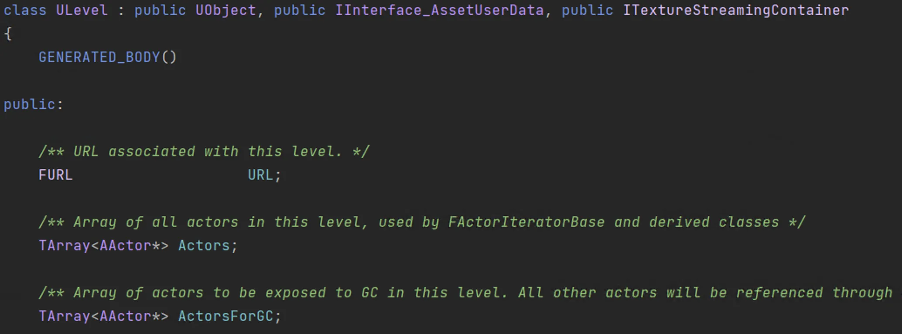

而动态创建的Actor， 比如Game Mode， 在New出对应的类实例后也会被添加到这个Actors数组里，由于是调用 的Add方法添加的，所以每个动态创建的Actor都是以追加的方式添加到Actors数组的末尾。总之，Actors数组保存了当前关卡地图里所有的Actor。

再来反观SortActorList方法， 它的逻辑其实很简单， 排序也只是将数组分成了三部分：

- World Settings类实例放在数组第一位
- 不具备网络属性的Actor紧接在World Settings后边， 也即第二部分 
- 具备网络属性的Actor处于第三部分

所谓的网络属性其实就是这个Actor是否能进行网络复制， 是否会同步给客户端。比如GameMode只存在于服务端， 那么它就应该位于第二部分； Game State会复制给客户端， 所以它应该处于第三部分， 也就是说Game State 的顺序应该在GameMode之后。为了验证这一点， 笔者以项目中比较简单的一个关卡场景为例， 在Standalone模式下查看各Actor的顺序。 

1.初始化World后且创建GameMode之前， Actors保存的是地图里的所有静态资源型Actor： 

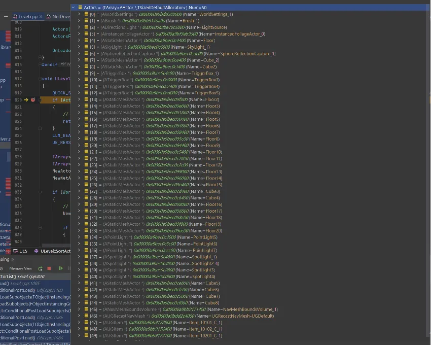

2.SortActorList之前创建了GameMode， 同时由于执行了Actor的生命周期函数RouteActorInitialize， 所以此时 Actors数组中出现了Game Mode、 Game Session、Game NetworkManager及Game State的身影

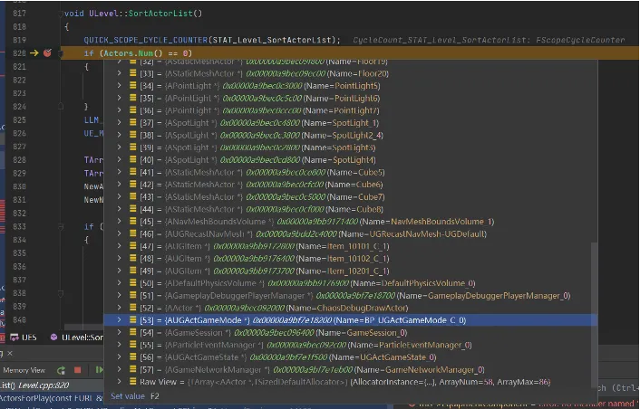

3.SortActorList之后， 由于GameMode、GameSession和GameNetworkManager都只存在于服务端，所以这三 类Actor的顺序会上升到GameState之前， 同时可以看到会网络复制的Item类实例对象也都被挪到GameNetworkManager之后了：

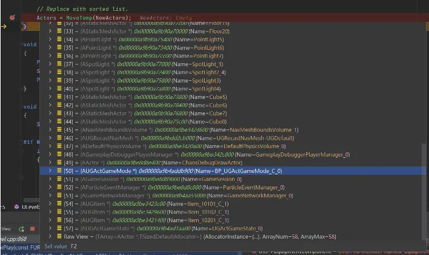

以上证明了Sort Actor List的结果符合预期， 同理， 由于Player Controller、Player State和Character等Actor类实例的创建时机晚于GameState， 同时它们都是会被复制到客户端， 所以它们的顺序也是在GameState之后的。最后，WorldSettings通过Actor迭代器， 按Actors数组中的顺序逐一将各个Actor运行起来。 

#### Dedicate Server

DS模式涉及网络登录， 服务端和客户端触发Load Map的时机不同， Begin Play的过程也存在差异化， 以下基于本 地DS模式分别介绍各端的流程：

#### Server

 笔者的项目通过独立的进程启动本地DS服务器， 所以通过UGameInstance::Start Game ln stance方法触发 Browse， 下图是DS服务器的加载流程：

可以看出， DS服务器的加载流程与Standalone模式大致相同， 只有两处差异： 

- Set Game Mode后会通过UWorld::Listen方法创建NetDriver， 开启网络监听， 等待客户端连入 
- 由于服务端LoadMap时客户端还未登录，玩家还未加入，此时不存在Local Player，所以不会执行 SpawnPlayActor，自然也不会创建PlayerController、PlayerState和Character 

#### Client

上文提到服务端加载过程中会开启网络监听，等待客户端的连入，而客户端连入需要经历三次握手和登录的流程，所以客户端的加载过程稍加复杂。

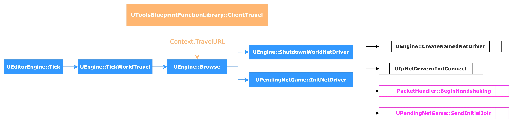

上图以PIE模式的客户端为例， 启动客户端进程后会创建本地的NetDriver， 然后通过PacketHandler::BeginHandshaking方法开始握手过程， 成功建立连接后调用`UPendingNetGame::SendInitialJoin`进入登录流程：

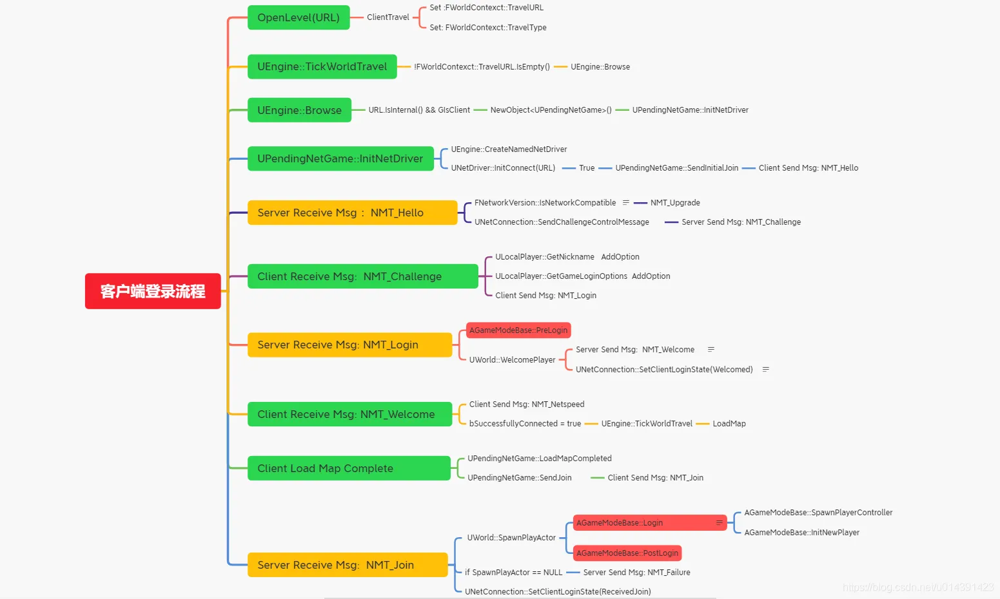

当客户端接收到NMT_Welcome的消息时， 可以获取到当前服务器的地图， 同时把b Successfully Connected设置 为True， 当下一帧Tick World Travel时会触发Load Map：

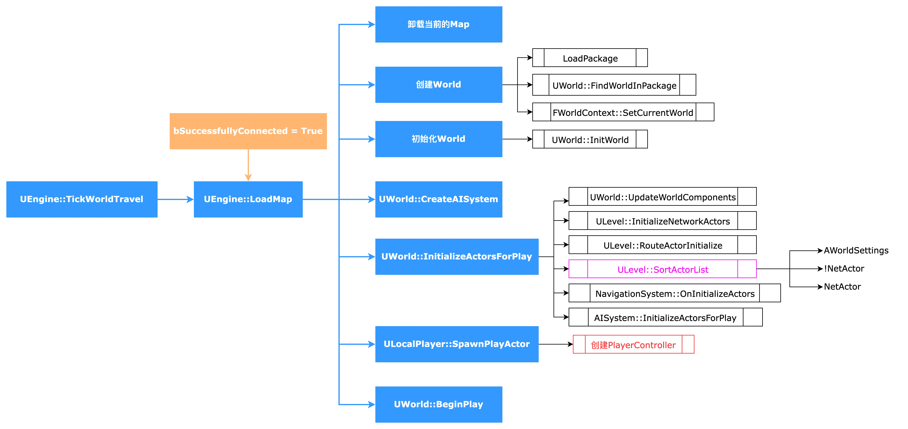

Load Map中部分方法在客户端不会执行， 例如Game Mode只存在于服务端， 所以U World::SetGameMode和 AGameModeBase::InitGame都无法执行，更不会主动创建GameState， 毕竟GameState是复制同步给客户端的。 

`ULocalPlayer::SpawnPlayActor`会创建本地的Player Controller， 当服务端接收到NMT_Join的消息时， 会调用 UWorld::SpawnPlay Actor来创建真正的Player Controller、Player State和Character， 随后Player Controller复制 到客户端覆盖本地的Controller。需要注意的是， 虽然客户端也会执行UWorld::Begin Play， 但是此时客户端真的 会Begin Play吗?不妨再回顾一下UWorld::BeginPlay的过程：

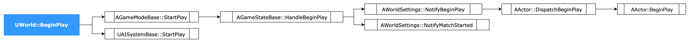

`AGameStateBase::HandleBeginPlay`是由Game Mode来调用的， 而客户端不存在Game Mode， 也就是说客户端 无法在Load Map流程里Begin Play!那客户端到底是怎么Begin Play的呢?冷静思考一下， 虽然客户端没有 Game Mode， 但是有Game State呀， 而且服务端为什么要绕到Game State来处理Begin Play呢?也许答案就藏在 Game State里， 于是跟着源码果然发现了线索：Game State里有一个可复制的变量b Replicated Has Begun Play， 它有一个同步回调函数On Rep_ReplicatedHasBegunPlay， 逻辑竟然与A Game State Base：：HandleBeginPlay一模 一样!大概读者已经能猜到了， 当Game State的这个属性同步下来时就会触发客户端的BeginPlay， 也就是说客户端的BeginPlay依赖于Game State的属性同步的时机。

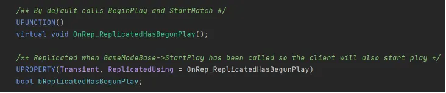

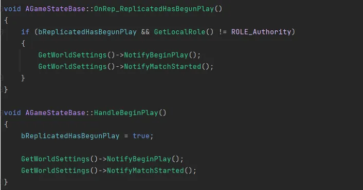

Listen Server 

Listen Server模式的加载流程与Standalone模式基本类似， 只是多了开启网络监听的步骤， 这里就不再熬述了。

#### BeginPlay时序 

前文详细阐述了不同模式下引擎从启动到Begin Play的过程，呼应了前言中抛出的前两个问题， 相信读者对整个 流程也有了大致的了解， 接下来以部分常用的核心Actor类为例， 简单总结一下这些Actor在不同模式下的 Begin Play时序。 

首先回顾一下Actor开启Begin Play的顺序规则：

- World->Begin Play之前创建的Actor(静态资源类or动态创建) ， 按World中的Actor的顺序Begin Play。 (这里的顺序是经Sort Actor List排序后的顺序， 对应上文Standalone模式里提到的排序规则)
- World->Begin Play后动态创建的Actor， 立即Begin Play。 (动态创建的Actor通过Post Actor Construction方法触发组件初始化的流程， 同时会判断World是否已经Begin Play了， 是的话就 让自己直接Begin Play)
- Actor的Component比Actor自身更早BeginPlay

结合Actor生命周期中涉及的特殊Actor的创建时机， 以及Load Map的加载流程， 以下几类核心Actor的Begin Play 时序就很容易理解了， 读者不妨先自行思考一下再与下文的结论做个对比， 看看自己是否get到了UE的设计理 念。 

- Game Mode 
- Game State
- Player Controller 
- Player State 
- Character 

#### Standalone

对Standalone模式来说既是客户端也是服务端， 所以在Load Map流程中会把Game Mode及Player Controller这些 类都创建出来， 最后整个World统—Begin Play， 将这个过程简化一下：

- Load Package加载资源(静态资源Actor) 。
- Set Game Mode：创建Game Mode 
- PrelnitializeComponents(Game Mode) ：创建Game State 
- Login：创建Player Controller 
- PostInitializeComponents(Player Controller) ：创建Player State 
- Post Login：创建Character 
- World开启BeginPlay

 所有的Actor都在World开启Begin Play之前创建出来， 所以这些Actor的BeginPlay时序： 

- Game Mode->Begin Play 
- Game State->Begin Play 
- Player Controller->Begin Play 
- Player State->Begin Play 
- Character->Begin Play

#### Dedicate Server 

由于DS模式下服务端与客户端Load Map的流程不同， 并且除Game Mode外其他的Actor是由服务端同步给客户端的， 所以这些Actor的Begin Play时序在服务端与客户端有较大的不同。

**Server** 

刚启动Server进程时， 由于客户端未连入不会创建玩家的链接和角色， 此时服务端只有Game Mode和 Game State：

- Load Package加载资源(静态资源Actor) 
- Set Game Mode：创建Game Mode 
- Prelnitialize Components(Game Mode) ：创建Game State 
- World开启BeginPlay

 即只有Game Mode和Game State会开始Begin Play： 

- Game Mode->Begin Play 
- Game State->Begin Play 

当客户端登录成功后， 服务端会创建Player Controller、Player State与Character， 此时服务端的World已经 Begin Play了， 所以这些Actor创建出来就会Begin Play。同时有一点要注意， Player State是作为 Player Controller的组件创建出来的， 所以Player State比Player Controller更早Begin Play：

- Login：创建Player Controller 
- Postlnitialize Components(Player Controller) ：创建Player State 
- Player State->Begin Play 
- Player Controller->Begin Play 
- Post Login：创建Character 
- Character->Begin Play 

**Client** 

客户端的Player Controller、Player State和Character依赖网络复制， 当Actor同步下来后再创建到当前World中， 而网络复制的无序性导致无法确定这些Actor的创建顺序， 另外上文也解释了客户端的Begin Play取决于 Game State的属性同步的时机， 所以客户端的Begin Play时序具有随机性。下面以其中一种复制顺序为例展示对 应的Begin Play时序： 

- 复制Player Controller下来并创建 
- 复制Character下来并创建 
- 复制Player State下来并创建 
- 复制Game State下来并创建 

示例中Game State是最后复制下来的， 而Game State的属性同步触发World的Begin Play， 所以这种情况下的 Begin Play时序：

- Player Controller->Begin Play 
- Character->Begin Play 
- Player State->Begin Play 
- Game State->Begin Play

 再次声明， 上边的示例只是网络复制无序性下的一种可能场景， 假如Game State是第二个复制下来的Actor， 那 么Begin Play的时序也会相应发生变化。

#### 总结 

本文先简单介绍了Actor以及生命周期涉及的几类特殊Actor的创建时机， 然后用了较大的篇幅详细讲解了从引擎 启动到Load Map的加载流程， 对于文章开头的三个问题渐进明细地给出了答案。Begin Play时序的原理作为 GamePlay开发必需掌握的基础知识之一， 能够避免开发者落入UE引擎迷雾般的陷阱， 尤其是对象依赖的问题， 这也是笔者在项目初期经常踩的坑之一； 另外Begin Play时序在不同网络模式下的差异化也给GamePlay开发带来了困扰，相信在理解了原理之后这些难题都能迎刃而解。 虽然对象依赖的问题本文没有给出完美的解决方案，但笔者基于目前的实践经验给出一点建议仅供参考：

- 灵活使用属性同步机制，特别是属性回调函数可以解决一大部分对象依赖下的初始化问题，当然尽量避免产生对象依赖， 逻辑上在Begin Play里做好解耦 
- 将游戏阶段拆分成状态管理，运用状态的属性同步可以更方便的解决客户端逻辑一致性的问题以及断线重连的实现 
- 从玩法框架的层面降低Actor复制无序性的影响， 例如通过封装统一的玩法逻辑入口， 以保证需要的Actor在 Begin Play之后才启动玩法逻辑的执行

 如果读者有更好的实践心得，欢迎随时交流