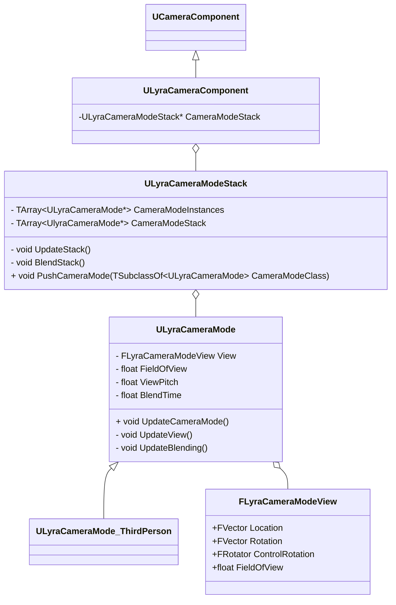

## Camera相关

#### 类图



更新流程

```C++
void ULyraHeroComponent::OnPawnReadyToInitialize()
{
	// ...
    
    // 绑定CameraMode代理
    CameraComponent->DetermineCameraModeDelegate.BindUObject(this, &ThisClass::DetermineCameraMode);
}

void APlayerController::UpdateCameraManager(float DeltaSeconds)
{
    void APlayerCameraManager::UpdateCamera(float DeltaTime)
    {
        void APlayerCameraManager::UpdateViewTarget(FTViewTarget& OutVT, float DeltaTime)
        {
            void APlayerCameraManager::UpdateViewTargetInternal(FTViewTarget& OutVT, float DeltaTime)
            {
                void AActor::CalcCamera(float DeltaTime, FMinimalViewInfo& OutResult)
                {
                    void ULyraCameraComponent::GetCameraView(float DeltaTime, FMinimalViewInfo& DesiredView)
                    {
                        
                    }
                }
            }
        }
    }
}

void ULyraCameraComponent::GetCameraView(float DeltaTime, FMinimalViewInfo& DesiredView)
{
    // 将CameraMode入栈，并且设置Blend参数
    void ULyraCameraComponent::UpdateCameraModes()
    {
        TSubclassOf<ULyraCameraMode> ULyraHeroComponent::DetermineCameraMode() const
        {
            return CameraMode
        }
        void ULyraCameraModeStack::PushCameraMode(TSubclassOf<ULyraCameraMode> CameraModeClass);
    }
    
    bool ULyraCameraModeStack::EvaluateStack(float DeltaTime, FLyraCameraModeView& OutCameraModeView)
    {
        void ULyraCameraModeStack::UpdateStack(float DeltaTime)
        {
            void ULyraCameraMode::UpdateCameraMode(float DeltaTime)
            {
                // 更新位置、旋转以及FOV
                void ULyraCameraMode::UpdateView(float DeltaTime);
                // 更新混合参数
                void ULyraCameraMode::UpdateBlending(float DeltaTime);
            }
        }
    }
    
    // 设置PlayerController的旋转
    PC->SetControlRotation(CameraModeView.ControlRotation);
    
    // 设置Cameara的位置以及旋转
    SetWorldLocationAndRotation(CameraModeView.Location, CameraModeView.Rotation);
}

```

