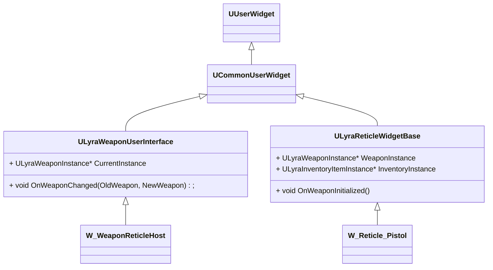

## UI相关



装备武器UI流程

```c++
void ULyraWeaponUserInterface::NativeTick(const FGeometry& MyGeometry, float InDeltaTime)
{
    // 找到Pawn身上的ULyraEquipmentManagerComponent获取当前WeaponInstance
    W_WeaponReticleHost::OnWeaponChanged(OldWeapon, CurrentInstance);
    {
        W_WeaponReticleHost::ClearExistingWidgets();
        AddChildOvelay
    }
}
```

界面Layert添加流程(分为Menu、Game)

```c++
// gameInstance创建时调用
void UGameUIManagerSubsystem::Initialize(FSubsystemCollectionBase& Collection)
{
    // 加载DefaultUIPolicyClass
}

ULocalPlayer* UGameInstance::CreateLocalPlayer(int32 ControllerId, FString& OutError, bool bSpawnPlayerController)
{
    UCommonGameInstance::AddLocalPlayer(ULocalPlayer* NewPlayer, int32 ControllerId);
    {
        void UGameUIManagerSubsystem::NotifyPlayerAdded(UCommonLocalPlayer* LocalPlayer);
        {
            void UGameUIPolicy::NotifyPlayerAdded(UCommonLocalPlayer* LocalPlayer)
            {
                //注册PlayerController创建Set时的事件，以便CreateLayoutWidget(LocalPlayer)
            }
        }
    }
}

APlayerController* UWorld::SpawnPlayActor()
{
    void ACommonPlayerController::ReceivedPlayer()
    {
        // 调用PlayerController创建Set时的事件
        LocalPlayer->OnPlayerControllerSet.Broadcast(LocalPlayer, this);
        {
            UGameUIPolicy::CreateLayoutWidget(UCommonLocalPlayer* LocalPlayer)
            {
                // 创建Layout，注册Game、Menu等UI Layer（与Gametag联系起来）
                UGameUIPolicy::CreateLayoutWidget(UCommonLocalPlayer* LocalPlayer);
                UGameUIPolicy::AddLayoutToViewport(UCommonLocalPlayer* LocalPlayer, UPrimaryGameLayout* Layout)
                {
                    Layout->SetPlayerContext(FLocalPlayerContext(LocalPlayer));
                    Layout->AddToPlayerScreen(1000);
                }
            }
        }
    }
}
```

添加HUDLayout和准星的流程

```C++
void UGameFeatureAction_AddWidgets::AddWidgets(AActor* Actor, FPerContextData& ActiveData)
{
    UCommonUIExtensions::PushContentToLayer_ForPlayer(const ULocalPlayer* LocalPlayer, FGameplayTag LayerName)；
    {
        UPrimaryGameLayout::PushWidgetToLayerStackAsync(FGameplayTag LayerName)
        {
            // 根据LayerName找到对应的Layer
            ActivatableWidgetT* PushWidgetToLayerStack(FGameplayTag LayerName);
            {
                UCommonActivatableWidgetContainerBase::AddWidget()
                {
                    UCommonActivatableWidgetContainerBase::RegisterInstanceInternal(UCommonActivatableWidget& NewWidget);
                    {
                        // ? 添加到WidgetList之后就行了？
                    }
                }
            }
        }
        ExtensionSubsystem->RegisterExtensionAsWidgetForContext(Entry.SlotID, LocalPlayer, Entry.WidgetClass.Get(), -1)
        {
             UUIExtensionSubsystem::RegisterExtensionAsData()
             {
                 
             }
        }
    }
}
```


