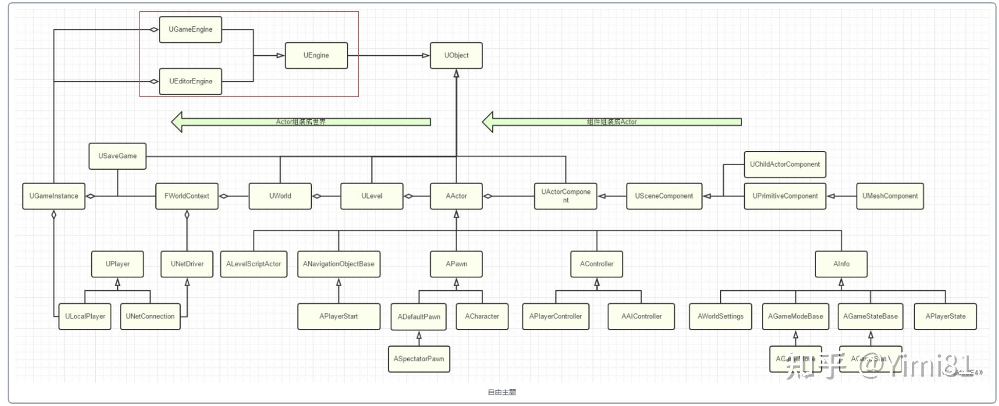

## 从Main到BeginPlay



#### main函数

```c++
int32 GuardedMain( const TCHAR* CmdLine )
{
    int32 ErrorLevel = EnginePreInit( CmdLine );
    
    ErrorLevel = EngineInit();
}
```

EnginePreInit函数

```c++
FEngineLoop::PreInit(const TCHAR* CmdLine)
{
    FEngineLoop::PreInitPreStartupScreen(const TCHAR* CmdLine);
    {
        //设置主线程为Game线程
        GGameThreadId = FPlatformTLS::GetCurrentThreadId();
        
        // 加载CoreUObject模块
        FEngineLoop::LoadCoreModules();
        
            
        //加载Engine,Renderer, AnimGraphRuntime,SlateRHIRenderer,landScape,RenderCore,
        // TextureCompressor,Virtualization,AudioEditor,AnimationModifiers等模块
        FEngineLoop::LoadPreInitModules();
        
        //初始化物理模块
        InitGamePhys();
        
        //RHIInit
        RHIInit(bHasEditorToken);
    }
    
    FEngineLoop::PreInitPostStartupScreen(const TCHAR* CmdLine);
    {
        // 加载Core, networking, SltateCore, Slate等模块
        FEngineLoop::LoadStartupCoreModules();
    }
}
```

#### EngineInit函数

```c++
FEngineLoop::Init()
{
    // 创建GEngine
    EngineClass = StaticLoadClass( UGameEngine::StaticClass(), nullptr, *GameEngineClassName);
    GEngine = NewObject<UEngine>(GetTransientPackage(), EngineClass);
    
    EngineClass = StaticLoadClass(UUnrealEdEngine::StaticClass(), nullptr, *UnrealEdEngineClassName);
    GEngine = GEditor = GUnrealEd = NewObject<UUnrealEdEngine>(GetTransientPackage(), EngineClass);
    
    //初始化
    GEngine->Init(this);
    
    // Start
    GEngine->Start();
}
```

#### UEngine::Init函数

```c++
void UEngine::Init(IEngineLoop* InEngineLoop)
{
    // 加入根集，读取配置
    
    if (GIsEditor)
    {
       	// 创建FWorldContext，创建World
    }
    
    // 加载liveCoding模块
}

void UGameEngine::Init(IEngineLoop* InEngineLoop)
{
    UEngine::Init(InEngineLoop);
    
    //创建GameInstance并初始化
    GameInstance = NewObject<UGameInstance>(this, GameInstanceClass);
    GameInstance->InitializeStandalone();
    {
        // 创建WorldContext
        // 创建DummyWorld
        // 初始化Subsystem
    }
    
    // 创建UGameViewportClient
   ViewportClient = NewObject<UGameViewportClient>(this, GameViewportClientClass);
    
    //创建LocalPlayer
    ViewportClient->SetupInitialLocalPlayer(Error);
    {
        NewPlayer = NewObject<ULocalPlayer>(GetEngine(), GetEngine()->LocalPlayerClass);
    }
    
}
```

#### UGameEngine::Start函数

```c++
void UGameEngine::Start()
{
    GameInstance->StartGameInstance();
    {
        UEngine::Browse( FWorldContext& WorldContext, FURL URL, FString& Error );
        {
            UEngine::LoadMap( FWorldContext& WorldContext, FURL URL, class UPendingNetGame* Pending, FString& Error );
            {
                // 清理当前世界的Actor以及Pawn，调用Destroy和EndPlay方法
                WorldContext.World()->CleanupWorld();
                
                GEngine->WorldDestroyed(WorldContext.World());
                WorldContext.World()->RemoveFromRoot();
                
                // 加载World,level,Actor等 
                WorldPackage = FindPackage(nullptr, *URL.Map);
                WorldPackage = LoadPackage();
                
                NewWorld = UWorld::FindWorldInPackage(WorldPackage);
                NewWorld->SetGameInstance(WorldContext.OwningGameInstance);
                GWorld = NewWorld;
                WorldContext.SetCurrentWorld(NewWorld);
                
                UWorld::InitWorld(const InitializationValues IVS);
                {
                    UWorld::InitializeSubsystems();
                    CreatePhysicsScene(WorldSettings);
                    CreateAISystem();
                }
                  
                // 创建GameMode
                WorldContext.World()->SetGameMode(URL);
                {
                    UGameInstance::CreateGameModeForURL(FURL InURL, UWorld* InWorld);
                    {
                        World->SpawnActor<AGameModeBase>(GameClass, SpawnInfo);
                    }
                }
                
                // 创建AISystem
                WorldContext.World()->CreateAISystem();

                WorldContext.World()->InitializeActorsForPlay(URL, true, &Context);
                {
                    // 注册Component,调用OnRegister函数
                    UpdateWorldComponents( bRerunConstructionScript, true, Context);
   
                    // 创建GameSession
                    AuthorityGameMode->InitGame( FPaths::GetBaseFilename(InURL.Map), Options, Error );
                    
                    //
                    Level->RouteActorInitialize(ProcessAllRouteActorInitializationGranularity);
                    {
                        // 在GameMode.PreInitializeComponents中创建了GameState,并调用了InitGameState();
                        Actor->PreInitializeComponents();
                        Actor->InitializeComponents();
                        Actor->PostInitializeComponents(); 
                    }
                }
                
                ULocalPlayer::SpawnPlayActor(const FString& URL,FString& OutError, UWorld* InWorld);
                {
                    UWorld::SpawnPlayActor();
                    {
                        APlayerController* NewPlayerController = GameMode->Login(NewPlayer, RemoteRole, *InURL.Portal, Options,UniqueId);
                        {
                            // 生成PlayerController,PlayerController的PostInitComponent调用生成PlayerState
                        }
                        
                        AGameModeBase::PostLogin(APlayerController* NewPlayer);
                        {
                            //PostLogin为新的PlayerController生成Pawn。
                            HandleStartingNewPlayer(NewPlayer);
                            {
                                AGameModeBase::RestartPlayer(AController* NewPlayer);
                            }
                        }
                    }
                }
            }
        }
    }
}
```

