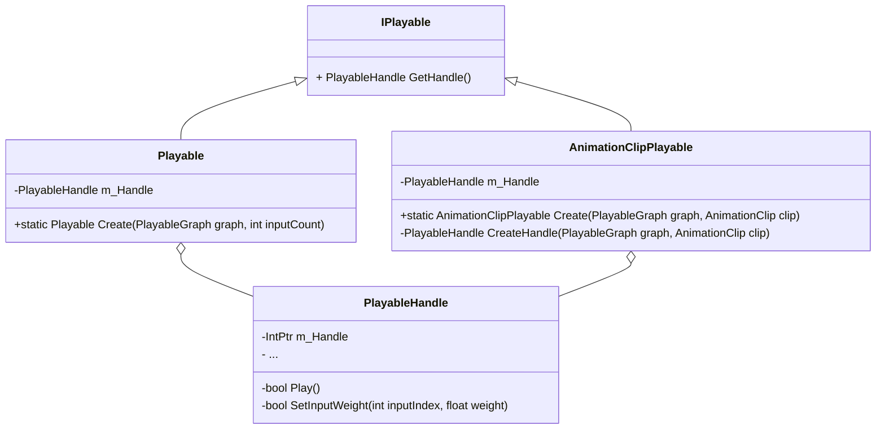
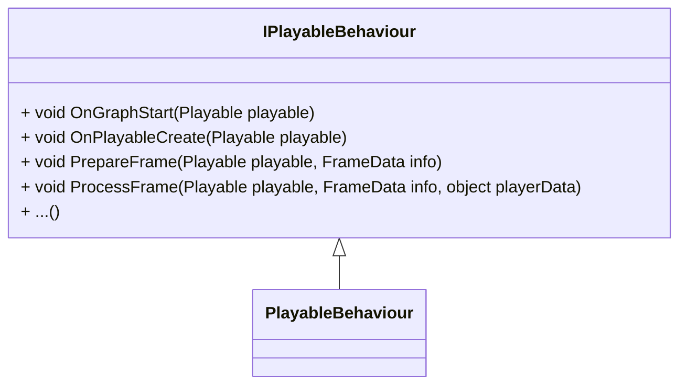
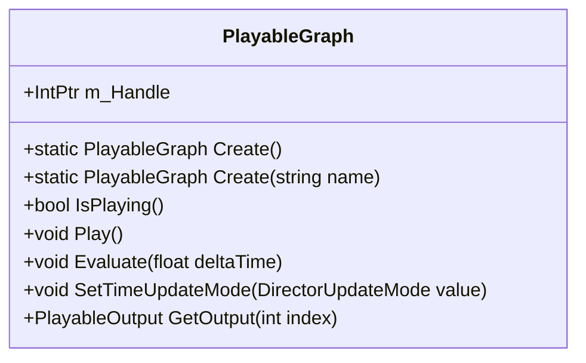
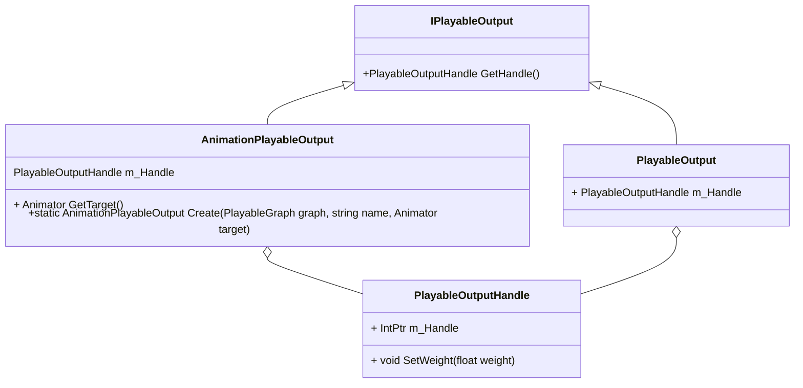
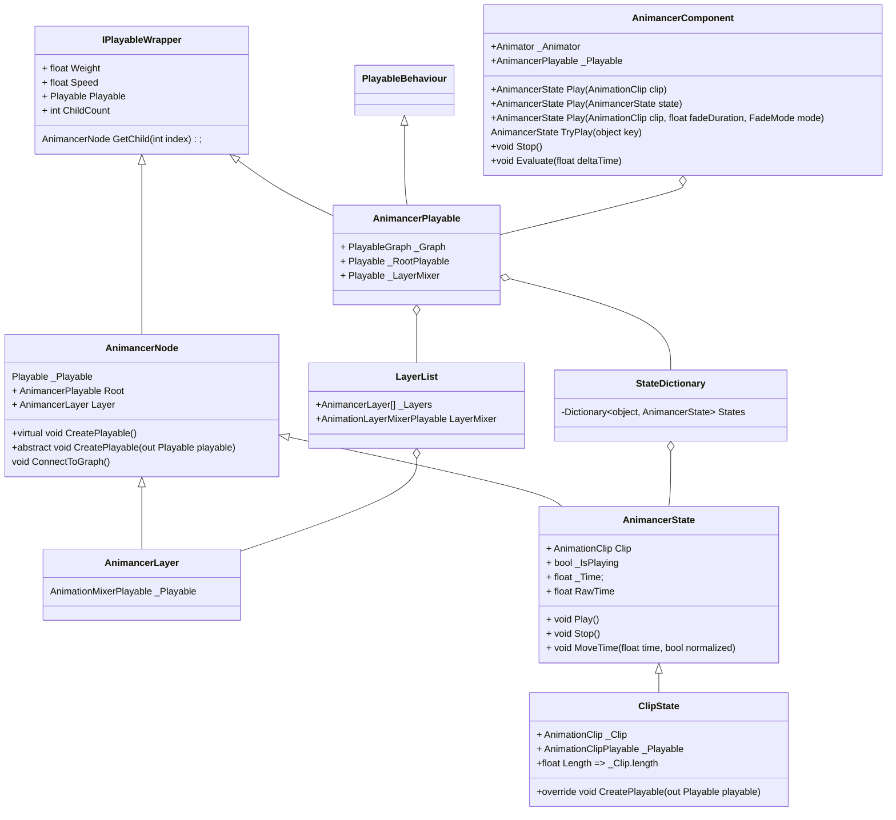

## Animancer

对比Mecanim优势：

- 简单 相比之下播放动画更简单
- 透明 源码开放，容易查bug
- 安全 直接引用动画资源，而不是用State的字符串
- 清晰 脚本可以定义自己的逻辑和需求，不像Mecanim中Animator Controller和Script的关系
- 可靠 代码中怎么写，程序就怎么跑。unity原生系统中为了维护自己的代码行为，有时候会延迟命令，甚至忽略。
- 可适配性 

------

#### Animancer类图









------



## 流程

使用PlayableAPI播放动画的一般流程是：

1. 创建一个PlayableGraph
2. 创建AnimationPlayableOutput
3. 创建Playable
4. 连接Playable与AnimationPlayableOutput
5. 调用playableGraph.Play()

#### 初始化

```c#
void AnimancerComponent.InitializePlayable()
{
    // Animator
    
    //创建Grpha和AnimancerPlayable
    static AnimancerPlayable Create();
    {
        var graph = PlayableGraph.Create();
        return ScriptPlayable<AnimancerPlayable>.Create(graph, Template, 2).GetBehaviour();
    }
    
    //创建Layers和States
    void AnimancerPlayable.OnPlayableCreate(Playable playable)
    {
        LayerList(AnimancerPlayable root, out Playable layerMixer)
        {
            //创建LayerMixer，连接到RootPlayable
            AnimationLayerMixerPlayable.Create(root._Graph, 1)
           	Root._Graph.Connect(layerMixer, 0, Root._RootPlayable, 0); 
        }
    }
    
    // 创建AnimationPlayableOutput
    _Playable.CreateOutput(_Animator, this);
    {
     	// 给Output连接playable
        output.SetSourcePlayable(playable, 0);
    }
}

```

#### 播放动画

```C#
AnimancerState Play(AnimationClip clip);
{
    AnimancerState State = States.GetOrCreate(clip);
    {
        // 创建ClipState
        return Root.Layers[0].CreateState(key, clip);
    }
}
```

