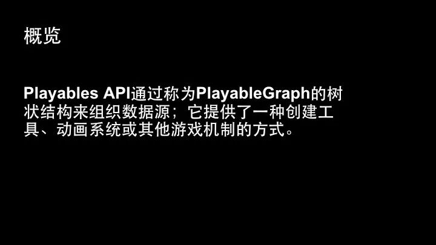

## Unity Playable API




一个树形结构一般由一个输出节点，若干个输入节点以及若干个功能节点组成。Playable graph本质上就是一颗动画混合树。注意：这里指的这个混合树并不是Blend Tree，而是一个更广泛的概念。它的内部节点是运算符，主要起到混合的作用，而叶节点是输入。


Show Me Code

**单独播放Clip**（**AnimationClipPlayable**）

```c#
//创建playableGraph 
playableGraph = PlayableGraph.Create();

// 设置graph的更新模式
playableGraph.SetTimeUpdateMode(DirectorUpdateMode.GameTime);

//创建playableOutput 
//每个Graph可以有一个或多个输入
var playableOutput = AnimationPlayableOutput.Create(playableGraph, "Animation", GetComponent<Animator>());

//使用AnimationClip创建Playable
var clipPlayable = AnimationClipPlayable.Create(playableGraph, clip);

//连接Playable与 PlayableOutput
 playableOutput.SetSourcePlayable(clipPlayable);

//播放PlayableGraph，会使用GameTime去Evaluator动画
 playableGraph.Play();
```

**播放混合动画(AnimationMixerPlayable)**

```c#
//创建playableGraph 
playableGraph = PlayableGraph.Create();

// 设置graph的更新模式
playableGraph.SetTimeUpdateMode(DirectorUpdateMode.GameTime);

//创建playableOutput 
//每个Graph可以有一个或多个输入
var playableOutput = AnimationPlayableOutput.Create(playableGraph, "Animation", GetComponent<Animator>());

//创建AnimationMixerPlayable
// 第二个参数表示参与混合的动画个数
mixerPlayable = AnimationMixerPlayable.Create(playableGraph, 2);

//连接Playable与 PlayableOutput
 playableOutput.SetSourcePlayable(mixerPlayable);

//创建AnimationClipPlayable
var clipPlayable0 = AnimationClipPlayable.Create(playableGraph, clip0);
var clipPlayable1 = AnimationClipPlayable.Create(playableGraph, clip1);

//将AnimationClipPlayable连接到mixerPlayable
//第二个参数表示clipPlayable0的输出Port
//第四个参数表示mixerPlayable的输入Port
playableGraph.Connect(clipPlayable0, 0, mixerPlayable, 0);
playableGraph.Connect(clipPlayable1, 0, mixerPlayable, 1);

// 设置每个节点的权重
mixerPlayable.SetInputWeight(0, 1);
mixerPlayable.SetInputWeight(1, 1);

//播放
playableGraph.Play();
```

**播放分层混合动画（AnimationLayerMixerPlayable）**

```c#
//创建playableGraph 
var playableGraph = PlayableGraph.Create();

// 设置graph的更新模式
playableGraph.SetTimeUpdateMode(DirectorUpdateMode.GameTime);

//创建playableOutput 
//每个Graph可以有一个或多个输入
var playableOutput = AnimationPlayableOutput.Create(playableGraph, "Animation", GetComponent<Animator>());

//创建AnimationLayerMixerPlayable
//第二参数表示层数
var LayerMixerPlayable = AnimationLayerMixerPlayable.Create(m_Graph, 2);

//连接OutPut与LayerMixerPlayable
 playableOutput.SetSourcePlayable(LayerMixerPlayable);

//创建AnimationClipPlayable
var clipPlayable1 = AnimationClipPlayable.Create(m_Graph, clip1);
var clipPlayable2 = AnimationClipPlayable.Create(m_Graph, clip2);

//创建两个Layer，并设置其数据
//第一个参数表示第一个输入端口或者是第几层
//第三个参数表示输出端口
//第四个参数表示权重
LayerMixerPlayable.ConnectInput(0, clipPlayable1, 0, 1.0f);
LayerMixerPlayable.ConnectInput(1, clipPlayable2, 0, mixLevel);

//设置骨骼遮罩
//第一个参数表示输入的层数索引
 LayerMixerPlayable.SetLayerMaskFromAvatarMask(1, mask);

// 播放
 m_Graph.Play();

// 更新时设置权重
LayerMixerPlayable.SetInputWeight(1, mixLevel);
```

**使用PlayableBehaviour**(给PlayableGraph添加自定义行为)

```c#
public class PlayQueuePlayable : PlayableBehaviour
{
    //AnimationMixerPlayable用来混合动画
    public AnimationMixerPlayable mixerPlayable;
    
    //帧开始前设置权重数据
    public override void PrepareFrame(Playable owner, FrameData info)
    {
         float blend = Mathf.PingPong((float)playable.GetTime(), 1.0f);

        mixerPlayable.SetInputWeight(0, blend);
        mixerPlayable.SetInputWeight(1, 1.0f - blend);

        base.PrepareFrame(playable, info);       
    }
}

public class PlayableBehaviourSample : MonoBehaviour
{
    PlayableGraph m_Graph;
    public AnimationClip clipA;
    public AnimationClip clipB; 
    // Use this for initialization
    void Start() 
    {
     	// Create the PlayableGraph.
        m_Graph = PlayableGraph.Create();

        // Add an AnimationPlayableOutput to the graph.
        var animOutput = AnimationPlayableOutput.Create(m_Graph, "AnimationOutput", GetComponent<Animator>());

        // Add an AnimationMixerPlayable to the graph.
        var mixerPlayable = AnimationMixerPlayable.Create(m_Graph, 2);

        // Add two AnimationClipPlayable to the graph.
        var clipPlayableA = AnimationClipPlayable.Create(m_Graph, clipA);
        var clipPlayableB = AnimationClipPlayable.Create(m_Graph, clipB);

        // Add a custom PlayableBehaviour to the graph.
        // This behavior will change the weights of the mixer dynamically.
        // ScriptPlayable以PlayableBehaviour的子类对象为成员变量
        var blenderPlayable = ScriptPlayable<BlenderPlayableBehaviour>.Create(m_Graph, 1);
        blenderPlayable.GetBehaviour().mixerPlayable = mixerPlayable;

        // Create the topology, connect the AnimationClipPlayable to the
        // AnimationMixerPlayable.  Also add the BlenderPlayableBehaviour.
        m_Graph.Connect(clipPlayableA, 0, mixerPlayable, 0);
        m_Graph.Connect(clipPlayableB, 0, mixerPlayable, 1);
        
        m_Graph.Connect(mixerPlayable, 0, blenderPlayable, 0);

        // Use the ScriptPlayable as the source for the AnimationPlayableOutput.
        // Since it's a ScriptPlayable, also set the source input port to make the
        // passthrough to the AnimationMixerPlayable.
        animOutput.SetSourcePlayable(blenderPlayable);
        animOutput.SetSourceInputPort(0);

        // Play the graph.
        m_Graph.Play();     
    }
    
    private void OnDestroy()
    {
        // Destroy the graph once done with it.
        m_Graph.Destroy();
    } 
}
```

介绍文档：https://mp.weixin.qq.com/s?__biz=MzkyMTM5Mjg3NQ==&mid=2247535622&idx=1&sn=b96a2d8ac55b49e74261d91bbffa944c&source=41#wechat_redirect