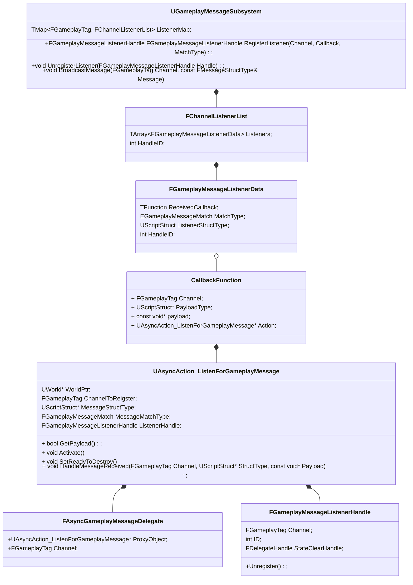
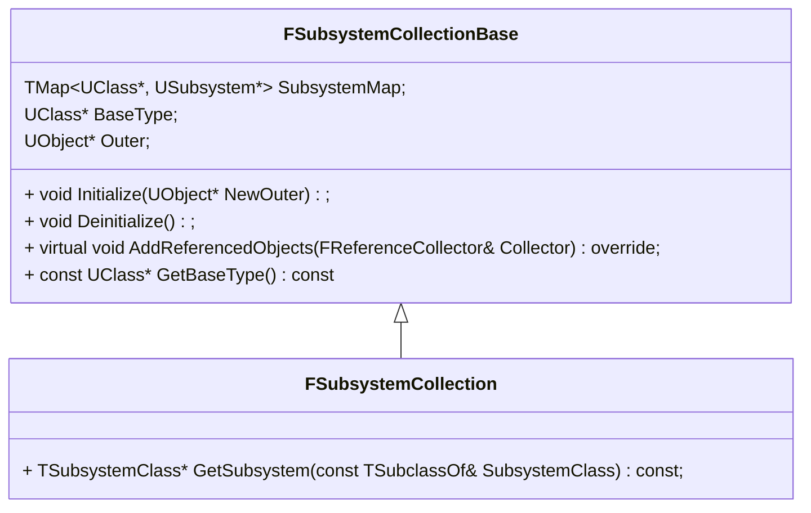

## Lyra Game play Message系统

#### 使用方法

1. 定义消息Payload结构体

   ```C++
   USTRUCT(BlueprintType) // 可以在蓝图中识别到
   struct FLyraPlayerResetMessage
   {
   	GENERATED_BODY()
   
   	UPROPERTY(BlueprintReadOnly)
   	AActor* OwnerPlayerState = nullptr; // 具体参数
   };
   ```

   

2. 调用蓝图节点Listen For Gameplay Messages,处理接收到消息后的具体逻辑

   

3. 调用Broadcast Message节点触发消息

   C++调用示例

   ```c++
   	FLyraPlayerResetMessage Message;
   	Message.OwnerPlayerState = CurrentActorInfo->OwnerActor.Get();
   	UGameplayMessageSubsystem& MessageSystem = UGameplayMessageSubsystem::Get(this);
   	MessageSystem.BroadcastMessage(FLyraGameplayTags::Get().GameplayEvent_Reset, Message);
   ```

   蓝图调用示例


#### 源码分析

类图



------

## Subsystem



