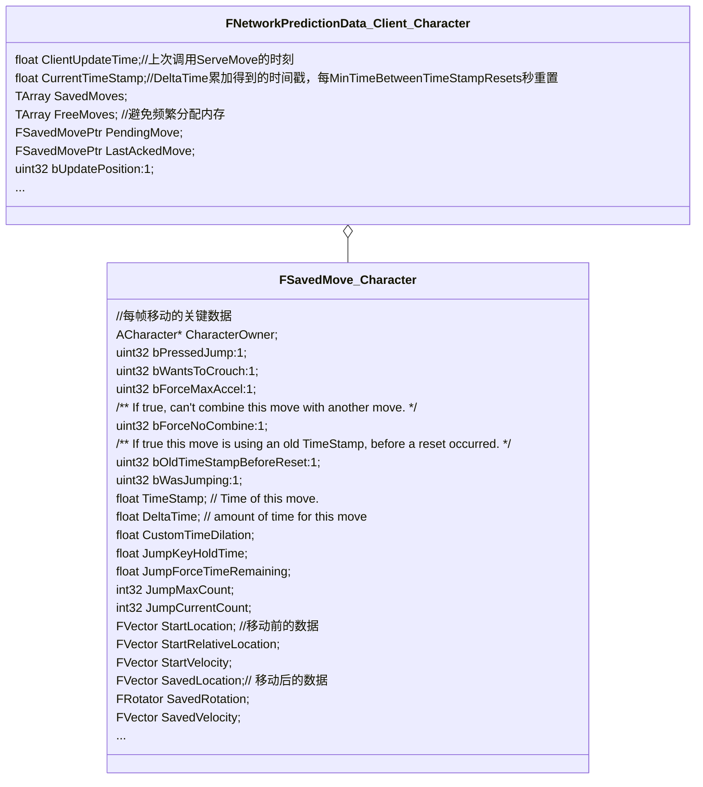
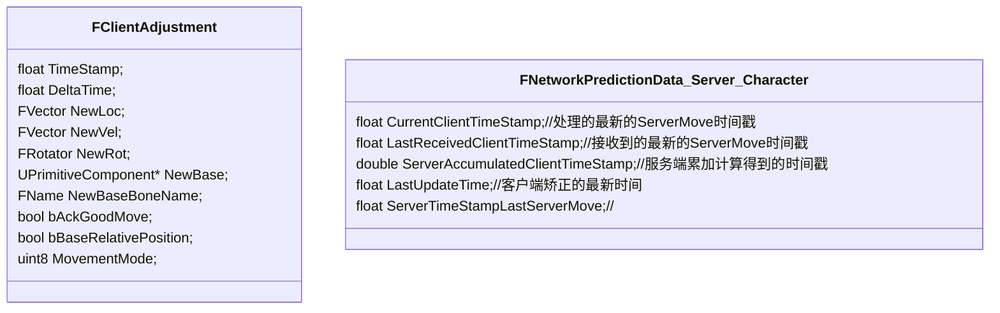
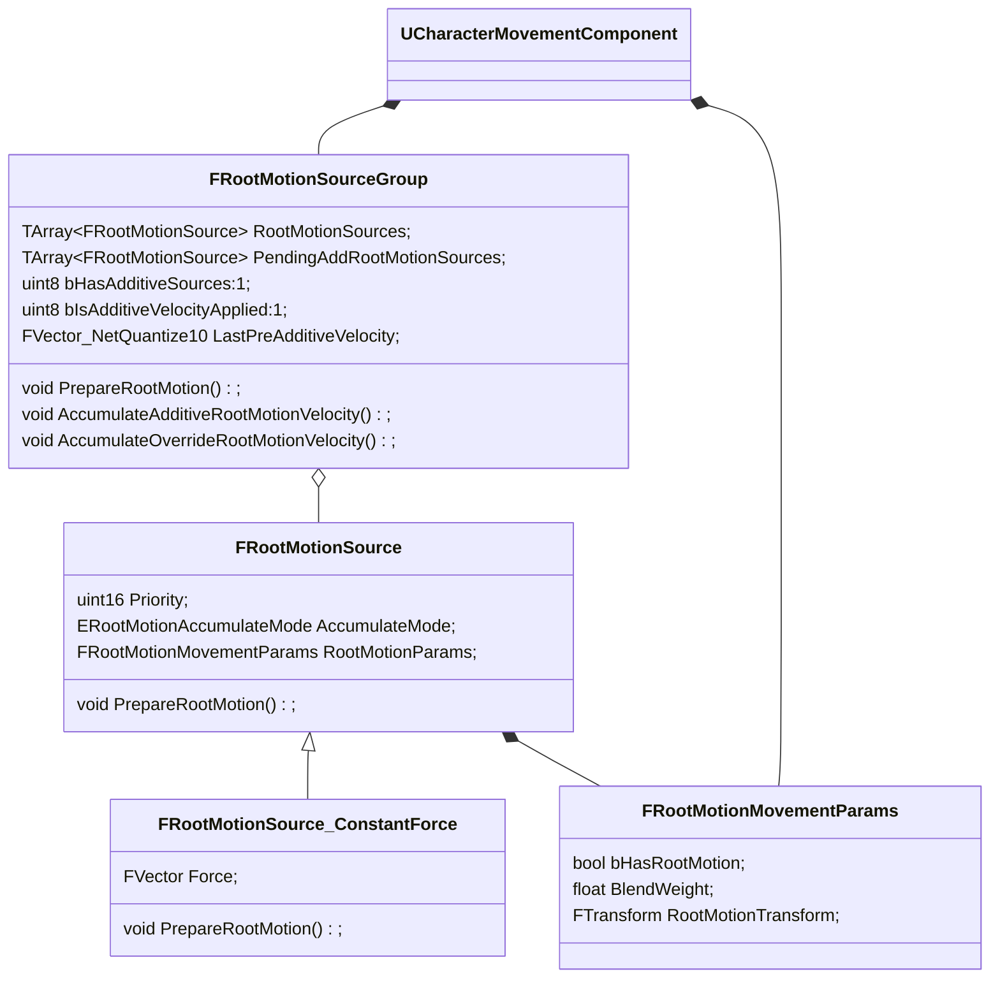

#### TickComponent

```c++
void UCharacterMovementComponent::TickComponent(float DeltaTime, enum ELevelTick TickType, FActorComponentTickFunction *ThisTickFunction)
{
    if (CharacterOwner->GetLocalRole() > ROLE_SimulatedProxy)
	{
        // 如果与服务端不一致，回放记录的Move
        if (ClientData && ClientData->bUpdatePosition)
	        ClientUpdatePositionAfterServerUpdate();
            {
				MoveAutonomous();
            }
        
        if (CharacterOwner->IsLocallyControlled())
        {
            ControlledCharacterMove(InputVector, DeltaTime);
        }
        else if (CharacterOwner->GetRemoteRole() == ROLE_AutonomousProxy)
        {
            if( IsNetMode(NM_ListenServer))
            	SmoothClientPosition(DeltaTime);
        }
    }
    else if (CharacterOwner->GetLocalRole() == ROLE_SimulatedProxy)
    {
        SimulatedTick(DeltaTime);
    }
}
```

#### ControlledCharacterMove

```C++
void UCharacterMovementComponent::ControlledCharacterMove(const FVector& InputVector, float DeltaSeconds)
{
    CharacterOwner->CheckJumpInput(DeltaSeconds);
    
	if (CharacterOwner->GetLocalRole() == ROLE_Authority)
	{
		PerformMovement(DeltaSeconds);
	}
	else if (CharacterOwner->GetLocalRole() == ROLE_AutonomousProxy && IsNetMode(NM_Client))
	{
		ReplicateMoveToServer(DeltaSeconds, Acceleration);
	}    
}
```




ReplicateMoveToServer

```c++
void UCharacterMovementComponent::ReplicateMoveToServer(float DeltaTime, const FVector& NewAcceleration)
{
    FNetworkPredictionData_Client_Character* ClientData = GetPredictionData_Client_Character();
    
    //用DeltaTime累加时间戳CurrentTimeStamp，每MinTimeBetweenTimeStampResets(240ms)重置一次
    DeltaTime = ClientData->UpdateTimeStampAndDeltaTime(DeltaTime, *CharacterOwner, *this);
    
    //找出第一个与上次AckMove不同的Move,记为OldMove
    /*符合以下条件之一则是important的：
        CompressedFlags不同。通过FSavedMove_Character::GetCompressedFlags()获得
        bPressedJump、bWantsToCrouch这两个成员变量对应不同的bit flag
        EndPackedMovementMode属性不同
        加速度大小 之差 > AccelMagThreshold
        加速度的单位向量 的点乘 < AccelDotThreshold。也就是加速度方向差异大于某个范围时 */
    if (CurrentMove->IsImportantMove(ClientData->LastAckedMove))
    	OldMove = CurrentMove;
    
    FSavedMovePtr NewMovePtr = ClientData->CreateSavedMove();
    //记录移动前的移动和跳跃输入、运动模式、角色位置、旋转、速度、地面等信息
    NewMove->SetMoveFor(CharacterOwner, DeltaTime, NewAcceleration, *ClientData);
    
    //尝试将NewMove和FNetworkPredictionData_Client_Character::PendingMove合并。以便减少带宽。如果可以合并的话，会将ClientData->PendingMove置空，因为其已经合并到当前move了。
    if (PendingMove->CanCombineWith(NewMovePtr, CharacterOwner, ClientData->MaxMoveDeltaTime * CharacterOwner->GetActorTimeDilation(*MyWorld)))
    {
        NewMove->CombineWith(PendingMove, CharacterOwner, PC, OldStartLocation);
        ClientData->FreeMove(ClientData->PendingMove);
        ClientData->PendingMove = nullptr;        
    }
    
    //执行本地移动
    PerformMovement(NewMove->DeltaTime);
    
    // 记录移动后的数据
    NewMove->PostUpdate(CharacterOwner, FSavedMove_Character::PostUpdate_Record);
    
    //有OldMove时，发送OldMove
    //调用CharacterOwner->ServerMove：Server端执行的RPC
    //发送的数据有累积的TimeStamp,加速度（输入）、移动后的输入、移动输入Flag、旋转数据、结束时的移动模式
    CallServerMove(NewMove, OldMove.Get());
}
```



#### ServerMove_Implementation

```c++
void UCharacterMovementComponent::ServerMove_Implementation(
	float TimeStamp,
	FVector_NetQuantize10 InAccel,
	FVector_NetQuantize100 ClientLoc,
	uint8 MoveFlags,
	uint8 ClientRoll,
	uint32 View,
	UPrimitiveComponent* ClientMovementBase,
	FName ClientBaseBoneName,
	uint8 ClientMovementMode)
{
    FNetworkPredictionData_Server_Character* ServerData = GetPredictionData_Server_Character();
    
    // 确认TimeStamp有效
    VerifyClientTimeStamp();
    
    // 计算出服务端的DeltaTime，并更新ServerData
    
    // 根据输入模拟移动
    MoveAutonomous(TimeStamp, DeltaTime, MoveFlags, Accel);
    
    //检查服务器得到的数据与客户端是否一致
    ServerMoveHandleClientError();
    {
        ServerCheckClientError();
        {
            // 检查移动后的运动模式是否和客户端一致
            // 检查移动后的位置和客户端的差距是否大到不可接受
            ServerExceedsAllowablePositionError();
        }
        
        // 如果需要客户端矫正
        // PendingAdjustment赋值（bAckGoodMove = false）
        // 否则
        // 是否直接使用客户端位置
        // bAckGoodMove = true
    }
}
```

#### TickFlush

```c++
void UNetDriver::TickFlush(float DeltaSeconds)
{
    ServerReplicateActors( DeltaSeconds );
    {
        Connection->PlayerController->SendClientAdjustment();
        {
            void UCharacterMovementComponent::SendClientAdjustment()
            {
                if (ServerData->PendingAdjustment.bAckGoodMove)
                {
                    // 根据TimeStamp找出Move
                    void UCharacterMovementComponent::ClientAckGoodMove_Implementation(float TimeStamp)
                    {
                        // 保存为LastAckedMove，并清除之前所有的Move
                        ClientData->AckMove(MoveIndex, *this);
                    }
                }
                else
                {
                    // 发送TimeStamp、服务器模拟的位置，速度、运动模式，moveBase
                    ClientAdjustPosition();
                    {
                        // 调用AckMove，删除之前的move
                        
                        // 将角色设置到服务器下发的位置，应用服务器的运动模式
                        // 重新找到floor
                        // 将ClientData->bUpdatePosition = true;
                    }
                }
            }
        }
    }
}
```

#### SimulatedTick

```c++
void UCharacterMovementComponent::SimulatedTick(float DeltaSeconds)
{
    // Replay处理
    
    //RootMotion处理（来自动画或者代码）
    
    // 移动胶囊体
    FScopedPreventAttachedComponentMove(Mesh)
    SimulateMovement(DeltaSeconds);
    {
        // 判断是否收到服务器的FRepMovement数据，Actor中接收
        
        //修改运动模式
        
        UCharacterMovementComponent::MoveSmooth(const FVector& InVelocity, const float DeltaSeconds, FStepDownResult* OutStepDownResult)
        {
            if (MovementMode == MOVE_Custom)
                PhysCustom(DeltaSeconds, 0);
            
            	if (IsMovingOnGround())
                {
                    MoveAlongFloor(InVelocity, DeltaSeconds, OutStepDownResult);
                }
                else
                {
                    SafeMoveUpdatedComponent(Delta, UpdatedComponent->GetComponentQuat(), true, Hit);
                }
        }
    }
    
    // 移动模型
    SmoothClientPosition();
    {
        SmoothClientPosition_Interpolate()
        {
            if (NetworkSmoothingMode == ENetworkSmoothingMode::Linear)
            {
                
            }
            else if (NetworkSmoothingMode == ENetworkSmoothingMode::Exponential)
            {
                
            }
            else if ( NetworkSmoothingMode == ENetworkSmoothingMode::Replay )
            {
                
            }
        }
    }
    
    SmoothClientPosition_UpdateVisuals()
    {
        
    }
}
```


------



```c++
// 添加RootMotionSource
uint16 UCharacterMovementComponent::ApplyRootMotionSource(TSharedPtr<FRootMotionSource> SourcePtr)
{
	// 设置FRootMotionSource的StartTime为CurrentTimeStamp
    
    uint16 FRootMotionSourceGroup::ApplyRootMotionSource(TSharedPtr<FRootMotionSource> SourcePtr)
    {
        // 设置LocalID
        PendingAddRootMotionSources.Add(SourcePtr);
    }
}

void UCharacterMovementComponent::TickComponent(float DeltaTime, enum ELevelTick TickType, FActorComponentTickFunction *ThisTickFunction)
{
    void UCharacterMovementComponent::PerformMovement(float DeltaSeconds)
    {
        // 是否有Addtive模式的RootMotionSource
        if( CurrentRootMotion.HasAdditiveVelocity() )
		{
			const FVector Adjustment = (Velocity - LastUpdateVelocity);
			CurrentRootMotion.LastPreAdditiveVelocity += Adjustment;
        }

        // 计算PendingImpulseToApply添加的力对速度影响
        
        // 是否有Addtive模式的RootMotionSource
        if( CurrentRootMotion.HasAdditiveVelocity() )
        {
         	 const FVector Adjustment = (Velocity - OldVelocity);
			CurrentRootMotion.LastPreAdditiveVelocity += Adjustment;
        }
        
        if (bHasRootMotionSources && !CharacterOwner->bClientUpdating && !CharacterOwner->bServerMoveIgnoreRootMotion)
        {
            CurrentRootMotion.PrepareRootMotion(DeltaSeconds, *CharacterOwner, *this, true);
            {
            	 RootMotionSources.Append(PendingAddRootMotionSources);
				PendingAddRootMotionSources.Empty();
                
                 //遍历RootMotionSources
                FRootMotionSource_ConstantForce->PrepareRootMotion(SimulationTime, DeltaTime, Character, MoveComponent);
                {
                    // 将力变为Transition添加到RootMotionParams的Transform中，并且更新时间
                }
                
                if (RootMotionSource->AccumulateMode == ERootMotionAccumulateMode::Additive)
                {
                    bHasAdditiveSources = true;
                } 
                else if (RootMotionSource->AccumulateMode == ERootMotionAccumulateMode::Override)
                {
                    bHasOverrideSources = true;

                    if (RootMotionSource->Settings.HasFlag(ERootMotionSourceSettingsFlags::IgnoreZAccumulate))
                    {
                        bHasOverrideSourcesWithIgnoreZAccumulate = true;
                    }
                }
            }
        }
        
        //处理Override模式的RootMotionSource或者来自动画的RootMotion
        if( CurrentRootMotion.HasOverrideVelocity() || HasAnimRootMotion() )
        {
            if( HasAnimRootMotion() )
            {
                
            }
            else
            {
                
            }
        }
        
        void UCharacterMovementComponent::ApplyRootMotionToVelocity(float deltaTime)
        {
            if( CurrentRootMotion.HasAdditiveVelocity() )
            {
                //处理速度
                FRootMotionSourceGroup::AccumulateRootMotionVelocity()
                {
                    
                }
            }
        }
    }
}
```

