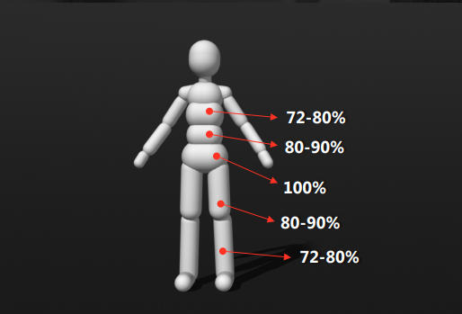

## Physics Animation in Uncharted 4: A Thief's End

### 基本物理模拟元素

#### Rigid Bodies

- Associated joint(s) 
- Mass
- Friction
- Restitution(Bounciness)
- Inertial Tensor（根据给定的某个轴旋转的惯性，越高越稳定）
- Linear Damping
- Angular Damping

#### Constraints

- Hinge

  限制关节只在一个轴上旋转，膝盖或者手肘

- Ragdoll

- Limits	

- Max Friction Torque

  - 质量的20%
  - 模拟关节和肌腱的摩擦力

#### Constraints Motor

会让普通Constraints 变为power Constraints，用来动画控制刚体。

- Maximum motor force

  让刚体（骨骼）保持动画姿势的最大力

- Motor damping

  用来约束 motor force

- Max Proportional Velocity

- Max Constance Velocty

  还原动画姿势的速度

- Motor Tau

  motor stiness(弹性)

#### 设置Ragdoll

- RB Weight Ratios

  从Root骨骼开始，刚体的质量应该以10%的速度递减

  

- Inner Collisions
  去除不需要的碰撞

------

#### BASICS RIGID BODY STATES

##### 骨骼的状态（刚体的状态）

#### **KeyFramed**

适用：手、脚

- Purely driven by animation 
- Does not alter its path when colliding with other objects 
- We use them for pinning characters to other objects •
- Collisions usually disabled

**Powered/Animated**

- RB is driven by animation 
- Animation can be altered by applying impulses or by colliding with other objects.

**Unpowered/Simulated**

- RB is not driven by animation / is not powered 
- Only gravity and constraints are influencing the RBs

------

#### 两种Controller

**Rigid Body Controller（Keyframe Controller）**
尝试设置RagDoll上刚体的速度和角速度来驱动刚体摆出正确的姿势

- Recommended for live characters 
- Works in world space (bone transforms) 
- Easy to match an animation pose 
- Very stable 
- Results not as realistic as motors

**Powered Constraint Controller**

使用附加在刚体上的powered constraints的力来驱动刚体摆出正确的姿势

- Recommended for dead or dying characters
- Works in local space (joints)
-  Somewhat hard to match the pose 
- Tend to overshoot the pose and vibrate
- Realistic results, but noisier than Keyframe

------

 