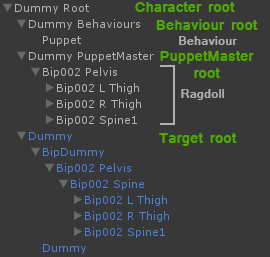
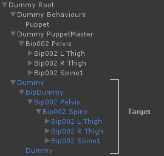
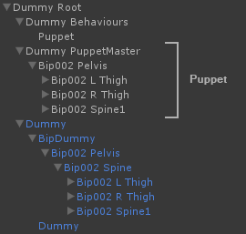

## PuppetMaster Ragdoll制作注意事项

http://www.root-motion.com/puppetmasterdox/html/pages.html

**概念**

Target：Animated Character
Puppet: Physics Ragdoll

**目标**

让Puppet以符合物理规律的方式跟随动画运动

**方式**

1. 连接关节（“Musles”）
2. 使用AddForce方式将Rigidbody固定在目标物上（“Pins”）

**脚本**

**Puppet Behaviours**

**结构**

通过映射将Ragdoll和AnimatedTarget联系起来。

#### Dual Rig

Target
普通的动画Character（可以有CharacterContorller等GamePlay脚本）。一帧中，PuppetMaster首先读取动画姿势，将其传给Musles以便Ragdoll跟随，然后进行物理解算，之后Target会根据Mapping的设置运动到物理解算的位置，等待下一帧的更新。

Puppet
结构与Target一致，但每根骨骼上有ragdoll Components，其他所有物理无关的的脚本都会被移除。关节类型只能是ConfigurableJoints ，任何其他的关节可以通过工具转换为ConfigurableJoints 。

Muscles

PuppetMaster将把Puppet的每个ConfigurableJoint变成Muscle ，保持对其动画目标的参考，并自动计算Joint Target的旋转、pinning forces和其他数值。当 Puppet 没有被固定时，Ragdoll将在Muscle 空间中跟随动画，其结果在物理上是真实和准确的。当固定时，pinning forces将使Ragdoll的骨头移动到它们的目标的世界空间位置，它们可以被想象成弹簧关节将每个Ragdoll的骨头拉向其动画目标。因此，Pinning是一种非自然的力，可以通过管理使Ragdoll模拟游戏角色的运动，而这在物理上是几乎无法实现的。Muscle 被列在PuppetMaster的检查器中，每个Muscle 都有单独的属性，使您能够指定每个Muscle 或Muscle 群的物理Behaviours。

Modes

- Active

  Puppet会使用Muscle Force和Pin Force使其跟随Target，进行物理模拟

- Kinematic

  Puppet会将其RigidBody设置为Kinematic，Muscle禁用。但是会接受碰撞。

-  Disabled 

  禁用所有Puppet功能，对性能完全无影响

#### Puppet Behaviours

Puppet Behaviours是继承自抽象的BehaviourBase.cs的类，其主要思想是为开发动态调整Muscle和pin weights、strength和其他属性或对目标姿势进行运动学调整的功能提供一个模式。最重要的 Puppet Behaviour 是BehaviourPuppet.cs，它负责处理将 "Puppet"固定在目标动画上，在发生碰撞时释放这些钉子，并在从地上站起来时重新收紧。PuppetBehaviours可以切换，例如，当BehaviourPuppet失去平衡时，理论上可以切换到BehaviourCatchFall或BehaviourWindmill。Puppet Behaviours 之所以设置为这样是因为：它们不包含一个外部对象的引用，这意味着它们可以被简单地复制并移动到另一个Puppet上。

------

#### 步骤

1. 利用**BipedRagdollCreator**将Character转换为Ragdoll GameObject
2. 用**RagdollEditor**进行编辑
3. 给Ragdoll GameObject添加PuppetMaster组件
   - Character Controller(碰撞层)
   - Ragdoll layer（碰撞层）

------

#### **PuppetMaster Component**参数详解

#### Simulation

- state(Alive, Dead or Frozen)

  Frozen 当进入死亡状态时，Ragdoll会被设置为失效

- stateSettings 

  **killDuration** 从muscle weight 过渡到deadMuscleWeight的时间

  **deadMuscleWeight** puppet死亡时的muscle weight

  **deadMuscleDamper** puppet死亡增加的damper

  **maxFreezeSqrVelocity** 冻结puppet所需的最大ragdollbones的速度平方

  **freezePermanently** 勾选后，当Puppet被冻结时，所有PuppetMaster功能将被销毁

  **enableAngularLimitsOnKill** 勾选后，会在杀死puppet时启用角度限制

  **enableInternalCollisionsOnKill** 勾选后，杀死Puppet后，会启用内部碰撞

- mode 

- blendTime

  从Active 模式到Kinematic/Disabled 模式所用的混合时间。从Kinematic 到Disabled 是即刻完成的

- fixTargetTransforms

  勾选后，会将target Character的Transforms 固定到它们默认的本地位置和旋转上，从而避免由于附加的读写Transform属性引起的抖动。只在角色骨骼中存在未被动画控制的骨骼时使用

- solverIterationCount 

  Rigidbody.solverIterationCount迭代次数

- visualizeTargetPose

  调试功能，勾选后，将用绿色线条显示动画的姿势。

#### Master Weights

- mappingWeight

  将animated Character映射到ragdoll pose的权重

- pinWeight

  使用addForce将Muscles固定在动画姿势的权重

- muscleWeight

  归一化的muscles强度

#### Joint and Muscle Settings

- **muscleSpring** 

  ConfigurableJoints的Slerp Drive的positionSpring参数

- **muscleDamper** 

  ConfigurableJoints的Slerp Drive的positionDamper 参数

- **pinPow** 

  用以调整pinWeight曲线的斜率，只在从0-1插值pinWeight时起效

- **pinDistanceFalloff**

  根据距离减小pinning force。值越大，表现越松弛

- **updateJointAnchors**

  在Muscles bones之间有动画控制的骨骼的时候，关节的锚点需要每帧都更新，因为muscle的目标在在位置上会产生相对移动。勾选后，会给出更加精确的位置，但是对性能影响较大，建议不勾选。

- **supportTranslationAnimation** 

  如果任何骨骼有**translation animation**启用此选项

- **angularLimits** 
  关节是否需要角度限制？如果PuppetMaster匹配target姿势失败，有可能是因为关节的限制。不勾选此项，测试设置是否clamping了animation。

- **internalCollisions** 

   muscles collide是否启用互相碰撞。

#### Individual Muscle Settings

- **props**

  **group** Muscle属于哪个身体部分。一些脚本需要该设置

  **mappingWeight** target到muscles的权重

  **pinWeight** 使用addForce将Muscles固定在动画姿势的权重

  **muscleWeight** Muscles Strength

  **muscleDamper** 

  **mapPosition**  勾选后，会将target映射到muscle的世界空间位置。一般情况下只勾选root

------

### Behaviour

动态调整puppetmaster的muscle、pin weights, strength和其他属性，对目标姿势做一个运动学上的调整。BehaviourPuppet.cs，负责通过pinning force将puppet调整到目标姿势上，在发生碰撞的时候释放这些pinning force，从跌倒姿势爬起来时重新施加力，使puppet调整到目标姿势上。pupperBehavior比较灵活，可以被直接复制到其他Puppet上。

#### Switching Behaviours

在处理多个 "Behaviours "时，在 "编辑器 "中只保留应该首先运行的那个Behaviours。例如，当你有BehaviourPuppet和BehaviourFall时，如果你希望Puppet从正常的动画状态开始，而不是坠落，请保持前者的启用状态，后者的禁用状态。

通过代码在Behaviours之间进行切换，必须通过在你希望切换到的Behaviours上调用BehaviourBase.Activate();完成。所有其他Behaviours将被禁用。

#### Events

Behaviours在某些情况下会触发事件（如失去平衡）。它们可用于将信息传递给您自己的脚本或切换Behaviours。

- switchToBehaviour - 在此事件中切换到另一个PuppetBehaviours。这必须是该Behaviours的确切类型，注意拼写。
- animations - 在此事件中要交叉淡出的动画。这与下面的UnityEvent是分开的，因为UnityEvents不能处理有多个参数的调用，比如Animator.CrossFade。
- unityEvent - 在这个事件上调用的UnityEvent。

#### Sub-Behaviours:

子Behaviours是可重用的独立功能块，可在多个PuppetBehaviours之间轻松共享。例如，SubBehaviourCOM是一个模块，可以自动计算和更新Puppet的质心相关信息--如质心或压力、COM矢量的方向和角度等数据，并检测Puppet是否已接地。这就避免了为所有需要进行COM计算的Behaviours重复编写代码的必要性。要了解如何使用这样的子Behaviours，请看下面的章节和BehaviourTemplate.cs类。

#### Creating Custom Behaviours:

PuppetMaster从一开始就考虑到了定制和可扩展性的问题。要创建您自己的可重用行为，请制作一个扩展BehaviourBase抽象类的类，或者直接复制或制作BehaviourTemplate.cs并开始按照手头的模式添加功能。

------

### BehaviourPuppet

在与物体碰撞时或者通过代码发生撞击，BehaviourPuppet会处理pinning或者unpinning Puppet，也会让Puppet从不平衡的状态下恢复。

#### Getting Started

将 "Melee"场景中演示角色的BehaviourPuppet的整个游戏对象复制到您自己的Puppet（Behaviours根的父级）。
Collision resistance取决于许多因素，也包括您的刚体的质量，如果Puppet太容易或太难失去平衡，请先调整 "Collision resistance "值。

#### Troubleshooting

- 木偶从不摔倒，有 "蛇足"--减少 "Collision Resistance"。
- 木偶在最轻微的接触中失去平衡 - 增加 "Collision Resistance "和/或 "Regain Pin Speed"。增加 "Knock Out Distances"。
- 木偶试图站起来，但屡屡失败 - 增加 "Get Up Collision Resistance "和/或 "Get Up Regain Pin Speed Mlp"和/或 "Get Up Knock Out Distance"。
- 木偶的肌肉在失去平衡时过于僵硬 - 减少 "Unpinned Muscle Weight Mlp"。
- 木偶在腿部受到重击时不会失去平衡--找到 "Hips"和 "腿Leg"以及 "Foot"组的重写。增加 "Unping Parents"、"Unpin Children "和 "Unpin Group "使碰撞更严重地传播到其他身体部位。也可以尝试减少 "Knock Out Distance"。

#### Collision And Recovery

- normalMode - 当当前不与任何东西接触时，木偶的行为如何？Active 模式使PuppetMaster始终保持活动状态并进行Mapping。Unmapped模式会混合Mapping以保持100%的动画质量。c使PuppetMaster处于Kinematic模式，直到发生碰撞。
- mappingBlendSpeed - 在Unmapped模式下，接触时Mapping的混合速度。
- activateOnStaticCollisions - false时，static Collider与Muscle碰撞时不会激活木偶。请注意，static Collider需要连接一个运动学刚体，才能发挥作用。仅在Kinematic模式中使用。
- activateOnImpulse - 激活木偶的最小碰撞冲力。仅在Kinematic模式中使用。
- groundLayers - CharacterController在unpinning或恢复时需要的碰撞地面层。
- collisionLayers - 碰撞时将unpin木偶的层。
- collisionThreshold - 一种优化。将被处理的最小冲力的平方。
- collisionResistance--较小的值意味着碰撞时更多是物理计算决定Character的姿势，因此Character更容易被击倒。如果使用曲线，该值将由每个Muscle的目标速度的magnitude来计算。当角色移动更快或者动画播放更快时，这让collisionResistance更高。
- collisionResistanceMultipliers（碰撞阻力乘数）--用于根据与Puppet碰撞的Layer来乘以collisionResistance的值。用以调节collisionResistance。
- maxCollisions -每个物理步骤将处理的最大碰撞数。有助于避免峰值（优化）。
- regainPinSpeed - 这个组的Musucle恢复pin weight的速度是多少？
- muscleRelativeToPinWeight - muscle weight相对于pin weight的乘数。在正常的Puppet状态下,它可以用来使muscle更多/更少unpinning时变得更弱/更强。
- boostFalloff - 提升是一个术语，用于使Musucle暂时对碰撞免疫和/或对其他角色的肌肉造成更多伤害。这是通过增加Muscle.State.immunity和Muscle.State.impulseMlp实现的。例如，当您将muscle.state.immunity设置为1时，boostFalloff将决定该值回落到正常值（0）的速度。使用BehaviourPuppet.BoostImmunity()和BehaviourPuppet.BoostImpulseMlp()，从自己的脚本中进行提升。它有助于使木偶变得更强壮，在播放近战击打/踢打动画时发出更多冲力。

#### Muscle Group Properties

- defaults - 默认的肌肉属性。如果没有 "组重写"，这将被用于所有肌肉。

  unpinParents - 与本组肌肉的碰撞会在多大程度上取消对父肌肉的锁定？

  unpinChildren - 与本组肌肉的碰撞将在多大程度上取消对儿童肌肉的锁定？

  unpinGroup - 与该组的肌肉发生碰撞时，会在多大程度上取消对同一组的肌肉的锁定？

  minMappingWeight - 如果是1，这个组的肌肉将总是被映射到布娃娃上。

  maxMappingWeight - 如果是0，这个组的肌肉将不会被映射到布娃娃的姿势上，即使它们是Unpin的状态。

  disableColliders - 如果为真，这个组的肌肉在木偶状态下（不是unbalanced ，也不是getting up）将禁用其碰撞器。

  regainPinSpeed - 这个组的肌肉恢复其pin weight的速度有多快（乘数）？

  collisionResistance（碰撞阻力）--数值越小，意味着从碰撞中unpinning越多（乘数）。

  knockOutDistance - 如果肌肉到目标的距离大于这个值，角色将被击倒。

  puppetMaterial - 当角色处于Puppet或GetUp状态时应用于肌肉的物理材料。使用较低的摩擦材料可以减少肌肉被卡住和拉出关节的风险。

  unpinnedMaterial - 当角色处于Unpinned状态时应用于肌肉的物理材料。

- groupOverrides - 覆盖某些肌肉群的默认肌肉属性（例如，使脚更硬或手更松）。

#### Losing Balance

- knockOutDistance - 如果肌肉到目标的距离大于这个值，角色将被击倒。
- unpinnedMuscleWeightMlp - 较小的值使肌肉在木偶被击倒时变弱。
- dropProps - 如果为真，当木偶失去平衡时，"道具 "组的所有肌肉将从木偶上分离。

#### Getting Up

- canGetUp - 如果为真，在 "Get Up Delay"后，当臀部肌肉的速度小于 "Max Get Up Velocity"时，将自动触发Get Up状态。
- getUpDelay - 失去平衡后起身的最小延迟。在这个时间过后，将等待臀部肌肉的速度下降到低于Max Get Up Velocity'，然后切换到Get Up状态。
- blendToAnimationTime - 一旦触发GetUp状态，将动画目标从布娃娃的姿势混合到Get Up动画的持续时间。
- maxGetUpVelocity - 在臀部肌肉的速度下降到这个值之前不会Get Up。
- minGetUpDuration - 在失去平衡后的这段时间内，不会Get Up。
- getUpCollisionResistanceMlp - 在起身状态下的CollisionResistance倍数。增加这个数值可以防止角色在从unpinned状态转到Get Up状态后立即再次失去平衡。
- getUpRegainPinSpeedMlp - 当处于GetUp状态时，重新获得pin weight的速度倍数。增加这个倍数可以防止角色在从unpinned状态到GetUp状态后立即再次失去平衡。
- getUpKnockOutDistanceMlp - 在GetUp状态下的击倒距离乘数。增加这个倍数可以防止角色在从unpinned状态转到get up状态后立即再次失去平衡。
- getUpOffsetProne - 从俯卧姿势启动起身动画时，目标人物（在人物旋转空间）与髋骨的偏移量。如果你的角色在开始起身时有点滑动，可以调整这个值。
- getUpOffsetSupine - 从仰卧姿势启动起身动画时，目标人物（在人物旋转空间）与髋骨的偏移量。如果你的角色在开始起身时有点滑动，可以调整这个值。

#### Events

- onGetUpProne - 当角色开始从俯卧姿势（朝下）起身时被调用。
- onGetUpSupine - 当角色开始从仰卧姿势（朝上）起身时被调用。
- onLoseBalance - 当角色被击倒（失去平衡）时被调用。从哪个状态开始并不重要。
- onLoseBalanceFromPuppet - 当角色仅从正常的Puppet状态被击倒（失去平衡）时被调用。
- onLoseBalanceFromGetUp - 当角色仅从GetUp状态被击倒（失去平衡）时被调用。
- onRegainBalance - 当角色完全恢复并切换到Puppet状态时调用。

------

### BehaviourFall

BehaviourFall只是根据布娃娃离地面的高度，在混合树中的两个动画片断之间进行混合。从下面的GIF中可以看出，当布娃娃高于地面时，会播放一个旋转动画，但当它落下时，会混合一个保护姿势。

BehaviourFall要求角色的Animator有一个混合树的设置，如下图所示。你可以从 "坠落 "演示场景中的AnimatorController复制混合树。

#### Component Variables

- stateName - 当这个行为被激活时，要交叉渐变到的Animation State。
- transitionDuration - 交叉渐变到stateName的持续时间。值以秒为单位。
- layer - 包含目标状态的层索引。如果没有指定图层或图层为-1，将播放找到的第一个具有给定名称或散列的状态。
- fixedTime - 当前目标状态的开始时间。值以秒为单位。如果没有指定明确的fixedTime或者fixedTime的值是float.NegativeInfinity，那么如果状态还没有被播放，将从开始播放，或者将从当前时间继续播放，不会发生转换。
- raycastLayers - 将对其进行光线投射以寻找碰撞对象的层。
- blendParameter - 动画师中的参数，用于混合捕捉下落和写入动画。
- writheHeight - 骨盆距离地面的高度，在这个高度上将会融合到写轮眼动画。
- writheYVelocity - 骨盆的垂直速度，将与写轮眼动画融合。
- blendSpeed - 两个下落动画之间的混合速度。
- canEnd - 如果是假的，这个行为将永远不会结束。
- minTime - 该行为启动后到结束的最短时间。
- maxEndVelocity - 如果骨盆的速度低于这个值，可以结束这个行为。
- onEnd - 当所有结束条件得到满足时触发的事件。
