Recreating the Climbing System from Zelda BOTW in Unreal (C++)

#### Getting Started

第三人称c++工程模板

#### CMC Setup

继承CharacterMovementComponent类以扩展攀爬功能

## Inheriting

继承CharacterMovementComponent

```C++
#pragma once

#include "CoreMinimal.h"
#include "GameFramework/CharacterMovementComponent.h"
#include "CustomCharacterMovementComponent.generated.h"

UCLASS()
class CS_API UCustomCharacterMovementComponent : public UCharacterMovementComponent
{
	GENERATED_BODY()

};
```

Character类必须默认使用我们创建的UCustomCharacterMovementComponent，在自定义的Character添加一个FObjectInitializer参数，在实现中将默认的MovementComponent改成我们自己定义的UCustomCharacterMovementComponent

```c++
// Replace default constructor:

/* YourCharacter.h */
ACSCharacter(const FObjectInitializer& ObjectInitializer);

/* YourCharacter.cpp */
ACSCharacter::ACSCharacter(const FObjectInitializer& ObjectInitializer)
	: Super(ObjectInitializer.SetDefaultSubobjectClass<UCustomCharacterMovementComponent>(ACharacter::CharacterMovementComponentName))
{
```

虽然我们替换了默认的Movement组件，但是在ACharacter中仍然保留着基类UCharacterMovementComponent的引用，所以我们应该保存一份UCustomCharacterMovementComponent的指针

```c++
/* YourCharacter.h */
public:
	UFUNCTION(BlueprintPure)
	FORCEINLINE UCustomCharacterMovementComponent* GetCustomCharacterMovement() const { return MovementComponent; }

protected:
	UPROPERTY(Category=Character, VisibleAnywhere, BlueprintReadOnly)
	UCustomCharacterMovementComponent* MovementComponent;


/* YourCharacter.cpp */
ACSCharacter::ACSCharacter(const FObjectInitializer& ObjectInitializer)
	: Super(ObjectInitializer.SetDefaultSubobjectClass<UCustomCharacterMovementComponent>(ACharacter::CharacterMovementComponentName))
{
	// ...
	MovementComponent = Cast<UCustomCharacterMovementComponent>(GetCharacterMovement());
}
```

## Overview

`CharacterMovementComponent`基于**Movement Modes**实现移动系统，有4种预定义的移动模式：Walking, Falling, Swimming, and **Custom**。我们需要在Custom中实现攀爬系统。

下面两张图片是核心函数以及它们的执行顺序


**`PerformMovement`**是整个类的核心函数，处理外部环境的物理交互，像是冲力，普通力和重力，也会处理由动画系统根运动带来的移动，**`PerformMovement`**在TickComponent中每帧调用。

**`StartNewPhysics`** 基于当前移动模式选择Phys Function。例如，当前是Walking模式，**`StartNewPhysics`** 调用*PhysWalking* 处理地面上的物理移动，计算对应的速度和加速度。

**`PhysCustom`** 是一个空的虚函数，开发人员可以在其中实现自己的移动，所以我们会将攀爬的相关代码写在PhysCustom中。*Phys* function也可以调用**`StartNewPhysics`**，立即改变到另一种移动模式中。例如，如果角色失去抓力，从攀爬转换到PhysFalling。

角色移动计算结束后，**`OnMovementUpdated`**会被调用。如果玩家想要攀爬，我们需要调用**`SetMovementMode`**方法改变移动模式。当**`SetMovementMode`**被调用后，会触发**`OnMovementModeChanged`** 。这两个方法在处理模式转换时非常有用。

## The Climbing

### Detecting Surfaces

第一步，检测可攀爬的表面，并且记录碰撞信息以处理正确处理角色移动。问题是我们如何获取这些信息。

最简单的方式是用从角色位置出发方向向前的射线去检测表面。但这样做有很多弊端。比如下图，角色就无法从左边的墙爬到右边的墙，因为射线追踪总是向前的，无法检测到右边的墙。

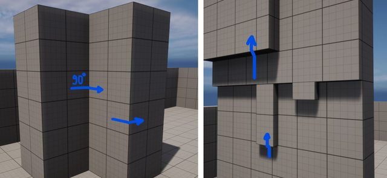

我们可以使用多条射线检测解决这个问题，包括对角落，低中高部分的检测，也可以向移动方向发射检测来解决这个问题，这两种方法中我们都可以得到足够的信息。但是，在这里我们会使用**Shape Sweeps**来解决问题

尽管多条射线检测方法可以解决问题，但是用Shape Sweeps可以让我们统一的处理所有碰撞信息，更加容易实现。我们可以使用比角色胶囊体更大的形状来覆盖许多特殊场景，例如上面提到的那种场景。 `SweepMultiByChannel` 方法返回碰撞信息的数组，来决定之后该如何移动。

在代码中，我们定义了 `SweepAndStoreWallHits`，并且定义了 `FHitResult`类型的数组`CurrentWallHits`。我们使用胶囊体来进行形状检测，所以定义了`CollisionCapsuleRadius` 和 `CollisionCapsuleHalfHeight`.

```c++
private:
	virtual void BeginPlay() override;

	virtual void TickComponent(float DeltaTime, ELevelTick TickType, FActorComponentTickFunction* ThisTickFunction) override;

	void SweepAndStoreWallHits();

	UPROPERTY(Category="Character Movement: Climbing", EditAnywhere)
	int CollisionCapsuleRadius = 50;

	UPROPERTY(Category="Character Movement: Climbing", EditAnywhere)
	int CollisionCapsuleHalfHeight = 72;

	TArray<FHitResult> CurrentWallHits;

	FCollisionQueryParams ClimbQueryParams;
```

 `SweepAndStoreWallHits` 需要在TickComponent中每帧调用，它主要负责以正确的参数调用`SweepMultiByChannel`，并且保存拿到的hits。我们可以只使用startposition这一个参数调用`SweepMultiByChannel`，它会自动用startposition来给endposition赋值，但这会带来bug,例如Landscapes会被忽略，所以需要添加一个很小的偏移计算出endposition。不需要对旋转有任何处理，所以直接使用*quaternion identity*.

```c++
/* CustomCharacterMovementComponent.cpp */
void UCustomCharacterMovementComponent::BeginPlay()
{
	Super::BeginPlay();

	ClimbQueryParams.AddIgnoredActor(GetOwner());
}

void UCustomCharacterMovementComponent::TickComponent(float DeltaTime, ELevelTick TickType,
                                                      FActorComponentTickFunction* ThisTickFunction)
{
	Super::TickComponent(DeltaTime, TickType, ThisTickFunction);

	SweepAndStoreWallHits();
}

void UCustomCharacterMovementComponent::SweepAndStoreWallHits()
{
	const FCollisionShape CollisionShape = FCollisionShape::MakeCapsule(CollisionCapsuleRadius, CollisionCapsuleHalfHeight);

  	const FVector StartOffset = UpdatedComponent->GetForwardVector() * 20;

  	// Avoid using the same Start/End location for a Sweep, as it doesn't trigger hits on Landscapes.
	const FVector Start = UpdatedComponent->GetComponentLocation() + StartOffset;
	const FVector End = Start + UpdatedComponent->GetForwardVector();

	TArray<FHitResult> Hits;
	const bool HitWall = GetWorld()->SweepMultiByChannel(Hits, Start, End, FQuat::Identity,
		  ECC_WorldStatic, CollisionShape, ClimbQueryParams);

	HitWall ? CurrentWallHits = Hits : CurrentWallHits.Reset();
}
```

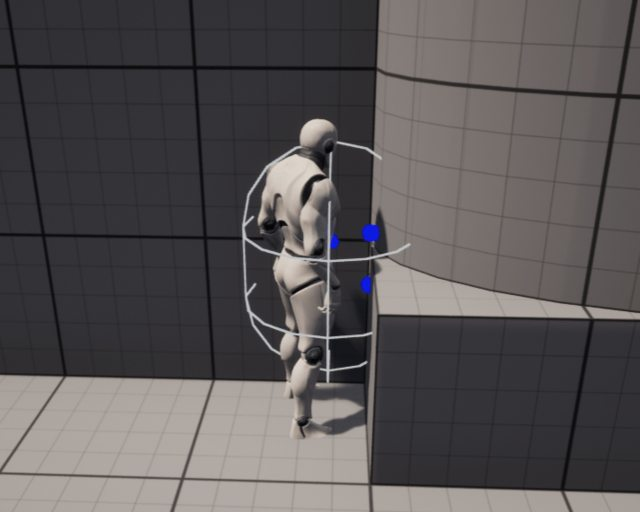

白色的胶囊体表示sweep shape,蓝色表示碰撞点。

## Entering Climbing Mode

我们现在有了一个检测可攀爬表面的方法。下一步是检查我们是否可以开始攀爬，如果可以，就把运动模式改为攀爬。

在塞尔达BOTW中，林克在跑向墙壁时自动开始攀爬。但这只发生在墙壁和他的运动之间的角度足够小的时候。让我们来做同样的事情。创建一个CanStartClimbing函数，它将遍历CurrentWallHits，并在任何命中角度在范围内时返回True。

想象一下，我们的角色想开始攀登一堵陡峭的墙，就像下面描述的那样。比方说，为了使之成功，它需要在与墙面最大25度的范围内寻找。为了知道角色的方向，我们可以简单地使用它的前进矢量F，然后我们可以找到F和墙壁法线wN之间的角度。

然而，这样做并不会给我们带来正确的答案，因为我们并不关心墙有多陡峭（或者法线有多大的指向，或者向下）。一个解决方案是将wN投射到一个水平平面p中，并对其进行归一化。我们可以通过创建一个法线等于UpVector的平面来构建p。结果是一个Z分量等于零的向量R。换句话说，我们可以简单地忽略Z分量。

注意:上面的理论之所以有效，是因为我们假设游戏中的上升方向始终是UpVector。如果你的游戏有不寻常的重力，请注意这一点 如果是这样的话，把矢量投射到一个法线与重力相反的平面。而且当角色朝向不完全朝着墙面方向时，也可能判断失败

让我们创建一个变量来控制最小角度（MinHorizontalDegreesToStartClimbing）。为了找到角色的前进矢量和HorizontalProjectedNormal之间的角度，我们需要计算点积的Arccosine 。结果是弧度，所以要转换为角度。

在塞尔达中，角色可以爬到除90度天花板以外的任何地方。要做到这一点，请计算墙壁法线和HorizontalProjectedNormal之间的点积。如果结果为零，这意味着矢量是垂直的，表明天花板是平的。

```c++
/* CustomCharacterMovementComponent.h */
private:
	UPROPERTY(Category="Character Movement: Climbing", EditAnywhere, meta=(ClampMin="1.0", ClampMax="75.0"))
	float MinHorizontalDegreesToStartClimbing = 25;
	bool CanStartClimbing();
/* CustomCharacterMovementComponent.cpp */
bool UCustomCharacterMovementComponent::CanStartClimbing()
{
	for (FHitResult& Hit : CurrentWallHits)
	{
		const FVector HorizontalNormal = Hit.Normal.GetSafeNormal2D();

		const float HorizontalDot = FVector::DotProduct(UpdatedComponent->GetForwardVector(), -HorizontalNormal);
		const float VerticalDot = FVector::DotProduct(Hit.Normal, HorizontalNormal);

		const float HorizontalDegrees = FMath::RadiansToDegrees(FMath::Acos(HorizontalDot));

		const bool bIsCeiling = FMath::IsNearlyZero(VerticalDot);

		if (HorizontalDegrees <= MinHorizontalDegreesToStartClimbing && !bIsCeiling)
		{
			return true;
		}
	}

	return false;
}

```

问题：下图这种情况角色不应该攀爬

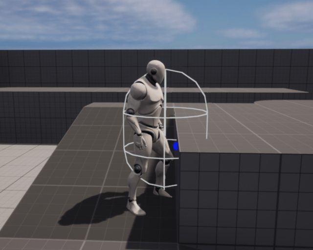

解决方案：从角色眼睛高度处发射射线检测，如果有物体才能攀爬

```c++
/* CustomCharacterMovementComponent.h */
private:
	bool EyeHeightTrace(const float TraceDistance) const;


/* CustomCharacterMovementComponent.cpp */
bool UCustomCharacterMovementComponent::EyeHeightTrace(const float TraceDistance) const
{
	FHitResult UpperEdgeHit;

	const FVector Start = UpdatedComponent->GetComponentLocation() +
			(UpdatedComponent->GetUpVector() * GetCharacterOwner()->BaseEyeHeight);
	const FVector End = Start + (UpdatedComponent->GetForwardVector() * TraceDistance);

	return GetWorld()->LineTraceSingleByChannel(UpperEdgeHit, Start, End, ECC_WorldStatic, ClimbQueryParams);
}
```

问题：tracelength的选择

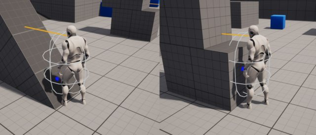

解决方案：根据墙的陡峭程度来决定tracelength。

```c++
/* CustomCharacterMovementComponent.h */
private:
	bool IsFacingSurface() const;


/* CustomCharacterMovementComponent.cpp */
bool UCustomCharacterMovementComponent::CanStartClimbing()
{
	// ...
		if (HorizontalDegrees <= MinHorizontalDegreesToStartClimbing &&
 			!bIsCeiling && IsFacingSurface(VerticalDot)) // Add IsFacingSurface
		{
			return true;
		}
	// ...
}

bool UCustomCharacterMovementComponent::IsFacingSurface(const float SurfaceVerticalDot) const
{
	constexpr float BaseLength = 80;
	const float SteepnessMultiplier = 1 + (1 - Steepness) * 5;

	return EyeHeightTrace(BaseLength * SteepnessMultiplier);
}
```

计算结果：

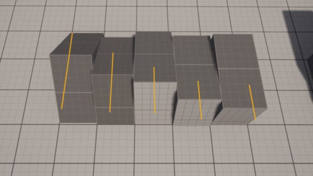

到此为止，我们已经准备好爬墙了。调用 `SetMomeventMode` ，传入 `EMovementMode::MOVE`。此函数还能传入第二个参数*CustomMode*，我们如下定义

```c++
#pragma once

#include "UObject/ObjectMacros.h"

UENUM(BlueprintType)
enum ECustomMovementMode
{
	CMOVE_Climbing      UMETA(DisplayName = "Climbing"),
	CMOVE_MAX			UMETA(Hidden),
};
```

实现**OnMovementUpdated**

```c++
/* CustomCharacterMovementComponent.h */
private:
	virtual void OnMovementUpdated(float DeltaSeconds, const FVector& OldLocation, const FVector& OldVelocity) override;


/* CustomCharacterMovementComponent.cpp */
void UCustomCharacterMovementComponent::OnMovementUpdated(float DeltaSeconds, const FVector& OldLocation, const FVector& OldVelocity)
{
	if (CanStartClimbing())
	{
		SetMovementMode(EMovementMode::MOVE_Custom, ECustomMovementMode::CMOVE_Climbing);
	}

	Super::OnMovementUpdated(DeltaSeconds, OldLocation, OldVelocity);
}
```

## Input

用E和Q键分别表示爬墙和取消爬墙

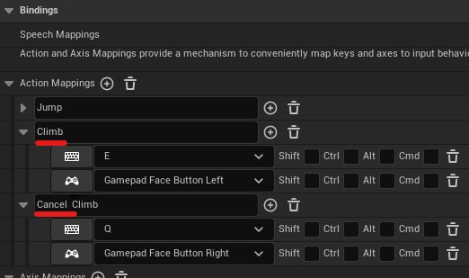

创建变量 `bWantsToClimb` 来存储玩家爬墙的操作，添加`TryClimbing` and `CancelClimbing`。

```c++
/* CustomCharacterMovementComponent.h */
public:
	void TryClimbing();

	void CancelClimbing();

private:
	bool bWantsToClimb = false;


void UCustomCharacterMovementComponent::OnMovementUpdated(float DeltaSeconds, const FVector& OldLocation,
                                                          const FVector& OldVelocity)
{
	// if (CanStartClimbing())
	if (bWantsToClimb)
	// ...
}


/* CustomCharacterMovementComponent.cpp */
void UCustomCharacterMovementComponent::TryClimbing()
{
	if (CanStartClimbing())
	{
		bWantsToClimb = true;
	}
}

void UCustomCharacterMovementComponent::CancelClimbing()
{
	bWantsToClimb = false;
}
```

在Character类中绑定输入操作

```c++
/* CustomCharacter.h */
protected:
	void Climb();

	void CancelClimb();


/* CustomCharacter.cpp */
void ACustomCharacter::SetupPlayerInputComponent(UInputComponent* PlayerInputComponent)
{
	// ...

	PlayerInputComponent->BindAction("Climb", IE_Pressed, this, &ACustomCharacter::Climb);
	PlayerInputComponent->BindAction("Cancel Climb", IE_Pressed, this, &ACustomCharacter::CancelClimb);
}

void ACustomCharacter::Climb()
{
	MovementComponent->TryClimbing();
}

void ACustomCharacter::CancelClimb()
{
	MovementComponent->CancelClimb();
}
```

 `MoveForward` and `MoveRight` 两个函数中的前进和向右方向原本是根据摄像机的朝向决定的，但是在爬墙状态下，前进和向右方向都应该与墙表面方向有关，前进就要改成向上爬行。

所以我们需要在ACustomCharacter中判断是否在墙上以及墙体的法线方向。

```c++
/* CustomCharacterMovementComponent.h */
public:
	UFUNCTION(BlueprintPure)
	bool IsClimbing() const;

	UFUNCTION(BlueprintPure)
	FVector GetClimbSurfaceNormal() const;


/* CustomCharacterMovementComponent.cpp */
bool UCustomCharacterMovementComponent::IsClimbing() const
{
	return MovementMode == EMovementMode::MOVE_Custom && CustomMovementMode == ECustomMovementMode::CMOVE_Climbing;
}

FVector UCustomCharacterMovementComponent::GetClimbSurfaceNormal() const
{
	// Temporary code!!
	return CurrentWallHits.Num() > 0 ? CurrentWallHits[0] : FVector::Zero();
}
```

在ACustomCharacter中，在墙上时，我们使用墙面的法线和角色的左方向叉乘计算up方向，利用墙面的法线和角色的up方向计算叉乘向右方向，注意计算都符合**左手定则**

```c++
/* CustomCharacter.cpp */

void ACSCharacter::MoveForward(float Value)
{
	// ...

	FVector Direction;
	if (MovementComponent->IsClimbing())
	{
		Direction = FVector::CrossProduct(MovementComponent->GetClimbSurfaceNormal(), -GetActorRightVector());
	}
	else
	{
		// Previous direction computation code ...
	}

	AddMovementInput(Direction, Value);
}

void ACSCharacter::MoveRight(float Value)
{
	// ...

	if (MovementComponent->IsClimbing())
	{
		Direction = FVector::CrossProduct(MovementComponent->GetClimbSurfaceNormal(), GetActorUpVector());
	}
}
	
```

## Climbing Physics

在PhysCustom中添加 `PhysClimbing`方法

```c++
/* CustomCharacterMovementComponent.h */
private:
	virtual void PhysCustom(float deltaTime, int32 Iterations) override;

	void PhysClimbing(float deltaTime, int32 Iterations);


/* CustomCharacterMovementComponent.cpp */
void UCustomCharacterMovementComponent::PhysCustom(float deltaTime, int32 Iterations)
{
	if (CustomMovementMode == ECustomMovementMode::CMOVE_Climbing)
	{
		PhysClimbing(deltaTime, Iterations);
	}

	Super::PhysCustom(deltaTime, Iterations);
}
```

如果在墙上角色转向了你移动的方向，尝试将 `bOrientRotationToMovement` 设置为false,在地上设置true.

在墙上时，人物的胶囊碰撞体需要缩小，如下图所示，这样我们就可以在更加复杂的表面上攀爬了。

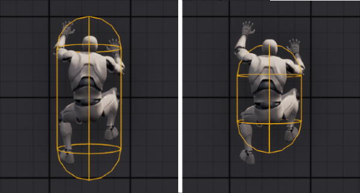

```c++
/* CustomCharacterMovementComponent.h */
private:
	virtual void OnMovementModeChanged(EMovementMode PreviousMovementMode, uint8 PreviousCustomMode) override;

	UPROPERTY(Category="Character Movement: Climbing", EditAnywhere, meta=(ClampMin="0.0", ClampMax="80.0"))
	float ClimbingCollisionShrinkAmount = 30;


/* CustomCharacterMovementComponent.cpp */
void UCustomCharacterMovementComponent::OnMovementModeChanged(EMovementMode PreviousMovementMode, uint8 PreviousCustomMode)
{
	if (IsClimbing())
	{
		bOrientRotationToMovement = false;

		UCapsuleComponent* Capsule = CharacterOwner->GetCapsuleComponent();
		Capsule->SetCapsuleHalfHeight(Capsule->GetUnscaledCapsuleHalfHeight() - ClimbingCollisionShrinkAmount);
	}

	const bool bWasClimbing = PreviousMovementMode == MOVE_Custom && PreviousCustomMode == CMOVE_Climbing;
	if (bWasClimbing)
	{
		bOrientRotationToMovement = true;

		const FRotator StandRotation = FRotator(0,  UpdatedComponent->GetComponentRotation().Yaw, 0);
		UpdatedComponent->SetRelativeRotation(StandRotation);

		UCapsuleComponent* Capsule = CharacterOwner->GetCapsuleComponent();
		Capsule->SetCapsuleHalfHeight(Capsule->GetUnscaledCapsuleHalfHeight() + ClimbingCollisionShrinkAmount);
	}

	Super::OnMovementModeChanged(PreviousMovementMode, PreviousCustomMode);
}
```

准备工作完成，我们可以开始着手实现 `PhysClimbing`了。在UE中如何处理速度加速度以及碰撞，我们可以参考其他Phys方法，比如 `PhysFlying`,

```c++
void UCharacterMovementComponent::PhysFlying(float deltaTime, int32 Iterations)
{
	if (deltaTime < MIN_TICK_TIME)
	{
		return;
	}

	RestorePreAdditiveRootMotionVelocity();

	// Calculates velocity if not being controlled by root motion.
	if( !HasAnimRootMotion() && !CurrentRootMotion.HasOverrideVelocity() )
	{
		if( bCheatFlying && Acceleration.IsZero() )
		{
			Velocity = FVector::ZeroVector;
		}
		const float Friction = 0.5f * GetPhysicsVolume()->FluidFriction;
		
		// Important!! - Updates velocity and acceleration with given friction and deceleration.
		CalcVelocity(deltaTime, Friction, true, GetMaxBrakingDeceleration());
	}

	ApplyRootMotionToVelocity(deltaTime);

	Iterations++;
	bJustTeleported = false;

	FVector OldLocation = UpdatedComponent->GetComponentLocation();
	
	// Location Change
	const FVector Adjusted = Velocity * deltaTime;
	
	FHitResult Hit(1.f);
	
	// Important!! Moves component by given Location Change and rotates by given rotation. 
	// Handles penetrations.
	SafeMoveUpdatedComponent(Adjusted, UpdatedComponent->GetComponentQuat(), true, Hit);

	// If Hit.Time >= 1.f, didn't hit anything.
	if (Hit.Time < 1.f)
	{
		/* Ignore - We are not interested in Stepping Up. */
		const FVector GravDir = FVector(0.f, 0.f, -1.f);
		const FVector VelDir = Velocity.GetSafeNormal();
		const float UpDown = GravDir | VelDir;

		bool bSteppedUp = false;
		if ((FMath::Abs(Hit.ImpactNormal.Z) < 0.2f) && (UpDown < 0.5f) && (UpDown > -0.2f) && CanStepUp(Hit))
		{
			float stepZ = UpdatedComponent->GetComponentLocation().Z;
			bSteppedUp = StepUp(GravDir, Adjusted * (1.f - Hit.Time), Hit);
			if (bSteppedUp)
			{
				OldLocation.Z = UpdatedComponent->GetComponentLocation().Z + (OldLocation.Z - stepZ);
			}
		}
		/* Ignore */

		
		if (!bSteppedUp)
		{
			// Handles blocking/physics interaction.
			HandleImpact(Hit, deltaTime, Adjusted);
			
			// Slides along collision. Specially important for climbing to feel good.
			SlideAlongSurface(Adjusted, (1.f - Hit.Time), Hit.Normal, Hit, true);
		}
	}

	// Velocity based on distance traveled.
	if( !bJustTeleported && !HasAnimRootMotion() && !CurrentRootMotion.HasOverrideVelocity() )
	{
		Velocity = (UpdatedComponent->GetComponentLocation() - OldLocation) / deltaTime;
	}
}

```

首先利用 friction和deceleration计算速度(`CalcVelocity`)，然后用计算出的速度和deltatime将UpdateComponent移动到计算出的位置 (`SafeMoveUpdatedComponent`).，之后计算impact，沿着表面滑行 (`HandleImpact` and `SlideAlongSurface`)，最后更新速度。

 `PhysClimbing`的处理类似上面流程。

```c++
/* CustomCharacterMovementComponent.h */
private:
	void ComputeSurfaceInfo();
	void ComputeClimbingVelocity(float deltaTime);
	bool ShouldStopClimbing();
	void StopClimbing(float deltaTime, int32 Iterations);
	void MoveAlongClimbingSurface(float deltaTime);
	void SnapToClimbingSurface(float deltaTime) const;


/* CustomCharacterMovementComponent.cpp */
void UCustomCharacterMovementComponent::PhysClimbing(float deltaTime, int32 Iterations)
{
	if (deltaTime < MIN_TICK_TIME)
	{
		return;
	}

	ComputeSurfaceInfo();

	if (ShouldStopClimbing())
	{
		StopClimbing(deltaTime, Iterations);
		return;
	}

	ComputeClimbingVelocity(deltaTime);

	const FVector OldLocation = UpdatedComponent->GetComponentLocation();

	MoveAlongClimbingSurface(deltaTime);

	if (!HasAnimRootMotion() && !CurrentRootMotion.HasOverrideVelocity())
	{
		Velocity = (UpdatedComponent->GetComponentLocation() - OldLocation) / deltaTime;
	}

	SnapToClimbingSurface(deltaTime);
}
```

第一个方法是 `ComputeSurfaceInfo`，它主要负责基于碰撞信息计算正确的 `CurrentClimbingNormal` 和`CurrentClimbingPosition`。先用简单的计算代替。

```c++
/* CustomCharacterMovementComponent.h */
private:
	FVector CurrentClimbingNormal;
	FVector CurrentClimbingPosition;


/* CustomCharacterMovementComponent.cpp */
void UCustomCharacterMovementComponent::ComputeSurfaceInfo()
{
	// Temporary code!
	if (CurrentWallHits.Num() > 0)
	{
		CurrentClimbingNormal = CurrentWallHits[0].Normal;
		CurrentClimbingPosition = CurrentWallHits[0].ImpactPoint;
	}
}

// Update temporary code to return the new variable instead!
FVector UCustomCharacterMovementComponent::GetClimbSurfaceNormal() const
{
	return CurrentClimbingNormal;
}
```

接下里 `ShouldStopClimbing` ，我们应该先判断是否停止攀爬。如果 `bWantsToClimb` 是false，或者墙的normal为0向量，或者角色在天花板上，这些情况下，我们都应该停止攀爬，将运动模式设置为 *Falling*，并且调用`StartNewPhysics`

```c++
bool UCustomCharacterMovementComponent::ShouldStopClimbing() const
{
	const bool bIsOnCeiling = FVector::Parallel(CurrentClimbingNormal, FVector::UpVector);

	return !bWantsToClimb || CurrentClimbingNormal.IsZero() || bIsOnCeiling;
}

void UCustomCharacterMovementComponent::StopClimbing(float deltaTime, int32 Iterations)
{
	bWantsToClimb = false;
	SetMovementMode(EMovementMode::MOVE_Falling);
	StartNewPhysics(deltaTime, Iterations);
}
```

在 `ComputeClimbVelocity` 中，计算速度。此方法处理影响玩家对于移动的感受和对攀爬操作的观察。模拟塞尔达，林克在爬行时看起来很费力，动画起来很大的作用，但是如果林克启动或者停止的非常突然，又或者不费力气就能改变方向，那就不对了。换句话说，它的加速度和减速因子很大程度上决定了表现。

 `PhysFlying` 在没有 `Acceleration` 时将速度变为0，但在攀爬中不能这样做。我们把 `Friction` 设置为0，表示在延着表面滑行时我们不需要任何摩擦阻力。这将在处理角落移动时提供一个平滑的表现。用变量`BrakingDecelerationClimbing`替换 `GetMaxBrakingDeceleration`。

查看 `CalcVelocity`，我们可以发现其会调用 `GetMaxSpeed` and `GetMaxAcceleration`获取最大速度和加速度，它们和`GetMaxBrakingDeceleration`一样基于移动模式返回值，所以我们得重写它们。

```c++
/* CustomCharacterMovementComponent.h */
private:
	UPROPERTY(Category="Character Movement: Climbing", EditAnywhere, meta=(ClampMin="10.0", ClampMax="500.0"))
	float MaxClimbingSpeed = 120.f;

	UPROPERTY(Category="Character Movement: Climbing", EditAnywhere, meta=(ClampMin="10.0", ClampMax="2000.0"))
	float MaxClimbingAcceleration = 380.f;

	UPROPERTY(Category="Character Movement: Climbing", EditAnywhere, meta=(ClampMin="0.0", ClampMax="3000.0"))
	float BrakingDecelerationClimbing = 550.f;

	virtual float GetMaxSpeed() const override;
	virtual float GetMaxAcceleration() const override;


/* CustomCharacterMovementComponent.cpp */
void UCustomCharacterMovementComponent::ComputeClimbVelocity(float deltaTime)
{
	RestorePreAdditiveRootMotionVelocity();

	if (!HasAnimRootMotion() && !CurrentRootMotion.HasOverrideVelocity())
	{
		constexpr float Friction = 0.0f;
		constexpr bool bFluid = false;
		CalcVelocity(deltaTime, Friction, bFluid, BrakingDecelerationClimbing);
	}

	ApplyRootMotionToVelocity(deltaTime);
}

float UCustomCharacterMovementComponent::GetMaxSpeed() const
{
	return IsClimbing() ? MaxClimbingSpeed : Super::GetMaxSpeed();
}

float UCustomCharacterMovementComponent::GetMaxAcceleration() const
{
	return IsClimbing() ? MaxClimbingAcceleration : Super::GetMaxAcceleration();
}
```

 `MoveAlongClimbingSurface` 方法处理组件的移动。与Flying不同的时，我们调用了**`GetClimbingRotation`**，它返回一个在墙上的正确的旋转值

```c++
void UCustomCharacterMovementComponent::MoveAlongClimbingSurface(float deltaTime)
{
	const FVector Adjusted = Velocity * deltaTime;

	FHitResult Hit(1.f);

	SafeMoveUpdatedComponent(Adjusted, GetClimbingRotation(deltaTime), true, Hit);

	if (Hit.Time < 1.f)
	{
		HandleImpact(Hit, deltaTime, Adjusted);
		SlideAlongSurface(Adjusted, (1.f - Hit.Time), Hit.Normal, Hit, true);
	}
}
```

计算climbing rotation, 我们让角色看向墙法线的反方向。我们以 `-CurrentClimbingNormal`为参数调用MakeFromX创建一个旋转矩阵，瞬时的旋转表现效果太差，所以我们使用插值。

```c++
/* CustomCharacterMovementComponent.h */
private:
	UPROPERTY(Category="Character Movement: Climbing", EditAnywhere, meta=(ClampMin="1.0", ClampMax="12.0"))
	int ClimbingRotationSpeed = 6;

	FQuat GetClimbingRotation(float deltaTime) const;

	FVector CurrentClimbingNormal;


/* CustomCharacterMovementComponent.cpp */
FQuat UCustomCharacterMovementComponent::GetClimbingRotation(float deltaTime) const
{
	const FQuat Current = UpdatedComponent->GetComponentQuat();
	const FQuat Target = FRotationMatrix::MakeFromX(-CurrentClimbingNormal).ToQuat();

	return FMath::QInterpTo(Current, Target, deltaTime, ClimbingRotationSpeed);
}
```

我们需要保证角色不会从表面上离开或者掉下来，所以 `SnapToClimbingSurface` 将组件向着表面移动，以和表面保持一个适当的距离(`DistanceFromSurface`).让组件距离表面有一定的距离，我们可以减少碰撞带来的不稳定，增加移动的平滑。`ClimbingSnapSpeed`用以控制速度，带来更加可控和平滑的snap移动

```c++
/* CustomCharacterMovementComponent.h */
private:
	UPROPERTY(Category="Character Movement: Climbing", EditAnywhere, meta=(ClampMin="0.0", ClampMax="60.0"))
	float ClimbingSnapSpeed = 4.f;

	UPROPERTY(Category="Character Movement: Climbing", EditAnywhere, meta=(ClampMin="0.0", ClampMax="80.0"))
	float DistanceFromSurface = 45.f;


/* CustomCharacterMovementComponent.cpp */
void UCustomCharacterMovementComponent::SnapToClimbingSurface(float deltaTime) const
{
	const FVector Forward = UpdatedComponent->GetForwardVector();
	const FVector Location = UpdatedComponent->GetComponentLocation();
	const FQuat Rotation = UpdatedComponent->GetComponentQuat();

	const FVector ForwardDifference = (CurrentClimbingPosition - Location).ProjectOnTo(Forward);
	const FVector Offset = -CurrentClimbingNormal * (ForwardDifference.Length() - DistanceFromSurface);

	constexpr bool bSweep = true;
	UpdatedComponent->MoveComponent(Offset * ClimbingSnapSpeed * deltaTime, Rotation, bSweep);
}
```

你可以通过增加一个距离阈值来改进这个方法。如果你在阈值之内，就像我们所做的那样平滑地移动组件。如果不是，你可以立即将它传送到正确的距离。这样做减少了角色在高速度下失去抓地力的机会。

## Computing Surface Info

如前所述，我们会检测到多个碰撞点，我们该如何选择哪个碰撞点去计算攀爬呢？

一种方式是，我们选择全部。用所有碰撞点的平均值来计算 `CurrentClimbingPosition`。至于 `CurrentClimbingNormal`, 我们可以将所有hitnormal的和再做一次normal。

```c++
// Replace the temporary code
void UCustomCharacterMovementComponent::ComputeSurfaceInfo()
{
	CurrentClimbingNormal = FVector::ZeroVector;
	CurrentClimbingPosition = FVector::ZeroVector;

	if (CurrentWallHits.IsEmpty())
	{
		return;
	}

	for (const FHitResult& WallHit : CurrentWallHits)
	{
		CurrentClimbingPosition += WallHit.ImpactPoint;
		CurrentClimbingNormal += WallHit.Normal;
	}

	CurrentClimbingPosition /= CurrentWallHits.Num();
	CurrentClimbingNormal = CurrentClimbingNormal.GetSafeNormal();
}
```

问题：如下图所示，在处理不同的距离很近或者相互重叠的集合体时， `CurrentClimbingNormal` 会计算错误，因为我们检测依赖于重叠。

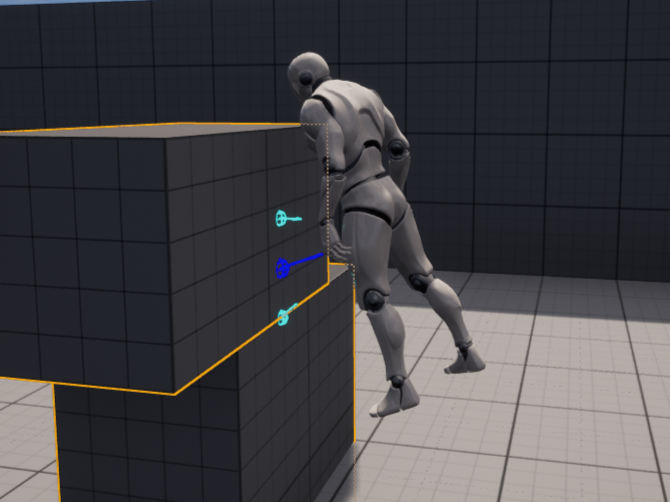

在现实中，最下层的撞击法线应该和最上层的法线相同。尽管重叠对于检测多次碰撞是完美的，但我们最终还是失去了一些控制。如果扫射是从角色位置到障碍物，而不是仅仅存在于事物内部，它就会像预期的那样检测到表面。

系统已经知道了障碍物的位置，将它们存储为一个命中数组。在这种情况下，我们可以从角色的位置到每一个命中点进行追踪。这给了我们一个更精确的表面检测。为了做到这一点，我们将使用一个小球体作为扫描的形状。每一次扫描的终点将是从角色到每个击中位置的方向，长度要足够大。最后，我们用新的扫描信息计算出CurrentClimbingPosition和CurrentClimbingNormal。

```c++
void UCustomCharacterMovementComponent::ComputeSurfaceInfo()
{
	// ...

	const FVector Start = UpdatedComponent->GetComponentLocation();
	const FCollisionShape CollisionSphere = FCollisionShape::MakeSphere(6);

	for (const FHitResult& WallHit : CurrentWallHits)
	{
		const FVector End = Start + (WallHit.ImpactPoint - Start).GetSafeNormal() * 120;

		FHitResult AssistHit;
		GetWorld()->SweepSingleByChannel(AssistHit, Start, End, FQuat::Identity,
			ECC_WorldStatic, CollisionSphere, ClimbQueryParams);

		CurrentClimbingPosition += AssistHit.ImpactPoint;
		CurrentClimbingNormal += AssistHit.Normal;
	}

	// ...
}
```

## Animation

资源地址： [Climbing Animation Set](https://www.unrealengine.com/marketplace/en-US/product/climbing-animation-set)或 [Mixamo](https://www.mixamo.com/)

注意：攀爬状态下禁用controlrig

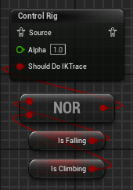

使用第三人称模板蓝图需要修改的地方：

修改引用

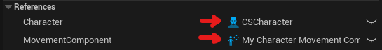

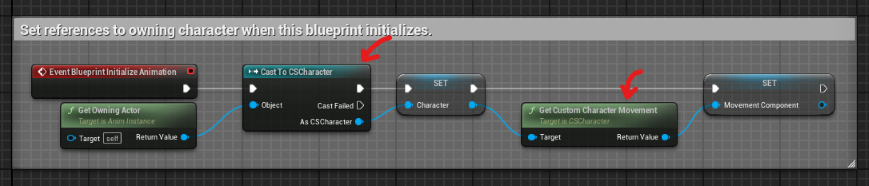

在动画蓝图中添加变量IsClimbing，并在事件更新中每帧更新它

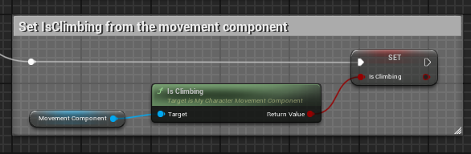

从Locomotion中连出来一个新的状态Climb，转换条件是Climb.

使用blendspace处理攀爬动画。横轴表示左右，竖轴表示上下，最大值最小值分别是120和-120，跟我们在移动组件中设置的最大爬行速度一样

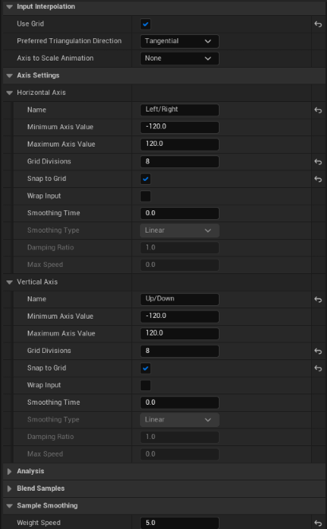

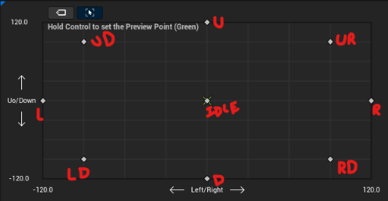

如何计算给blendSpace的xy值呢？不能直接使用速度，因为速度会跟着随着角色的旋转而旋转。所以我们得用角色旋转得逆乘以速度获取世界空间的速度值。我们在动画蓝图中创建 `Velocity to Blendspace 2D` 方法用以将速度转换为blendspace需要的值。转换后Y值对应横轴输入，Z值对应纵轴输入。

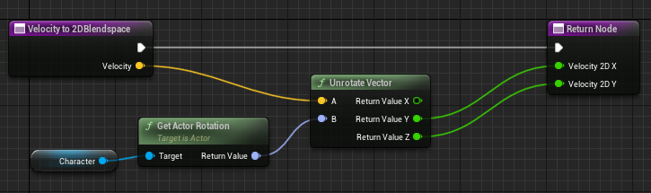

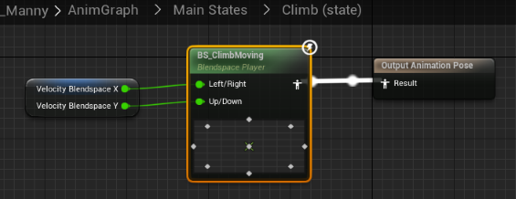

将blendspace添加到Climb结点中。

由于之前使用了 `DistanceFromSurface` 变量，角色看起来离墙面有一定距离，所以我们需要使用IK解决这个问题。也可以计算距离，然后将模型向前方偏移一定距离。

直接从walking到Climbing看起来不会很自然。需要创建中间状态来做过渡。

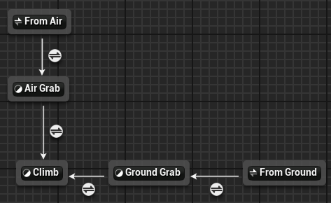

# Extra Mechanics

## Climbing Down

角色不仅可以通过取消攀爬操作来进入其他移动状态，也可以从墙上爬下来。为了处理这种情况，添加 `ClimbDownToFloor` 方法，我们可以在 `ShouldStopClimbing` 测试失败后调用此函数。

```c++
/* CustomCharacterMovementComponent.h */
private:
	bool ClimbDownToFloor() const;


/* CustomCharacterMovementComponent.cpp */
void UCustomCharacterMovementComponent::PhysClimbing(float deltaTime, int32 Iterations)
{
	// ...

	if (ShouldStopClimbing() || ClimbDownToFloor()) // <--
	{
		StopClimbing(deltaTime, Iterations);
		return;
	}

	// ...
```

第一步，我们需要检测角色底下是否有可行走的表面。`CheckFloor`方法从角色位置朝下发射射线检测，`FloorCheckDistance`控制检测的距离，我们需要FHitResult来保存检测信息。如果检测成功，就会有两种情况，第一种，我们正在往一个可行走的表面爬行，第二种我们已经爬在可行走的表面上了。

第一种场景下，我们用表面法线的z分量和 `WalkableFloorZ` (`GetWalkableFloorZ`)去做比较来判断是否可行走。如果法线z分量比 `WalkableFloorZ`大，那么角色就可以在上面行走。我们可以使用速度与表面法线的反方向做点乘来判断我们是否正朝着表面爬行，点乘结果正好是我们朝表面爬行的速度。我使用了一个任意的最低速度来计算向地板移动，因为我们不希望玩家意外地爬下去。

第二种情况比较容易，我们比较`CurrentClimbingNormal`。如果`CurrentClimbingNormal`可行走。则玩家可以直接站立起来。在某些情况下，考虑到旋转偏移，只在目前爬行位置检测会让玩家跌落。解决这个问题的一个方法是检查击中的位置是否登记了一个可行走的地板（bIsClimbingFloor && bOnWalkableFloor）。

```c++
/* CustomCharacterMovementComponent.h */
private:
	UPROPERTY(Category="Character Movement: Climbing", EditAnywhere, meta=(ClampMin="1.0", ClampMax="500.0"))
	float FloorCheckDistance = 100.f;

	bool CheckFloor(FHitResult& FloorHit) const;


/* CustomCharacterMovementComponent.cpp */
bool UCustomCharacterMovementComponent::ClimbDownToFloor() const
{
	FHitResult FloorHit;
	if (!CheckFloor(FloorHit))
	{
		return false;
	}

	const bool bOnWalkableFloor = FloorHit.Normal.Z > GetWalkableFloorZ();

	const float DownSpeed = FVector::DotProduct(Velocity, -FloorHit.Normal);
	const bool bIsMovingTowardsFloor = DownSpeed >= MaxClimbingSpeed / 3 && bOnWalkableFloor;

	const bool bIsClimbingFloor = CurrentClimbingNormal.Z > GetWalkableFloorZ();

	return bIsMovingTowardsFloor || (bIsClimbingFloor && bOnWalkableFloor);
}

bool UCustomCharacterMovementComponent::CheckFloor(FHitResult& FloorHit) const
{
	const FVector Start = UpdatedComponent->GetComponentLocation();
	const FVector End = Start + FVector::DownVector * FloorCheckDistance;

	return GetWorld()->LineTraceSingleByChannel(FloorHit, Start, End, ECC_WorldStatic, ClimbQueryParams);
}
```

注意：在该地点的胶囊追踪是一个更好的方法，可以确保角色可以站起来。如果它记录了一次撞击，这意味着有东西会挡住它，我们应该中止这个功能，以避免碰撞问题。

对于动画来说，我们只需要关注Climb状态和land状态之间的转换。

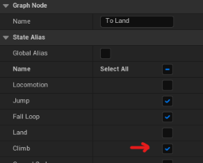

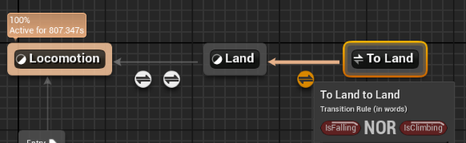

## Climb Up Ledges

当林克在边缘爬行时，他会自然的爬上去，进入行走状态。一种实现方式是，播放一个动画并且将角色移动到正确的位置，在此期间，拦截用户输入，使其对角色的移动状态无法产生影响，这样做的好处时能给我们更多的控制，但是这种方式实现起来比较难，特别是配合动画时。所以我们会利用RootMotion来解决这个问题，让动画控制角色的物理运动。

添加新方法 `TryClimbUpLedge` ，在PhysClimbing最后调用它，这样就可以在任何可以爬上去的时候正确处理运动了。实现此方法之前，我们需要存储和播放root motion动画。[**Animation Montages**](https://docs.unrealengine.com/5.0/en-US/animation-montage-in-unreal-engine/) 能完美解决我们的问题，并且还可以进行网络传输。新建一个motage，并且将动画放入到默认slot中，确保动画开启了Root Motion。

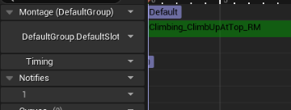

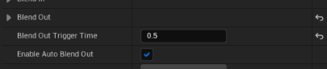

如果你的动画和我一样，那播放完成之后会有长时间的停顿而导致玩家无法控制角色。所以，我从动画结束0.5s之前就开始淡出动画了，设置如上图所示。

我们需要motage的引用 (`LedgeClimbMontage`)和一个用来播放montage的*animation instance* 引用。前者我们可以在编辑器中设置，后者则可以在beginPlay中获取设置。

如果motage正在播放， `TryClimbUpLedge` 应该直接返回。否则，得先判断角色是否在往上移动，其次判断角色是否处在上边缘附近，最后判断角色是否可以站立在爬上去的表面，只有这三个条件都满足了，我们才可以播放motage。在播放此montage之前，先将角色的旋转重置成只有Yaw有值的状态，这样可以提升角色在攀爬陡峭表面时的移动表现。

角色是否在向上移动很好判断，可以点乘速度方向和角色up向量来计算朝上的速度值。

```c++
/* CustomCharacterMovementComponent.h */
private:
	UPROPERTY(Category="Character Movement: Climbing", EditDefaultsOnly)
	UAnimMontage* LedgeClimbMontage;

	UPROPERTY()
	UAnimInstance* AnimInstance;

	bool HasReachedEdge() const;
	bool IsLocationWalkable(const FVector& CheckLocation) const;
	bool CanMoveToLedgeClimbLocation() const;


/* CustomCharacterMovementComponent.cpp */
void UCustomCharacterMovementComponent::BeginPlay()
{
	Super::BeginPlay();

	AnimInstance = GetCharacterOwner()->GetMesh()->GetAnimInstance();
	// ...
}

bool UCustomCharacterMovementComponent::TryClimbUpLedge()
{
	if (AnimInstance && LedgeClimbMontage && AnimInstance->Montage_IsPlaying(LedgeClimbMontage))
	{
		return false;
	}

	const float UpSpeed = FVector::DotProduct(Velocity, UpdatedComponent->GetUpVector());
	const bool bIsMovingUp = UpSpeed >= MaxClimbingSpeed / 3;

	if (bIsMovingUp && HasReachedEdge() && CanMoveToLedgeClimbLocation())
	{
		const FRotator StandRotation = FRotator(0, UpdatedComponent->GetComponentRotation().Yaw, 0);
		UpdatedComponent->SetRelativeRotation(StandRotation);

		AnimInstance->Montage_Play(LedgeClimbMontage);

		return true;
	}

	return false;
}
```

 `HasReachedEdge` 返回角色是否正在上边缘移动。我们可以用之前的`EyeHeightTrace`方法从眼睛处发射射线判断是否击中了任何物体。判断的距离应该足够大，确保当角色站上去之后有足够的位置。

```c++
bool UCustomCharacterMovementComponent::HasReachedEdge() const
{
	const UCapsuleComponent* Capsule = CharacterOwner->GetCapsuleComponent();
	const float TraceDistance = Capsule->GetUnscaledCapsuleRadius() * 2.5f;

	return !EyeHeightTrace(TraceDistance);
}
```

之前实现`EyeHeightTrace`方法时，我们用的是站立姿态，所以人物眼部较高，此时我们处于攀爬姿态，人物眼部的位置变低了。所以我们得把变低的值加回来。

```c++
bool UCustomCharacterMovementComponent::EyeHeightTrace(const float TraceDistance) const
{
	// ...
	const float BaseEyeHeight = GetCharacterOwner()->BaseEyeHeight;
	const float EyeHeightOffset = IsClimbing() ? BaseEyeHeight + ClimbingCollisionShrinkAmount : BaseEyeHeight;

	const FVector Start = UpdatedComponent->GetComponentLocation() + UpdatedComponent->GetUpVector() * EyeHeightOffset;
	// ...
}
```

第三点，需要检测我们是否能站上去。第一步我们需要计算我们能站上去的大概位置，这里用了一些测试中发现的魔法数字，要点是让站立点稍微高一点，因为有可能这个点在倾斜或不规则的地形上。然后 `IsLocationWalkable` 从该位置向下检测是否有可行走的表面，然后我们用胶囊体水平检测，模拟人物是否可以站在上面，如果有阻挡物，则失败。

```c++
bool UCustomCharacterMovementComponent::CanMoveToLedgeClimbLocation() const
{
	// Could use a property instead for fine-tuning.
	const FVector VerticalOffset = FVector::UpVector * 160.f;
	const FVector HorizontalOffset = UpdatedComponent->GetForwardVector() * 120.f;

	const FVector CheckLocation = UpdatedComponent->GetComponentLocation() + HorizontalOffset + VerticalOffset;

	if (!IsLocationWalkable(CheckLocation))
	{
		return false;
	}

	FHitResult CapsuleHit;
	const FVector CapsuleStartCheck = CheckLocation - HorizontalOffset;
	const UCapsuleComponent* Capsule = CharacterOwner->GetCapsuleComponent();

	const bool bBlocked = GetWorld()->SweepSingleByChannel(CapsuleHit, CapsuleStartCheck,CheckLocation,
		FQuat::Identity, ECC_WorldStatic, Capsule->GetCollisionShape(), ClimbQueryParams);

	return !bBlocked;
}

bool UCustomCharacterMovementComponent::IsLocationWalkable(const FVector& CheckLocation) const
{
	const FVector CheckEnd = CheckLocation + (FVector::DownVector * 250.f);

	FHitResult LedgeHit;
	const bool bHitLedgeGround = GetWorld()->LineTraceSingleByChannel(LedgeHit, CheckLocation, CheckEnd,
	                                                                  ECC_WorldStatic, ClimbQueryParams);

	return bHitLedgeGround && LedgeHit.Normal.Z >= GetWalkableFloorZ();
}
```

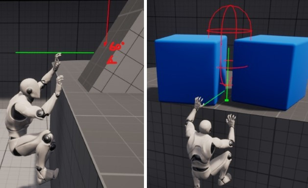

最后，当播放montage时，我们使用montage的速度，而不是使用根据输入计算出的速度。旋转也一样，所以在 `GetClimbingRotation`中，当播放montage时，返回角色当前的旋转。

## Climb Dash

在荒野之息中，林克可以在墙之间跳跃。下面是实现这个效果的说明。我们可以把这个动作想成是角色正在以非常高的加速度很快的爬行。理论上，我们只需要调整 `ClimbingSnapSpeed` and `ClimbingRotationSpeed` 等属性，并且重新设置初始速度。

但是，观感上，动画上这样做都是不行的。为了表现出令人满意的冲刺动画效果，它需要一个强烈的预期阶段，即角色处于闲置状态，以及一个跟随阶段。简单地在玩家做动作时覆盖速度，看起来并不好看。

RootMotion也不能解决这个问题，因为速度可能变换方向，而且当我们由于某些原因调整速度的时候还得调整动画的播放速度。

可以用float曲线计算我角色的速度和爬升冲刺的时间。

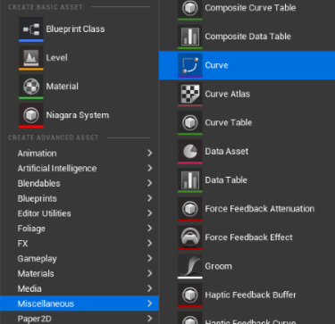

创建float曲线资源

关键部分是将速度和动画相匹配。发射动画在0.29s结束，所以速度在0.4s时从0cm/s迅速上升到950cm/s。由于动画的着陆阶段在0.93s开始，我从0.4s的标志处做了一个平滑过渡。我使用的完整动画是1.58秒，但由于我想让玩家更快地恢复控制，我在1.15s时做了最后一个关键帧。稍后，我将使用一个较长的混合，让动画的其余部分淡出。

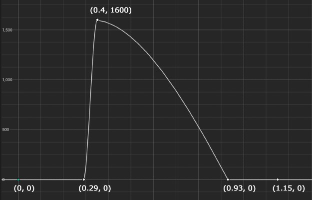

现在我们需要在代码中存储一个冲刺方向 `ClimbDashDirection`，一个决定角色是否冲刺的布尔变量 `bWantsToClimbDash` ，和一个用来保存当前冲刺时间的float变量`CurrentClimbDashTime`。如果玩家在角色静止时按下冲刺键，则向上冲刺，其余时候朝着玩家移动方向冲刺。

```c++
/* CustomCharacterMovementComponent.h */
private:
	UPROPERTY(Category="Character Movement: Climbing", EditDefaultsOnly)
	UCurveFloat* ClimbDashCurve;

	FVector ClimbDashDirection;
	bool bWantsToClimbDash = false;
	float CurrentClimbDashTime;

public:
	UFUNCTION(BlueprintCallable)
	void TryClimbDashing();

	UFUNCTION(BlueprintPure)
	bool IsClimbDashing() const
	{
		return IsClimbing() && bIsClimbDashing;
	}

	UFUNCTION(BlueprintPure)
	FVector GetClimbDashDirection() const;
	{
		return ClimbDashDirection;
	}


/* CustomCharacterMovementComponent.cpp */
void UCustomCharacterMovementComponent::TryClimbDashing()
{
	if (ClimbDashCurve && bWantsToClimbDash == false)
	{
		bWantsToClimbDash = true;
		CurrentClimbDashTime = 0.f;

		StoreClimbDashDirection();
	}
}

void UCustomCharacterMovementComponent::StoreClimbDashDirection()
{
	ClimbDashDirection = UpdatedComponent->GetUpVector();

	const float AccelerationThreshold = MaxClimbingAcceleration / 10;
	if (Acceleration.Length() > AccelerationThreshold)
	{
		ClimbDashDirection = Acceleration.GetSafeNormal();
	}
}
```

当角色开始冲刺时，我们需要更新其状态。`PhysClimbing`中 `ComputeClimbingVelocity`之前，使用deltatime累加 `CurrentClimbDashTime` ，当 `CurrentClimbDashTime` 大约动画帧时间时，我们可以停止冲刺。 `GetTimeRange` 可以得到最大帧时间。最后当停止攀爬时，也得停止冲刺

```c++
/* CustomCharacterMovementComponent.h */
private:
	void UpdateClimbDashState(float deltaTime);
	void StopClimbDashing();


/* CustomCharacterMovementComponent.cpp */
void UCustomCharacterMovementComponent::PhysClimbing(float deltaTime, int32 Iterations)
{
	// ...
	UpdateClimbDashState(deltaTime); // <--

	ComputeClimbingVelocity(deltaTime);
	// ...
}

void UCustomCharacterMovementComponent::UpdateClimbDashState(float deltaTime)
{
	if (!bWantsToClimbDash)
	{
		return;
	}

	CurrentClimbDashTime += deltaTime;

	// Better to cache it when dash starts
	float MinTime, MaxTime;
	ClimbDashCurve->GetTimeRange(MinTime, MaxTime);

	if (CurrentClimbDashTime >= MaxTime)
	{
		StopClimbDash();
	}
}

void UCustomCharacterMovementComponent::StopClimbDashing()
{
	bWantsToClimbDash = false;
	CurrentClimbDashTime = 0.f;
}

void UCustomCharacterMovementComponent::StopClimbing(float deltaTime, int32 Iterations)
{
	StopClimbDash();
	// ...
}
```

在 `ComputeClimbingVelocity` 我们得用曲线来计算速度。 `GetFloatValue` 可以根据传入的`CurrentClimbDashTime`来获取速度值，然后乘以`ClimbDashDirection`得到冲刺速度。但是，仅仅使用初始的冲刺方向并不能在拐角处正确处理移动，我们需要调整速度，使其沿着表面方向。一种方法是，根据表面法线创建一个平面，然后将方向投影在平面上，从而找到方向。我们不必考虑z分量，所以和之前一样获取xy分量即可。

```c++
/* CustomCharacterMovementComponent.h */
private:
	void AlignClimbDashDirection();


/* CustomCharacterMovementComponent.cpp */
void UCustomCharacterMovementComponent::ComputeClimbingVelocity(float deltaTime)
{
	// ...
	if (!HasAnimRootMotion() && !CurrentRootMotion.HasOverrideVelocity())
	{
		if (bWantsToClimbDash)
		{
			AlignClimbDashDirection();

			const float CurrentCurveSpeed = ClimbDashCurve->GetFloatValue(CurrentClimbDashTime);
			Velocity = ClimbDashDirection * CurrentCurveSpeed;
		}
		else
		{
			constexpr float Friction = 0.0f;
			constexpr bool bFluid = false;
			CalcVelocity(deltaTime, Friction, bFluid, BrakingDecelerationClimbing);
		}
	}
	// ...
}

void UCustomCharacterMovementComponent::AlignClimbDashDirection()
{
	const FVector HorizontalSurfaceNormal = GetClimbSurfaceNormal().GetSafeNormal2D();

	ClimbDashDirection = FVector::VectorPlaneProject(ClimbDashDirection, HorizontalSurfaceNormal);
}
```

我们还需要调整 `ClimbingRotationSpeed` and the `ClimbingSnapSpeed`,将他们和当前速度与最大速度的差值相乘。

```c++
FQuat UCustomCharacterMovementComponent::GetClimbingRotation(float deltaTime) const
{
  // ...
  const float RotationSpeed = ClimbingRotationSpeed * FMath::Max(1, Velocity.Length() / MaxClimbingSpeed);
  return FMath::QInterpTo(Current, Target, deltaTime, RotationSpeed);
}

void UCustomCharacterMovementComponent::SnapToClimbingSurface(float deltaTime) const
{
  // ...
  const float SnapSpeed = ClimbingSnapSpeed * FMath::Max(1, Velocity.Length() / MaxClimbingSpeed);
  UpdatedComponent->MoveComponent(Offset * SnapSpeed * deltaTime, Rotation, bSweep);
}
```

至于动画，和之前处理的十分相似，但是这次我们不需要处理速度。

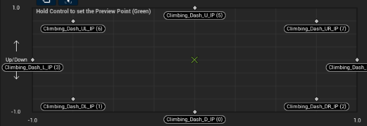

创建一个新的blendspace，设置动画，轴的值设置为（-1，1），现在只考虑方向的影响。

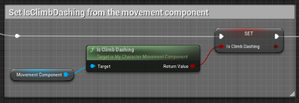

在动画蓝图中创建 `IsClimbingDash` 

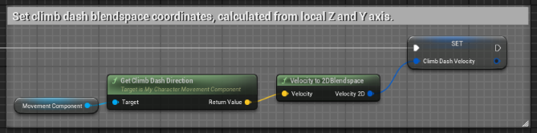

创建一个2DVector `ClimbDashVelocity`，计算方式与`ClimbVelocity`一样

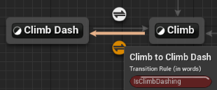

根据`IsClimbDashing`创建 *Climb and Climb Dash* 之间的额转换。

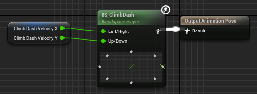

向BlendSpace中传入值

## Inverse Kinematics

利用UE5的ControlRig可以很方便的计算IK.

下面你可以看到屏幕截图。我们的想法是对手和脚进行附加修改。要做到这一点，我们要跟踪并找到它所击中的地方的偏移量，这将是目标。然后，我们通过deltatime对目标矢量进行追踪，使其成为一个平滑的运动，并将结果连接到具有加法全局模式的修改变换节点。在对每根骨头做完这些工作后，将变换结果插入到全身IK节点中。根据你的骨架，你可能需要排除和增加一些骨头的额外配置。通过增加Pull Chain Strength和Alpha，如果你将Root Behaviour改为Pre Pull，手和脚都可以迫使网格紧贴它们。

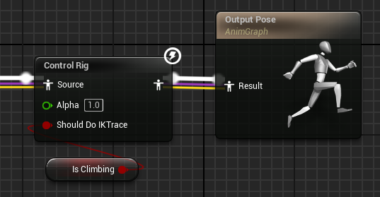

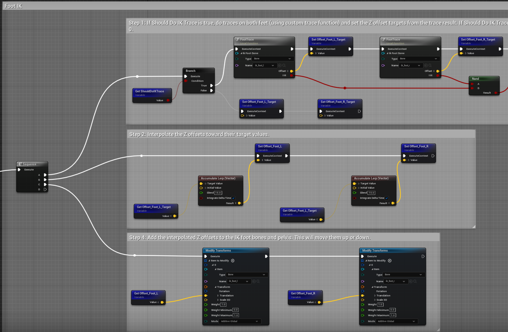

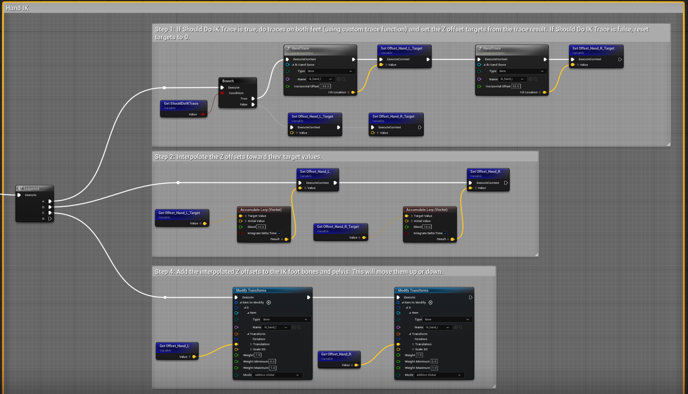

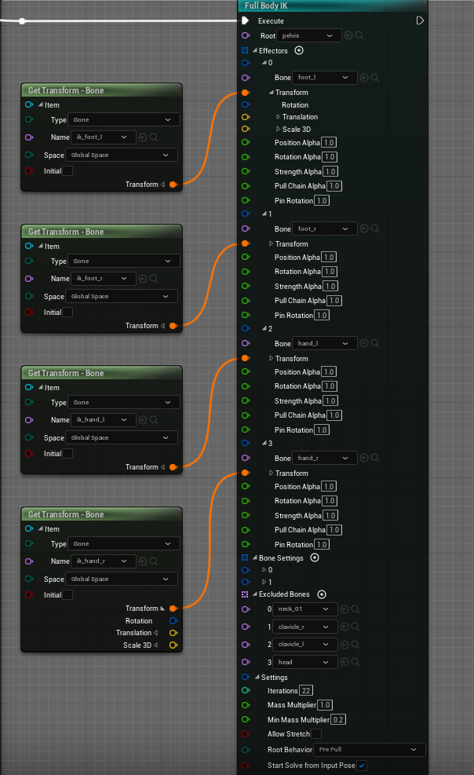

#### 问题：

1. SweepMultiByChannel检测时对单个模型只能获得一个碰撞点，导致在不规则物体上攀爬时表现可能不对

2. 在生成的墙面上，人物碰撞盒有倾斜，导致爬行时有碰撞，表现上有抖动

   原因：未知

3. 连续两次Dash动画衔接不自然

4. ClimbDownFloor向下打射线获取的地面的法线z值非常小

   原因：向下发射线时End位置没加Start,没有开始位置，只有方向。

5. 拐角处的Dash表现不自然

   原因：目前dash的冲刺方向是根据正在爬的墙的表面法线计算出的，在拐角出没有考虑另一个墙面的法线。
   
6. 在墙上的IK表现有瞬时移动
