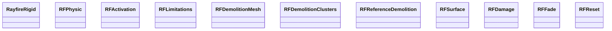

# 破碎效果

[TOC]


## 插件Rayfire的学习

### Rigid

#### Simulation Type

- Dynamic

  物体将受到重力的影响，开始下坠，并有可能受到其他模拟物体的影响

- Sleeping

  物体将冻结在空气中，直到与任何其他物体发生第一次碰撞，然后它将开始作为一个Dynamic行事

- Inactive

  物体将冻结在空气中，不受重力的影响，它可以受到其他模拟物体的影响，但它不会开始下降，直到它被激活。激活后，该物体将开始像一个动态物体的行为

- Kinematic

  物体将使用它的动画来影响其他物体，但它无论如何都不会受到其他物体的影响。可以使用实际的网格作为碰撞器。

#### Object Type

Rigid component可以用它的网格来模拟单个物体，也可以用所有的子网格来模拟多个物体作为一个凹面物体。

- Mesh

  在Mesh Collider中使用Meshfilter的网格对物体进行模拟

- Mesh Root

  应该添加到带有网格的子代的空根中。给所有的子节点添加相同的刚性组件，并将其模拟为网格类型。根部本身不会被模拟。使用这种类型，你不需要选择每一个子节点来添加刚性组件，也不需要在以后编辑它们，你只需要编辑根部的所有属性即可

- Skinned Mesh

  使Skinned mesh 对象破碎。Skinned Mesh对象只能通过手动使用公共方法Demolish()进行破碎。

- Nested Cluster

  使用其所有子Mesh Filter的网格作为一个实体凹面对象模拟。在这种情况下，根节点将为每个子节点获得一个Mesh Collider。要创建这样的对象，你需要在根节点上添加一个刚性组件，该组件将所有你想模拟的对象作为其子节点。在破碎的情况下，Cluster将分离每一个子对象并开始模拟它们自己。如果一个子节点在拆除后也只是其他有网格的子节点的根，那么它也将被视为一个嵌套Cluster。通过这种方式，你可以用你自己的方式拆毁物体。

- Connected Cluster

  使用其所有子网格Meshfilter的网格作为一个固体凹面对象模拟，就像Nested Cluster。它只使用第一层的子节点，不允许嵌套。 在拆除过程中，它将在接触点上分离Shard，而其余的Shard将保持为一个固体Cluster。在每次拆除时，Cluster会检查自己的连接性，如果它检测到一些Shard组不再连接在一起，它们将开始模拟为独立的连接Cluster
  
  **相比Connected Cluster， Nested Cluster更加可控**

#### Demolition Type

定义在游戏模式中何时以及如何拆毁物体

- None

  物体不会被摧毁

- Runtime

  物体将在运行时被拆毁。Shard将在碰撞接触的瞬间被创建。最好对于低聚物和低Shard数量的物体使用这种类型，在其他类型中速度最慢（**帧率低**）

- Awake PreCache

  对象将在Awake中预存所有片段的网格数据，并在Rigid组件中存储所有网格数据信息。在发生碰撞时，具有所有必要组件的游戏对象将被创建，并被分配给Mesh

- Awake Prefragment

  对象将在Awake下被预先破碎。所有的Shard将被禁用并等待拆除

- Reference Demolition

  允许将拆除的对象换成预定义的参考对象，并拆除该参考对象的实例。参考对象可以是FBX资产、预制件或其他场景对象。

#### Physics

- Physic Material

  - Material Type

    材料预设有预定的密度、摩擦力、弹性和坚固性。可以在Rayfire Man组件中进行编辑

  - Material

    允许定义自己的物理材料。请记住，它仍将为固体和质量定义材料类型。

- Mass

  - Mass By

    允许选择质量将被应用到RigidBody组件的方式。

    - Material Density

      物体将根据定义的材料类型和网格体积获得质量

    - Mass Property

      物体将通过质量属性获得质量

  - Mass

    如果Mass By设置为Mass，RigidBody组件将得到这个值。

- Collider

  - Collider Type

    如果对象没有应用自定义碰撞器，允许为对象选择自动碰撞器类型

- Planar Check

  不要将Mesh Collider添加到具有非常小的和/或平面的网格的物体上。Mesh Collider无法为这样的网格添加正确的Mesh Collider，所以应用的Mesh Collider总是比它应该的要大，当这样的物体被放置在非常靠近其他物体的地方时，这样的碰撞会导致爆炸性的模拟。启用此属性可以避免这种模拟行为

- Ignore Near

  允许忽略物体周围的所有碰撞器，如果它们的边界盒相互重叠。如果你有很多物体彼此靠近，所以它们的凸面网格碰撞器彼此重叠，导致不稳定的模拟，那么就可以启用。

- Use Gravity

- Solver Iterations

#### Activation

Inactive的对象可以使用公共方法激活：`public void Activate()`

**By Velocity:**当不活跃的物体被其他动态物体推动时，它的速度将高于By Velocity值，Inactive物体将被激活。设置为0时关闭。

**By Offset:** 如果从原来的位置推到比By Offset值更远的地方，不活动的物体将被激活。设置为0时关闭。

**By Damage:**如果不活跃的物体的当前伤害值高于By Damage值，它将被激活。设置为0时关闭

**By Activator:** 不活跃的对象将通过与带有RayFire Activator组件的对象重叠而被激活

**By Impact:**当不活跃的物体被RayFire Gun组件击中时，它将被激活。

**By Connectivity**:如果InActive对象无法通过其他InActive对象到达任何具有Unyielding属性的InActive对象，那么InActive对象将被激活。**必须使用RayFire Connectivity组件**来建立InActive对象之间的连接，并在它们与其他InActive对象失去连接时激活它们。

**Connectivity**

- Unyielding:允许将Inactive/Kinematic对象定义为Unyielding，以检查与其他Inactive/Kinematic对象的连接
- Activatable:默认情况下，Unyielding对象不能被激活。当开启时，也允许激活Unyielding对象

#### Limitations

Collision

- **By Collision**: Enables demolition by collision.
- **Solidity**:  物体的局部稳固性乘数。低坚固性使物体更脆弱。请记住，物理组中的每个材料类型也有自己的稳固性。如果你想让一个物体在第一次接触时就被拆毁，就设置为0。
- **Tag**: 允许设置特定的标签，因此具有刚性的物体只有在与具有定义的标签的物体碰撞时才会被撞毁。

Other

- Depth:定义物体可以被拆除的深度。如果设置为0，深度是无限的。
  	例如。最大深度设置为1，意味着物体可以被拆毁一次，新的Shard（深度为1的Shard）将不可能再被拆毁。 
  	如果最大深度设置为2，意味着物体可以被拆毁一次，新的Shard（深度1级的Shard）可以被拆毁一次，但新的Shard（深度2级的Shard）将不再可能被拆毁。等等
- Time:安全时间。以秒为单位，允许防止Shard在刚初始化后就被拆毁。
  	例子:时间设置为3秒，这意味着物体可以被拆毁，新的Shard在接下来的3秒内肯定不会被拆毁。
- Size:防止边界框的尺寸小于定义值的物体被拆毁。
- Visible:防止物体在主摄像机看不到的情况下被拆毁。
- Slice by Blade:允许用RayFire Blade组件对对象进行切片

#### Mesh Demolition

**Fragments**

- **Amount**: Defines amount of new fragments after demolition.
- **Variation**: 以百分比定义对象的额外数量变化。最终数量将总是高于Amount值。
  	例如。Amount设置为50，变化设置为10％。最终Amount将在50到55的范围内随机抽取。
- **Depth Fade**:下一个深度水平的数量乘数。允许减少每一个下一个拆除水平的Shard量。
  	例子。数量设置为100。深度淡化设置为0.5。物体拆毁到100个Shard。对于每一个Shard，它的下一个拆除的数量将被设置为50（100* 0.5）。比方说，某个Shard拆成了50个Shard。对于这50个Shard中的每一个Shard，它的下一次拆毁量将被设置为25（50*0.5）。
- **Contact Bias**: 更高的值允许创造更多的靠近碰撞接触点的微小Shard和远离碰撞接触点的大Shard。这个属性可以让玩家明白，运行时爆破就发生在现在，之前没有任何东西被预先破碎。
- **Seed**:定义Shard算法的种子。相同的种子将为同一对象每次产生相同的片段。
- **Use Shatter**: 允许使用RayFire Shatter属性进行Shard化。只有当对象具有RayFire Shatter组件时才起作用。这是在运行时创建其他Shard类型的唯一方法，因为默认的拆除Shard类型只产生普通的VoronoiShard。

**Advanced**

- **Clusterize**:允许将拆除的Shard变成连接的Cluster。
- **Mesh Input**: 允许选择何时对拆除的网格进行Shard化处理。处理的时间约占总Shard时间的10%-15%。
- **Properties**
  - **Collider Type**:定义网格Shard的碰撞器类型，如果它们的包围盒尺寸小于 **Size Filter**.在你想对很多小片段应用简单的碰撞器的情况下很有用。
  - **Size Filter**：定义碰撞器类型属性的包围盒尺寸值。如果设置为0，则关闭。
  - **Remove Collinear:**移除输出片段网格上的拼接顶点。

#### Runtime Caching

- **Type**:Defines Runtime Caching type. Disabled by default
  - **By Frames：**在定义的帧数内缓存片段的网格。
  - **By Fragments per Frame:**每一帧缓存定义数量的片段网格。
- **Frames**: 
- **Fragments**:
- **Skip First Demolition**:当所有的网格都被缓存时，不要拆毁对象，等待下一次拆毁。允许使用第一次拆解来启动缓存，并在第二次拆解时才拆解对象。

#### Cluster Demolition

- Connectivity 

  定义Shard之间的连接将被计算的方式

  - **By Bounding Box:**如果Shard的绑定盒相互渗透，将被认为是连接的。这是建立连接的最快方法，可以在Runtime中使用，但是计算出的共享区域值将不精确，将基于Shard的大小。
  - **By Mesh**: 如果一个Shard的三角形与邻居Shard的三角形相吻合，Shard将被认为是连接的。这是最慢的建立连接的方法，应该只在编辑器中使用设置Cluster按钮，但它精确地计算共享区域的值，提供真实的按区域Collapse。
  - **By Bounding Box and Mesh**: 如果Shard的边界盒相互渗透，那么Shard将被认为是相连的。如果Shard也共享三角形，那么共享面积将使用 "按网格 "方法计算，如果Shard不共享三角形，那么将使用 "按边框 "方法。

- Filters

  过滤器允许你减少连接的数量。有三个过滤器，它们在默认情况下是关闭的。

  - **Minimum Area**:如果两个Shard的共享区域大于这个值，它们就有连接。
  - **Minimum Size**:如果两个Shard的大小大于这个值，它们将有连接。
  - **Percentage**:随机百分比的连接将被丢弃。
  - **Seed**:用于随机百分比过滤器和随机Collapse的种子

- Demolition Distance

  当一个 "Connect Cluster "与某些东西相撞或受到枪的冲击，并应在接触点上被拆除时，它必须决定有多少Shard应被分离成独立的Shard，所有在距离接触点的拆除半径内的Shard将被分离。然后，其余的Shard将检查彼此之间的连接情况，如果有几组Shard只相互连接，那么这些Shard组将被模拟为独立的连接Cluster。

  - **Type**

    定义了测量Demolition距离的方式。

    - **Ratio To Size**: 以相对于初始Cluster大小的百分比来衡量。
      例如，如果Cluster的大小是50个单位，与大小的比率值是20%，那么拆除距离的半径将是10个单位，接触点周围10个单位半径内的所有Shard将从Cluster中分离。
    - **World Units**: 
    - **Ratio**:Demolition距离的百分比值。
    - **Units**:Demolition距离的世界单位值。

- Shards

  在拆除距离区域的所有分离的Shard将得到具有网格对象类型的RayFire Rigid组件，并将被单独模拟。所有这些Shard都将从最初的连接Cluster刚体中继承网格拆除的属性。但是可以将这些分离的Shard聚成小的连接簇，由于这个原因，你可以在初始拆毁的连接簇和独立的分离Shard之间创造一个平滑的过渡，所以在它们之间会有小的连接簇群。

  - **Shard Area**

    定义了相对于拆除距离的百分比。
    例如，Cluster大小为50个单位，拆除距离为20个单位，因此接触点周围20个单位半径内的所有Shard都将从拆除的连接Cluster中分离出来。如果Shard面积值为100%，那么所有的Shard将被单独模拟为带有网格对象类型的刚性Shard，如果Shard面积值为25%，那么只有接触点周围5个单位半径的Shard将被单独模拟，其余的5到20个单位半径的Shard将被分成小组，每个小组都将被模拟为小型的连接Cluster。这种群组的数量可以使用群组部分的最小和最大数量属性来定义。

  - **Shard Demolition**:为具有Mesh对象类型的分离式Shard设置运行时拆除类型。

- Clusters

  - **Min** **Amount**:定义在 "拆除距离 "半径内将创建的最小连接Cluster数量。
  - **Max Amount**: 定义在拆除距离半径内将被创建的最大连接Cluster数量。最终值将在最小和最大范围之间随机选择。
  - **Demolishable**: 为已创建的连接Cluster设置运行时拆除类型，这样也就可以拆除它们了。

- Collapse

  - **Type**: 有三种方法可以打破Shard之间的连接。你应该在编辑器中尝试所有这些方法，以找到更适合你的结构和目标的方法。
    - **By Area**:如果Shard的共享面积表面小于定义值，它将失去连接。
    - **By Size**:如果Shard的大小小于定义值，它将失去连接。
    - **Random**：如果Shard的随机值在0到100的范围内小于定义值，Shard将失去连接。
  - **Start**:以相对于所选类型的整个范围的百分比来定义起始值。例如，类型设置为按大小，你有200个Shard，最小的Shard大小等于0.1单位，最大的Shard大小等于50单位。如果你把 "开始 "值设置为50%，它将开始Collapse，把 "按大小 "的阈值设置为25个单位，所有大小小于25个单位的Shard将失去它们的连接。如果你想快速开始Collapse，增加这个值，这样很多Shard将失去连接，并从一开始就被激活。如果你想慢慢地开始Collapse，一个接一个地激活Shard，就把它设置为0。
  - **End**: 以相对于整个选取类型范围的百分比定义结束值。如果你想中断所有的连接，就设置为100，如果你想保留一些连接，就设置得低一些
  - **Steps**:在持续时间内，定义的阈值将被设置的次数。
  - **Duration**:将开始值增加到结束值的时间

#### Reference Demolition

使用参考拆解类型，你可以将被拆解的对象交换到场景中的另一个游戏对象、预制资产、FBX资产，甚至是用你自己的脚本自定义粒子系统。这个拆卸类型可以用于你刚刚使用Shatter组件创建的Shard，或者用于你从其他3D包导入的带有Shard的FBX资产。如果参照物只是一个物体，那么在拆除时，它将代替原始物体被拆除。如果Reference是一个空的根节点，那么这些节点将被模拟成Shard。也可以保持Reference字段为空，这样原始的拆毁对象就会消失，而不会留下任何东西。

**Reference**: 定义用于拆除的引用。引用将被实例化并被拆除，而不是原始对象。

**Random List**:允许定义几个参照物并随机挑选一个进行拆除。

**Action**: 定义了源对象的使用方式。

- **Instantiate**: 实例化源对象并使用实例。
- **Set Active**: 激活源物体，用它来进行拆除。

**Add Rigid**:所有没有刚性组件的引用将自动得到它。单个物体会得到网格物体类型，带有一组网格物体的根部会得到网格根部物体类型。

**Inherit Scale**:实例化的引用将继承原始对象的比例。

#### Damage

**Enable**: 允许通过其自身的浮动伤害值来拆毁物体。当当前伤害值大于或等于最大伤害值时，物体将被拆毁。当前伤害值可以通过RayFireBomb和RayFireGun组件、碰撞或公共方法来增加。

```
public bool ApplyDamage(float damageValue, Vector3 damagePosition)
```

damagePosition:在世界空间中的位置。在这种情况下，损坏位置将被Contact Bias用来在损坏区域创造更多的微小Shard。返回值为 "真 "的布尔值意味着该物体因为应用了损伤而被拆毁。

**Max Damage**: 定义一个物体在被拆毁前的最大允许伤害

**Current Damage**: Shows current damage value.

#### Fading

**Initiation**

- **On Demolition**: Initiate Fading for demolished object fragments.
- **On Activation**:当物体被激活时启动Fading（将不活动的模拟类型改为动态）。
- **By Offset**: 当物体从它的初始化位置移动到足够远的地方时，就启动Fading。

**Life**

- **Life Type**: 定义在物体开始fade之前，物体将被模拟的时间
  - **By Life Time**:
  - **By Life Time and Simulation**:
- **Life Time**: 
- **Life Variation**: Add random period of time in seconds to final **Life Time.**

**Fade**

**Fade Type**:Fade会保持场景的清洁，并通过破坏片段或将其排除在模拟之外来优化动态模拟

- **None**:∙Shard将不受限制地留在场景中，它们将始终被模拟。
- **Sim Exclude**
- **Fall Down**：Shard在出生后将被模拟为生命时间段，然后它们将从地面坠落，并在消逝时间段后被销毁。
- **Scale Down**: ∙Shard在出生后将被模拟为生命时间段，然后在消逝时间段内开始慢慢缩减为零，最后被销毁。
- **Move Down**: 
- **Destroy**
- **Set Static**∙Shard在出生后将被模拟为生命期，然后销毁刚体组件保留碰撞器。
- **Set Kinematic**: 

**Fade Time**:物体在地面上缓慢移动或缩减至无的时间段，以秒为单位。

**Size FIlter**: 如果对象的尺寸大于定义值，则防止其Fading。如果为0则关闭

------

### Connectivity

RayFire Connectivity管理具有Rigid组件的独立对象之间的连接并激活它们。Connectivity组件也支持RigidRoot组件。 使用Connectivity，你可以在它们的底部打破复杂的结构，顶部将被激活并自动落下。连通性还可以将顶层的物体群组化，这样它们就会被模拟成一个连接的群组。

#### Rigid component requirements

只有当刚性组件符合它的要求时，Connectivity才会考虑将具有刚性组件的子对象作为它的Shard。

- **Inactive or Kinematic simulation type**: 带有刚性组件的物体应该将模拟类型设置为InActive或Kinematik，只有这些模拟类型可以激活，这意味着变成受重力影响的动态物体。
- **Mesh object type**:连接性需要刚性组件与Mesh成为单一对象
- **By Connectivity activation**:激活属性中的 "连接 "属性应该是 "已启用"
- **Unyielding Shard:** 在激活属性中，至少有一个子Rigid应该有Enabled Unyielding属性。连接性结构中的每个Shard将检查与至少一个UnyieldingShard的连接，如果没有这种连接，将被激活。你可以在同一个根上添加Unyielding组件和Connectivity组件，通过它的小工具定义一个或几个UnyieldingShard组。它将在激活属性中启用Unyielding属性。

#### Connectivity

Type:定义Shard之间的连接将被计算的方式。

- By Bounding Box:如果Shard的边界盒彼此相互渗透，就会被认为是连接的。这是建立连接的最快方式，可以在Runtime中使用，但计算出的共享值将不精确，将基于Shard的大小。
- By Mesh:如果一个Shard的三角形与邻近Shard的三角形吻合，Shard将被认为是连接的。这是最慢的建立连接的方法，应该只在编辑器中使用设置Cluster按钮，但它精确地计算了共享面积值，提供了现实的按面积Collapse。
- By Bounding Box and Mesh:如果Shard的边界盒相互穿插，它们就会被认为是连接的。如果Shard也共享三角形，那么共享面积将使用 "网格 "方法计算，如果Shard不共享三角形，那么将使用 "边界框 "方法。
- Expand:允许为物体的包围盒增加额外的尺寸，以防止它们的包围盒太小而无法建立彼此之间的联系。

#### Filters:

过滤器允许你减少连接的数量。有三个过滤器，它们在默认情况下是关闭的。
Minimum Area: 如果两个Shard的共享区域大于这个值，它们就会有连接。
Minimum Size: 如果两个Shard的大小大于这个值，它们就会有连接。
Percentage:随机百分比的连接将被丢弃。
Seed：随机百分比过滤器和随机Collapse的种子。

#### Cluster Properties

- Clusterize：所有被激活的Shard组，如果没有通过其他Shard与任何Unyielding的Shard相连，但彼此相连，将被移到一个空的根父体下，该根父体将得到连接Cluster刚性组件，整个组将被模拟成一个对象。刚性组件将从第一个Shard的连接Cluster属性中继承连接Cluster的属性，除了拆除类型属性，这取决于可拆除属性。
- Demolishable：如果Clusterize为On，对于激活期间创建的连接簇，将拆除类型设置为Runtime。否则它将被设置为无。

#### Collapse

Collapse允许你开始打破Shard之间的连接，并激活单个Shard或Shard组，如果它们没有与任何Unyielding的Shard连接。将Collapse与其他激活类型一起使用是个好主意，比如通过偏移，在这种情况下，被冷却剂激活的Shard会掉下来，并移动仍然不活跃的Shard，同时激活它们，在某些时候，整个Collapse会开始看起来像一个连锁反应。

有两种方法来启动Collapse：

- 手动设置Collapse阈值或使用公共方法。

  你可以通过手动设置 "按面积"、"按尺寸 "和 "随机 "阈值来断开连接。你可以使用组件用户界面顶部的Collapse滑块或使用公共静态方法来设置这些阈值。你可以同时设置这三个阈值，这取决于哪一个对你更有效。例如，如果你把 "按大小 "的值设置为0.5，所有大小小于0.5个单位的Shard将失去它们的连接。

- 使用Collapse属性开始Collapse

  如果你不想直接设置准确的阈值，你可以使用Collapse属性组来自动处理这个过程，它允许你定义Collapse类型和速度。有三种方式来开始Collapse，你可以使用开始Collapse下拉属性选择一种。

  **At Start**:Collapse将在Connectivity的组件开始时启动。

  **By Method**:你可以使用组件用户界面顶部的开始Collapse按钮或使用公共的静态方法开始Collapse（更多信息在底部）。

  **By Integrity**: 当Connectivity结构的完整性低于Collapse By Integrity属性值时，将启动Collapse。

#### User Interface

在连接性组件中，你可以在组件的顶部和底部看到Collapse用户界面。
在顶部，你可以在运行时手动设置Collapse阈值来启动Collapse。按面积和按尺寸的值以浮动单位表示，随机值以整数表示。当你设置Cluster时，所有三个滑块将被设置为0值，所以你将能够增加它们并断开连接。按面积和按大小滑块将相应地以最大的共享面积和最大的Shard大小为上限，随机滑块将以100为上限，因为它是以百分比衡量的。


------

### 问题

1. 使用Connectivity组件时，即使有些Fragment失去了于Unyielding组件的所有连接，仍然不模拟动态效果

   原因：Fragment的Rayfire Rig组件的SimulationType是InActive的。

   | 解决方案                        | 问题                           |
   | ------------------------------- | ------------------------------ |
   | Rayfire Rig组件初始化为Dynamic  | 开始就会受到重力影响而进行模拟 |
   | Rayfire Rig组件初始化为Sleeping | 碰撞后就会模拟                 |

2. 只要与Unyielding物体有连接，建筑就不会Collapse

   解决方案：检查物体的连接数量，小于一定的数量就断开连接

3. 只使用ByConnectivity，物体永远不会被激活，因为连接永远存在，需要配合其他激活条件使用

4. Unyielding物体无法被激活

   

   

------

#### 代码分析



