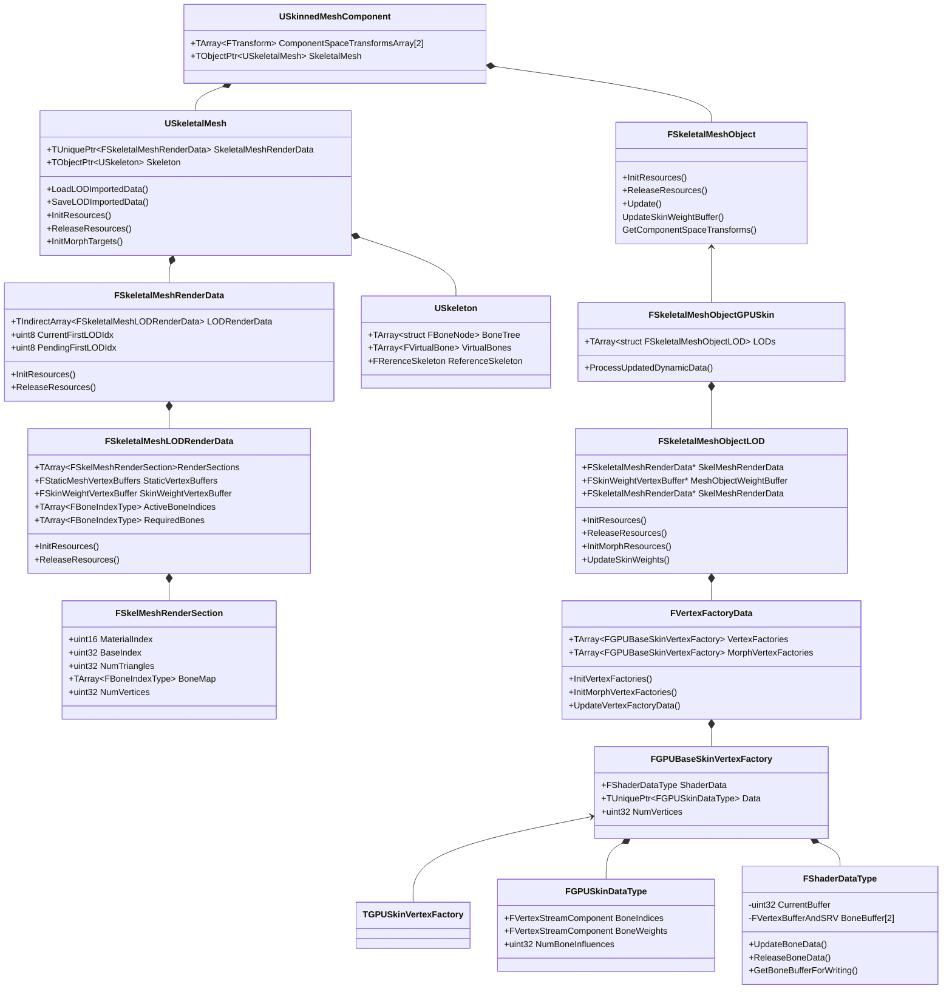
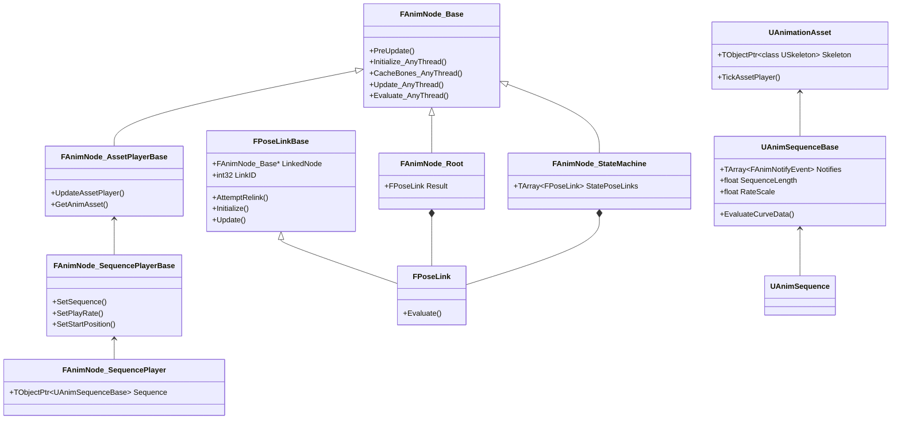
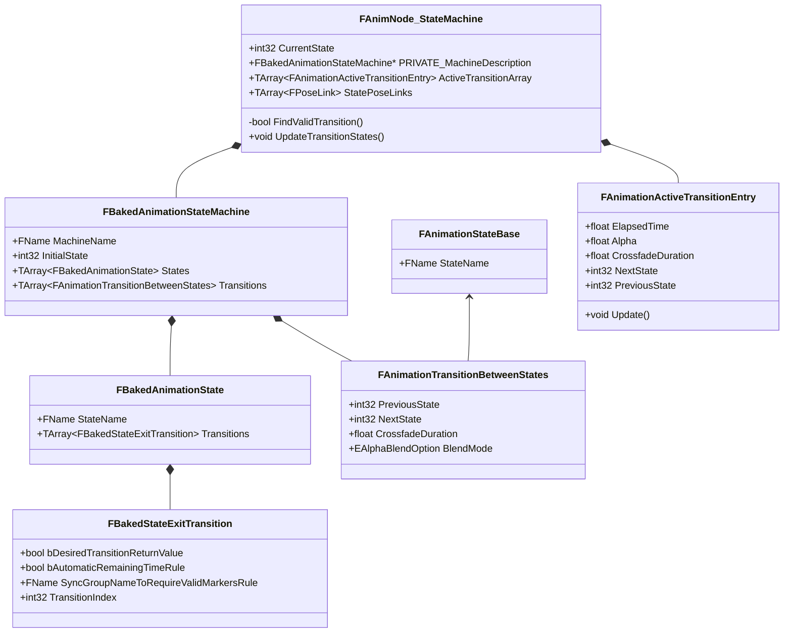
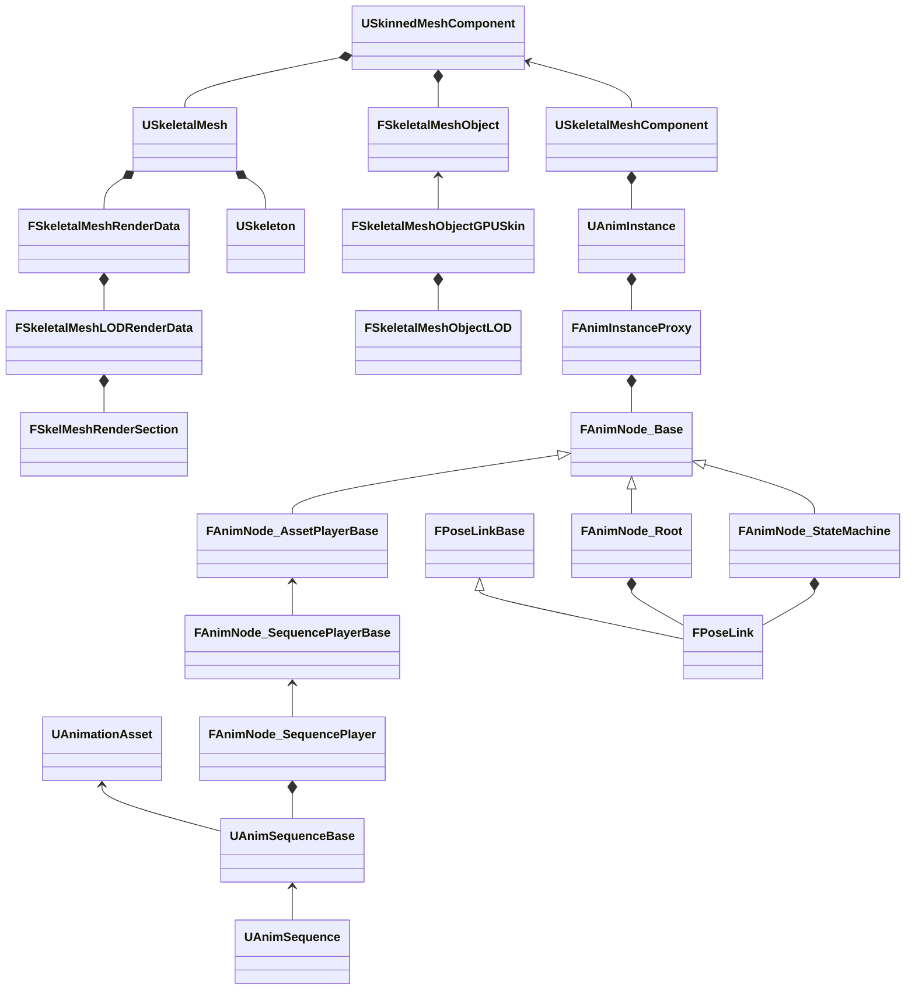
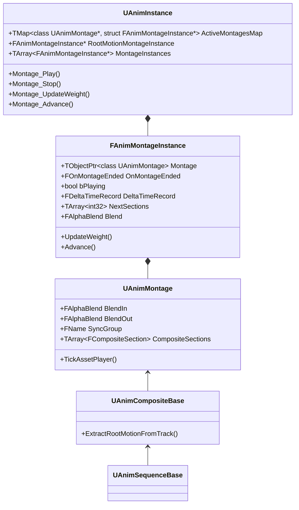

#### UE 动画系统源码阅读记录

#### 预备知识

##### 多线程

虚幻引擎中主要的线程有三个：

GameThread(主线程)：主要用来更新游戏逻辑，包括GamePlay、动画、物理等等

RenderThread：主要用来处理GameThread提交的渲染命令，将其转换为RHI线程中可以使用的渲染命令

RHIThread：主要用来处理RenderThread提交的渲染命令，将其转换为对应渲染API命令，以便发送至GPU处理渲染。

动画处理时，也会另起线程来处理动画更新流程，下文中会介绍到。

#### 涉及的类型

| 类名                              | 描述                                                         |
| --------------------------------- | ------------------------------------------------------------ |
| FSkelMeshRenderSection            | 表示模型的一个部分。保存这个部分的材质索引，在IndexBuffer中的顶点索引偏移，三角形数量，蒙皮的骨骼索引等 |
| FSkeletalMeshLODRenderData        | 表示模型在Lod层级的渲染数据。保存该Lod层级上的FSkelMeshRenderSection， 顶点Buffer，蒙皮权重Buffer，MorphTarget信息，布料信息以及该层级上的活跃的骨骼 |
| FSkeletalMeshRenderData           | 表示模型的渲染数据。保存一组FSkeletalMeshLODRenderData，以及Lod信息，包括有多少lod层级，当前正在使用哪个层级等等 |
| USkeletalMesh                     | 表示一组组成模型表面的多边形和一个与之对应的骨架。包括FSkeletalMeshRenderData数据 |
| FSkeletalMeshObject               | 模型渲染数据的接口，包括初始化渲染资源、更新渲染资源、获取VertexFacotry等接口.负责将FSkeletalMeshRenderData中的渲染数据处理成GPU可以使用的格式 |
| FSkeletalMeshObjectLOD            | 对应于FSkeletalMeshObjectLOD                                 |
| FSkeletalMeshObjectCPUSkin        | 负责CPUSkin的渲染实现.                                       |
| FSkeletalMeshObjectGPUSkin        | 负责GPUSkin的渲染接口(PC上默认是GPUSkin)                     |
| FGPUBaseSkinVertexFactory         | GPU蒙皮的顶点工厂                                            |
| FDynamicSkelMeshObjectDataGPUSkin | 一系列蒙皮所需的矩阵（Transform变换信息）。游戏线程与渲染线程通信的主要数据结构 |
| UAnimInstance                     | 动画蓝图类                                                   |
| FAnimInstanceProxy                | 动画更新代理类，为了支持在游戏线程之外的线程上更新动画而产生的类。多线程更新动画 |
| USkinnedMeshComponent             | 支持蒙皮                                                     |
| USkeletalMeshComponent            | 支持动画                                                     |

### 部分类详解

#### FSkelMeshRenderSection

表示SkeletalMesh的一个部分

#### 成员变量

- uint16 MaterialIndex 材质索引
- uint32 BaseIndex 在IndexBuffer中的偏移值
- uint32 NumTriangles Section中包含的三角形数量
- TArray<FBoneIndexType> BoneMap;  影响Section的骨骼索引数组
- uint32 NumVertices; 顶点数量

#### FSkeletalMeshLODRenderData

表示模型在Lod层级的渲染数据

##### 成员变量

- TArray<FSkelMeshRenderSection>	RenderSections; 一组组成整个SkeletalMesh的RenderSection
- VertexBuffers、IndexBuffer等
- FSkinWeightVertexBuffer		SkinWeightVertexBuffer;  SkinWeightBuffer
- TArray<FBoneIndexType> ActiveBoneIndices;  活跃的骨骼Index
- TArray<FBoneIndexType> RequiredBones; Lod层的骨骼

#### FSkeletalMeshRenderData

- TIndirectArray<FSkeletalMeshLODRenderData> LODRenderData; 渲染数据
- LodIndex

#### USkeleton

##### 成员变量

- TArray<FBoneNode> BoneTree;

  骨骼树的数组。FBoneNode中定义了骨骼的名字和父类在数组中的索引
  
- FRerenceSkeleton ReferenceSkeleton;

  这个对象中保存了在原始资源中的骨骼，包括名字和变换(A-Pose/T-Pose)，也保存在用户编辑后添加的虚拟骨骼数据。

#### USkeletalMesh

当游戏或编辑器加载时，磁盘数据首先会被反序列化到此类的成员变量中。

##### 成员变量

- TUniquePtr<FSkeletalMeshRenderData> SkeletalMeshRenderData;
- TObjectPtr<USkeleton> Skeleton;

#### USkinnedMeshComponent

负责蒙皮的类

- TObjectPtr<class USkeletalMesh> SkeletalMesh

- TArray<FTransform> ComponentSpaceTransformsArray[2]

  动画线程和主线程用于骨骼矩阵交换的Buffer

#### USkeletalMeshComponent

负责动画的类

- TObjectPtr<UAnimInstance> AnimScriptInstance

  动画蓝图实例

#### UAnimInstance

动画蓝图类，负责动画更新以及输出每帧的姿势

- TObjectPtr<USkeleton> CurrentSkeleton;

- TArray<struct FAnimMontageInstance*> MontageInstances;

  动画Montage数组

- FAnimInstanceProxy* AnimInstanceProxy;

  负责多线程更新动画的代理类实例

#### FAnimInstanceProxy

负责多线程更新动画的代理类

- FAnimNode_Base* RootNode;

  动画蓝图根节点，通过这个节点可以更新和计算所有动画蓝图节点

#### 渲染（蒙皮）相关类图



动画图表数据结构

所有在动画图表中用到的动画节点都继承自FAnimNode_base,以下是其类图，简单展示了其两个子节点以及节点间链接的抽象类

其中FAnimNode_Root是在AnimInstance中存储的动画图表的根节点，负责链接动画蓝图和节点，其中包含一个FPoseLinkBase链接，链接到动画图表中具体的节点。这个具体的节点可以是FAnimNode_StateMachine或者是其他输入姿势的节点。

#### 动画节点相关类图



状态机




关系图




#### SkeletalMeshComponent初始化

流程简介

1. `UActorComponent::ExecuteRegisterEvents`会在游戏启动时执行，主要负责创建和初始化游戏对象的动画，渲染，物理等状态

```c++
UActorComponent::ExecuteRegisterEvents()
{
    // 动画
	USkeletalMeshComponent::OnRegister();
    {
        USkeletalMeshComponent::InitAnim(bool bForceReinit);
        {
            TickAnimation();
            RefreshBoneTransforms();
        }
    }
    
    // 渲染
    USkinnedMeshComponent::CreateRenderState_Concurrent(FRegisterComponentContext* Context);
    {
        // 创建MeshObject，保存蒙皮数据，是游戏线程与渲染线程传递数据的对象
        // 区分GPUSkin和CPUSkin，默认GPUSkin
        MeshObject = ::new FSkeletalMeshObjectGPUSkin(this, SkelMeshRenderData, SceneFeatureLevel);
        {
            // 创建FSkeletalMeshObjectLOD，用来保存FSkeletalMeshLODRenderData
            InitResources();
            {
                FSkeletalMeshObjectLOD::InitResources();
                {
                    GPUSkinVertexFactories.InitVertexFactories(VertexBuffers, LODData.RenderSections, InFeatureLevel);
                    {
                        CreateVertexFactory(VertexFactories, VertexBuffers, InFeatureLevel);
                        {
                            // RenderThread
                            InitGPUSkinVertexFactoryComponents();
                            {
                                // 绑定BoneIndex
                                // 绑定SkinWeight
                            }
                        }
                    }
                }
            }
        }
        
        // 创建渲染线程的资源
        UPrimitiveComponent::CreateRenderState_Concurrent(FRegisterComponentContext* Context);
        {
            //渲染Dirty标记设置
            UActorComponent::CreateRenderState_Concurrent();
           	// 在渲染线程上创建游戏线程对象的代理
            GetWorld()->Scene->AddPrimitive(this);
            FScene::AddPrimitive(Primitive);
            {
                Primitive->CreateSceneProxy();
            }
        }
        
        // 更新MeshObject动态渲染数据
    }
    
    // 物理
    UActorComponent::CreatePhysicsState(true);
    {
        
    }
}
```

`USkeletalMeshComponent::OnRegister()` 负责创建和初始化动画相关的资源，主要调用了`USkeletalMeshComponent::InitAnim`

```c++
USkeletalMeshComponent::OnRegister();
{
    USkeletalMeshComponent::InitAnim(bool bForceReinit);
    {
        // 根据lodindex计算需要更新的骨骼
        RecalcRequiredBones();
        {
            // FSkeletalMeshLODRenderData数据中已经保存了LodIndex对应的普通骨骼数组数据
            // 添加虚拟骨骼
            // 添加物理骨骼,确保PhysicsAsset中用到的骨骼都在更新列表中
            // 删除不可见的骨骼
            // 添加镜像骨骼
            // 添加Socke骨骼
            // 添加ShadowShapeBones
        }

        USkeletalMeshComponent::InitializeAnimScriptInstance(bool bForceReinit, bool bInDeferRootNodeInitialization);
        {
            // 创建并初始化AnimInstance对象
            // 动画蓝图节点的初始化，例如状态机节点的初始化
            UAnimInstance::InitializeAnimation(bool bInDeferRootNodeInitialization)；
            {
                // 创建并初始化FAnimInstanceProxy对象
                FAnimInstanceProxy::Initialize();
                {
                    // 初始化一些对象，例如Skeleton,SkeltetalMeshCom等
                    // URO优化初始化
                    
                    // 从蓝图中获取RootNode
                }
            }
        	// 比如调用动画蓝图的BeginPlay等事件
        	// 更新MorphTargets
            

            FAnimInstanceProxy::InitializeRootNode();
            {
                // 初始化FAnimNode_StateMachine，设置BakedStateMachine
                // 缓存所有需要preupdate的node
                // 缓存所有dynamic reset nodes
                
                // 初始化RootNode, 动画节点的初始化
            }
        }

        
        // 更新动画，详细内容在下文中描述
        TickAnimation();
        
        // 更新骨骼Transform画，详细内容在下文中描述
        RefreshBoneTransforms();
        
        // 更新Component的坐标
        UpdateComponentToWorld();
    }
}
```

### SkeletalMesh更新

#### 动画更新

```c++
// GameThread
USkeletalMeshComponent::TickComponent()
{
    // 布料数据更新
	
    USkinnedMeshComponent::TickComponent(float DeltaTime, enum ELevelTick TickType, FActorComponentTickFunction *ThisTickFunction)；
    {
        // Lod计算
        // 如果需要先TickPose
         USkeletalMeshComponent::TickPose(float DeltaTime, bool bNeedsValidRootMotion)；
         {
             // URO优化
             USkeletalMeshComponent::TickAnimation(float DeltaTime, bool bNeedsValidRootMotion)
             {
                 USkeletalMeshComponent::TickAnimInstances(float DeltaTime, bool bNeedsValidRootMotion);
                 {
                     // 动画蓝图更新
                     // 主线程中的动画蓝图更新主要负责:
                     // 1 PreUpdateAnimation
                     // 2 montage更新
                     // 3 事件图表的更新
                     UAnimInstance::UpdateAnimation(DeltaTime * GlobalAnimRateScale, bNeedsValidRootMotion)
                 }
             }
         }
        
        if( ShouldUpdateTransform(bLODHasChanged) )
        {
            // 更新骨骼矩阵
            RefreshBoneTransforms(ThisTickFunction);
        }
        else
        {
            // 多线程更新
        	USkeletalMeshComponent::DispatchParallelTickPose(ThisTickFunction);
        }
        
        // 将标记为置为Dirty
        UActorComponent::MarkRenderDynamicDataDirty();
    }
}
```


```c++
// GameThread
USkeletalMeshComponent::RefreshBoneTransforms(FActorComponentTickFunction* TickFunction)
{
    // 初始化AnimEvaluationContext
    
    // 如果需要更新动画
    {
        // 动画初始化时，更新一次动画
        TickAnimation(0.f, false);
    }
    
    // 如果开启多线程更新动画
    if (bDoParallelEvaluation)
    {
        USkeletalMeshComponent::DispatchParallelEvaluationTasks();
        {
            // 交换TransformBuffer，以便蒙皮时主线程和渲染线程使用
            SwapEvaluationContextBuffers();

            // 创建FParallelAnimationEvaluationTask
            FParallelAnimationEvaluationTask::DoTask()
            {
                Comp->ParallelAnimationEvaluation();
            }

            // 创建FParallelAnimationCompletionTask
            FParallelAnimationCompletionTask::DoTask()
            {
                Comp->CompleteParallelAnimationEvaluation(bPerformPostAnimEvaluation);
            }
        } 
    }   
    // 否则
    {
        // 在主线程更新动画
        DoParallelEvaluationTasks_OnGameThread();
    }
}
```


```c++
// 动画更新线程
USkeletalMeshComponent::ParallelAnimationEvaluation();
{
    PerformAnimationProcessing();
    {
        UAnimInstance::ParallelUpdateAnimation();
        
        //输出这一帧骨骼的姿势（骨骼空间下）
        EvaluateAnimation(InSkeletalMesh, InAnimInstance, OutRootBoneTranslation, OutCurve, EvaluatedPose, Attributes);
        {
            UInAnimInstance::ParallelEvaluateAnimation(bForceRefpose, InSkeletalMesh, EvaluationData);
        }
        
        FinalizePoseEvaluationResult()
        {
            // 拷贝FCompactPose的数据到OutBoneSpaceTransforms中
            // 计算Root骨骼的位移
        }
        
        // 将骨骼的Transform从BoneSpace转换到组件空间下
        FillComponentSpaceTransforms();
    }
    
    // 插值
    ParallelDuplicateAndInterpolate();
}
```

#### 动画蓝图更新

```c++
// GameThread
UAnimInstance::UpdateAnimation(float DeltaSeconds, bool bNeedsValidRootMotion, EUpdateAnimationFlag UpdateFlag);
{
    UAnimInstance::PreUpdateAnimation(DeltaSeconds);
    {
        // 重置动画通知队列
        FAnimInstanceProxy::PreUpdate(DeltaSeconds);
        {
            // 准备一些在动画线程中会用的的数据
            // 如Skeleton、Component的transform数据等
            
            //对动画蓝图中的需要PreUpdate的每个AnimNode调用PreUpdate();
        }
    }
    
    // 动画蒙太奇更新
    UpdateMontage(DeltaSeconds);
    
   	// 动画蓝图事件图表更新，主要负责计算动画图表需要的数据
    BlueprintUpdateAnimation(DeltaSeconds);
    
    // 初始化时,bShouldImmediateUpdate为true
    if (bShouldImmediateUpdate)
    {
        // 初始化时，GameThread更新一次动画
        ParallelUpdateAnimation();
        PostUpdateAnimation();
    }
}
```

```c++

// 动画更新线程
UAnimInstance::ParallelUpdateAnimation();   
{
    FAnimInstanceProxy::UpdateAnimation();
    {
        // 初始化FAnimationUpdateContext
        // FAnimInstanceProxy
        // BlendWeight
        // DeltaTime
        
        // 此处的RootNode就是以AnimGraph为名的动画蓝图根节点
        UpdateAnimation_WithRoot(Context, RootNode, NAME_AnimGraph);
        {
            // ?
            CacheBones();

            // 多线程更新事件图表
            UAnimInstance::NativeThreadSafeUpdateAnimation();
            UAnimInstance::BlueprintThreadSafeUpdateAnimation();

            UpdateAnimationNode_WithRoot();
            {
                UpdateAnimationNode();
                {
                    InRootNode->Update_AnyThread(InContext);
                    {
                        FPoseLink::Update()
                        {
                            // LinkedNode是动画图表中具体的可以输入姿势的节点，如FAnimNode_StateMachine等
                            LinkedNode->Update_AnyThread(LinkContext);
                        }
                    }
                }
            }
        }
    }
}
    
```

```c++
// 动画更新线程
UAnimInstance::ParallelEvaluateAnimation(bool bForceRefPose, const USkeletalMesh* InSkeletalMesh, FParallelEvaluationData& OutEvaluationData)
{
    // 创建并初始化FPoseContext
    // FAnimInstanceProxy
    // FCompactPose:记录姿势。（RequiredBone骨骼索引的数组）
    // FBlendedCurve
    
	FAnimInstanceProxy::EvaluateAnimation_WithRoot();
    {
        Evaluate_WithRoot();
        {
            InRootNode->Evaluate_AnyThread(Output);
            {
                FPoseLink::Evaluate(FPoseContext& Output);
                {
                    // LinkedNode是动画图表中具体的可以输入姿势的节点，如FAnimNode_StateMachine等
                    LinkedNode->Evaluate_AnyThread(Output);
                }
            }
        }
    }
}
```

```c++
// 动画更新线程
// 以Sequence_player为例

InRootNode->Update_AnyThread(InContext);
{
    FPoseLink::Update()
    {
        // LinkedNode是动画图表中具体的可以输入姿势的节点，如FAnimNode_StateMachine等
        FAnimNode_AssetPlayerBase::Update_AnyThread(LinkContext);
        {
            FAnimNode_SequencePlayerBase::UpdateAssetPlayer();
            {
                // ?
                FAnimNode_AssetPlayerBase::CreateTickRecordForNode();
                {
                    
                }
            }
        }
    }
}

```

```c++
// 动画更新线程
// 以Sequence_player为例
InRootNode->Evaluate_AnyThread(Output);
{
    FPoseLink::Evaluate(FPoseContext& Output);
    {
        // LinkedNode是动画图表中具体的可以输入姿势的节点，如FAnimNode_StateMachine等
        FAnimNode_SequencePlayerBase::Evaluate_AnyThread(FPoseContext& Output)；
        {
            //
            FAnimationPoseData AnimationPoseData(Output);
            UAnimSequence::GetAnimationPose();
            {
                UAnimSequence::GetBonePose();
                {
                    // 提取曲线数据
                    UAnimSequence::EvaluateCurveData();
                    // 提取骨骼变换数据，Pose
                    DecompressPose() 
			   }
            }
        }
    }
}
```

```c++
// 动画更新线程
// 以StateMachine为例
InRootNode->Initialize_AnyThread(Output);
{
    FPoseLink::Initialize();
    {
        FAnimNode_StateMachine::Initialize_AnyThread();
        {
            // 根据FBakedAnimationStateMachine的state创建StatePoseLinks
            // 设置StatePoseLink的LinkID，之后根据LinkID获取AnimNode
            
            // 初始化FAnimNode_TransitionResult，这个结构体包含了条件语句的代理函数，负责计算是否满足转换条件
            
            // 设置state
            SetState(Context, Machine->InitialState);
            {
                // 调用OnGraphStatesExited回调
                // 设置CurrentState
                
                // 当前State节点初始化
                // StatePoseLink链接的节点初始化
                
                // OnGraphStatesEntered调用
            }
        }
    }
}

```

```c++
// 动画更新线程
// 以StateMachine为例

// 找到可以转换的节点，进行转换

FAnimNode_StateMachine::Update_AnyThread()
{
    // 找到满足条件的转换PotentialTransition
	FAnimNode_StateMachine::FindValidTransition();
    {
        // 获取当前State的StateEntryRuleNode节点并执行其条件代理函数，获得是否满足转换条件的结果
        
        // 遍历当前State的所有ExitTransition，遍历的顺序优先级从高到低的顺序
       	// 根据ExitTransition.CanTakeDelegateIndex获取条件判断代理节点FAnimNode_TransitionResult
        
        // 如果设置了同步组，判断是否满足同步组的条件
        
        // 或者如果有条件判断代理，则执行条件判断代理
        
        // 如果是bAutomaticRemainingTimeRule，判断当前节点动画剩余时间是否小于混出时间

        // 如果bCanEnterTransition为true，获取转换终点State，
        // 如果下一个State是Conduit，则再执行一次FindValidTransition(),找到满足条件的State
        // 否则用获得数据填充OutPotentialTransition，然后整个函数返回
        // 如果bCanEnterTransition为false, 则继续
    }
    
    // 如果需要转换State：
    // 触发上一个转换的InterruptNotify(添加到通知队列中)
    // 触发当前状态的EndNotify(添加到通知队列中)
    // 触发下一个状态的StartNotify(添加到通知队列中)
    // 创建新的FAnimationActiveTransitionEntry，添加到ActiveTransitionArray中
    // 将当前状态设置为转换后的状态
    
    // 继续寻找可以转换的状态直到找不到或者超过最大寻找次数为止

    // 遍历ActiveTransitionArray
    FAnimationActiveTransitionEntry::Update();
    {
        // 根据DeltaTime和CrossfadeDuration更新混合参数
        // 输出是否过渡完成
    }
    
    // 过渡完成之后添加通知时间到通知队列中
    
   	// 过渡过程
    // 调用节点的Update_AnyThread
    FAnimNode_StateMachine::UpdateTransitionStates()
    {
        // 标准混合模式，按权重更新混出节点和混入节点

        // 惯性化混合，只更新混入节点
    }
    
    // 删除ActiveTransitionArray数组中已经完成混合的Transition
    
    
    // 如果没有发生过Transition
    // 更新当前节点Update_AnyThread
    
    
}
```

```c++
// 动画更新线程
// 以StateMachine为例

FAnimNode_StateMachine::Evaluate_AnyThread()
{
    // ActiveTransitionArray.Num() > 0时，正在转换时
    
    // 根据混合模式调用不同的函数
    // 标准混合时
    EvaluateTransitionStandardBlend(Output, ActiveTransition, bIntermediatePoseIsValid);
    {
       // 对混入节点 调用Evaluate_AnyThread，获取姿势
        
        // 当前节点的姿势、曲线与混入节点的姿势、曲线作混合
        
    }
    
    // 惯性化混合时
    EvaluateState(ActiveTransition.NextState, Output);
    {
        // 直接对混入节点作Evaluate_AnyThread，输出姿势
    }
    
    // 没发生转换时
    // Evaluate当前节点（Evaluate_AnyThread）
}
```


```c++
USkeletalMeshComponent::CompleteParallelAnimationEvaluation(bool bDoPostAnimEvaluation)
{
    //交换Buffer
    SwapEvaluationContextBuffers();
	PostAnimEvaluation(FAnimationEvaluationContext& EvaluationContext);
    {
        UAnimInstance::PostUpdateAnimation();
        {
            FAnimInstanceProxy::PostUpdate();
            {
                // 将通知队列加入到UAnimInstance的通知队列中
            }
            
            // 累计RooMotion变换
            // RootMotion处理
        }
       
        // MorphTarget曲线处理
        // 其他曲线值处理
        
        // 处理BlueprintPostEvaluateAnimation事件
        UAnimInstance::PostEvaluateAnimation();
        {
            FAnimInstanceProxy::PostEvaluate();
        }
    
       	// 更新物理动画数据
        
        USkeletalMeshComponent::FinalizeAnimationUpdate();
        {
            USkeletalMeshComponent::FinalizeBoneTransform();
            {
                //处理动画通知事件
               USkeletalMeshComponent::ConditionallyDispatchQueuedAnimEvents();
                {
                    UAnimInstance::DispatchQueuedAnimEvents();
                }
                
                // 更新子Component的位置
                USceneComponent::UpdateChildTransforms();
                
                // Need to send new bounds to 
                MarkRenderTransformDirty();

                // New bone positions need to be sent to render thread
                MarkRenderDynamicDataDirty(); 
            }
        }
    }
}

```

#### 渲染(蒙皮)

```c++
USkinnedMeshComponent::CreateRenderState_Concurrent(FRegisterComponentContext* Context);
{
    // 创建MeshObject，保存蒙皮数据，是游戏线程与渲染线程传递数据的对象
    // 区分GPUSkin和CPUSkin，默认GPUSkin
    MeshObject = ::new FSkeletalMeshObjectGPUSkin(this, SkelMeshRenderData, SceneFeatureLevel);
    {
        // 创建FSkeletalMeshLODRenderData对应的FSkeletalMeshObjectLOD
        
        InitResources();
        {
            FSkeletalMeshObjectLOD::InitResources();
            {
                // 从FSkeletalMeshLODRenderData中获取SkinWeightBuffer， ColorBuffer信息
                
                // FSkeletalMeshLODRenderData获取VertexBuffer信息，以便后续初始化使用GPUSkinVertexFactory时使用
                GPUSkinVertexFactories.InitVertexFactories(VertexBuffers, LODData.RenderSections, InFeatureLevel);
                {
                    // 为每个section调用一次
                    CreateVertexFactory(VertexFactories, VertexBuffers, InFeatureLevel);
                    {
                        //根据Influence的类型创建TGPUSkinVertexFactory实例，并且添加到数组中
                        //
                        
                        // RenderThread
                       
                        InitGPUSkinVertexFactoryComponents();
                        {
                            // 初始化FGPUSkinDataType对象
                            // FGPUSkinDataType对象绑定了位置，法线，顶点颜色等信息
                            
                            // 初始化ShaderData
                            // 绑定BoneIndex
                            // 绑定SkinWeight
                        }
                        
                        // 为GPUSkinVertexFactory设置Data
                        
                        GPUSkinVertexFactory::InitResource()
                    }
                }
            }
        }
    }
    
    // 创建渲染线程的资源
    UPrimitiveComponent::CreateRenderState_Concurrent(FRegisterComponentContext* Context);
    {
        //渲染Dirty标记设置
        UActorComponent::CreateRenderState_Concurrent();
       	// 在渲染线程上创建游戏线程对象的代理
        GetWorld()->Scene->AddPrimitive(this);
        FScene::AddPrimitive(Primitive);
        {
            Primitive->CreateSceneProxy();
        }
    }
    
    // 更新MeshObject动态渲染数据
}
```

蒙皮实现概述

蒙皮过程就是模型顶点跟随对应骨骼的运动的过程。首先我们得了解几个空间：

- 世界空间
  - 最终模型顶点坐标会转换到这个空间下交由GPU去渲染
- 模型空间
  - 顶点初始位置是相对于模型空间的，即顶点buffer中的信息是定义在模型空间下的
- 骨骼空间
  - 动画中骨骼的Transform数据是定义在骨骼空间下的

还得了解A-Pose(T-Pose)，即模型和动画的初始动作，骨骼的初始位置，在UE中叫做`Reference Pose`, 在Unity中叫做BindPose

动画师在制作模型、骨骼时，都会有一个初始Pose，顶点与骨骼的蒙皮信息都是在这个Pose下定义的，也就是说后续动画如何改变骨骼的位置，对应顶点与骨骼的相对位置应该一直保持不变。动画中每帧的数据存储了骨骼在骨骼空间下的变换，所以一般引擎动画数据中都会存储一个专门的矩阵，用来先将模型空间下顶点的坐标信息转换到骨骼空间下。采集完动画中的骨骼变换信息后，先要将每根骨骼的变换转换到模型空间下，只需将每根骨骼乘以其父骨骼的变换即可。下面将以上过程公式化

下列公式中应m表示模型空间，b表示`BindPose(Reference Pose)`， l 表示骨骼空间, t 表示时刻

$V_b^m$ 表示模型空间下顶点在`BindPose`时的坐标

$V_b^l$ 表示在骨骼空间下顶点在`BindPose`时的坐标

$M_b^m(j)$ 表示在模型空间下骨骼在`BindPose`时的变换矩阵

则在`BindPose`下顶点在骨骼空间的坐标
$$
V_b^l = {M_b^m(j)}^{-1} · V_b^m
$$
$M_j^m$ 表示时刻t时，骨骼J在模型空间下的变换
$$
M_J^m(t) = \prod_{j=J}^{0}.{M_p^l(t)}
$$
则蒙皮后在时刻t，顶点V在模型空间下的位置
$$
V^m(t) = M_J^m(t)\cdot V_b^l
$$

$$
V^m(t) =  \prod_{j=J}^{0}.{M_p^l(t)}\cdot{M_b^m(j)}^{-1} · V_b^m
$$

则蒙皮矩阵为
$$
K_j =  \prod_{j=J}^{0}.{M_p^l(t)}\cdot{M_b^m(j)}^{-1}
$$
下文中的`RefToLocal`矩阵就是${M_b^m(j)}^{-1}$,一般由引擎计算与存储下来。

```c++
// RenderThread
// shader binding
void FGPUSkinVertexFactoryShaderParameters::Bind(const FShaderParameterMap& ParameterMap)
{
    PerBoneMotionBlur.Bind(ParameterMap,TEXT("PerBoneMotionBlur"));
    BoneMatrices.Bind(ParameterMap,TEXT("BoneMatrices"));
    PreviousBoneMatrices.Bind(ParameterMap,TEXT("PreviousBoneMatrices"));
    InputWeightIndexSize.Bind(ParameterMap, TEXT("InputWeightIndexSize"));
    InputWeightStream.Bind(ParameterMap, TEXT("InputWeightStream"));
    NumBoneInfluencesParam.Bind(ParameterMap, TEXT("NumBoneInfluencesParam"));   
}

// 
void FGPUSkinVertexFactoryShaderParameters::GetElementShaderBindings()
{
    if (BoneMatrices.IsBound())
    {
        FRHIShaderResourceView* CurrentData = ShaderData.GetBoneBufferForReading(false).VertexBufferSRV;
        ShaderBindings.Add(BoneMatrices, CurrentData);
    }
}
```


```c++
// GameThread
USkinnedMeshComponent::SendRenderDynamicData_Concurrent();
{
	FSkeletalMeshObjectGPUSkin::Update();
    {
        // 创建DynamicData并且初始化
        // 更新变换数据
        FDynamicSkelMeshObjectDataGPUSkin::InitDynamicSkelMeshObjectDataGPUSkin();
        {
            // 计算蒙皮矩阵Kj
            UpdateRefToLocalMatrices();
            {
                // 动画更新后的组件空间下的骨骼变换
                const TArray<FTransform>& ComponentTransform = InMeshComponent->GetComponentSpaceTransforms();
                // 将顶点转换到骨骼空间下的矩阵
                const TArray<FMatrix44f>* RefBasesInvMatrix = &ThisMesh->GetRefBasesInvMatrix();
            }
            
            // Morph Target更新
            
            // 布料模拟数据更新
        }
        
        // 添加更新骨骼矩阵的Command到渲染线程ENQUEUE_RENDER_COMMAND
        FSkeletalMeshObjectGPUSkin::UpdateDynamicData_RenderThread(FDynamicSkelMeshObjectDataGPUSkin* DynamicData)
    }
}
```

```c++
// RenderThread
FSkeletalMeshObjectGPUSkin::UpdateDynamicData_RenderThread(FDynamicSkelMeshObjectDataGPUSkin* DynamicData);
{
    // 释放内存
	ProcessUpdatedDynamicData()
    {
        // Morph Target处理
        
        FGPUBaseSkinVertexFactory::FShaderDataType::UpdateBoneData();
        {
            // 将BoneMatrix数据传入到GPU Buffer中
        }
    }
}
```

```c
// GpuSkinVertexFactory.ush


// 骨骼变换矩阵
#define FBoneMatrix float3x4

#if GPUSKIN_USE_BONES_SRV_BUFFER

// The bone matrix buffer stored as 4x3 (3 float4 behind each other), all chunks of a skeletal mesh in one, each skeletal mesh has it's own buffer
STRONG_TYPE Buffer<float4> BoneMatrices;
// The previous bone matrix buffer stored as 4x3 (3 float4 behind each other), all chunks of a skeletal mesh in one, each skeletal mesh has it's own buffer
STRONG_TYPE Buffer<float4> PreviousBoneMatrices;

#endif

// Shader输入结构体
struct FVertexFactoryInput
{
	float4	Position		: ATTRIBUTE0;
	// 0..1
	HALF3_TYPE	TangentX		: ATTRIBUTE1;
	// 0..1
	// TangentZ.w contains sign of tangent basis determinant
	HALF4_TYPE	TangentZ		: ATTRIBUTE2;	
    
    // BoneIndex和BoneWeight等数据
#if GPUSKIN_UNLIMITED_BONE_INFLUENCE
	uint	BlendOffsetCount	: ATTRIBUTE3;
#else
	uint4	BlendIndices	: ATTRIBUTE3;
	uint4	BlendIndicesExtra	: ATTRIBUTE14;
	float4	BlendWeights	: ATTRIBUTE4;	
	float4	BlendWeightsExtra	: ATTRIBUTE15;
#endif // GPUSKIN_UNLIMITED_BONE_INFLUENCE


#if NUM_MATERIAL_TEXCOORDS_VERTEX
	// If this changes make sure to update LocalVertexFactory.usf
#if NUM_MATERIAL_TEXCOORDS_VERTEX > 0
	float2	TexCoords0 : ATTRIBUTE5;
#endif
#if NUM_MATERIAL_TEXCOORDS_VERTEX > 1
	float2	TexCoords1 : ATTRIBUTE6;
#endif
#if NUM_MATERIAL_TEXCOORDS_VERTEX > 2
	float2	TexCoords2 : ATTRIBUTE7;
#endif
#if NUM_MATERIAL_TEXCOORDS_VERTEX > 3
	float2	TexCoords3 : ATTRIBUTE8;
#endif

	#if NUM_MATERIAL_TEXCOORDS_VERTEX > 4
		#error Too many texture coordinate sets defined on GPUSkin vertex input. Max: 4.
	#endif
#endif

    // MORPH数据
#if GPUSKIN_MORPH_BLEND
	// NOTE: TEXCOORD6,TEXCOORD7 used instead of POSITION1,NORMAL1 since those semantics are not supported by Cg 
	/** added to the Position */
	float3	DeltaPosition	: ATTRIBUTE9;	//POSITION1;
	/** added to the TangentZ and then used to derive new TangentX,TangentY, .w contains the weight of the tangent blend */
	float3	DeltaTangentZ	: ATTRIBUTE10;	//NORMAL1;
#endif

#if GPUSKIN_MORPH_BLEND || GPUSKIN_APEX_CLOTH
	uint VertexID : SV_VertexID;
#endif

	/** Per vertex color */
	float4 Color : ATTRIBUTE13;

	// Dynamic instancing related attributes with InstanceIdOffset : ATTRIBUTE16
	VF_GPUSCENE_DECLARE_INPUT_BLOCK(16)
};

// Morph动画顶点数据计算
/** 
* Adds the delta position from the combined morph targets to the vertex position 
*/
float3 MorphPosition( FVertexFactoryInput Input, FVertexFactoryIntermediates Intermediates )
{
	return Intermediates.UnpackedPosition + Input.DeltaPosition;
}

// 将Buffer中的数据拼接为矩阵
FBoneMatrix GetBoneMatrix(int Index)
{
#if GPUSKIN_USE_BONES_SRV_BUFFER
	float4 A = BoneMatrices[Index * 3];
	float4 B = BoneMatrices[Index * 3 + 1];
	float4 C = BoneMatrices[Index * 3 + 2];
	return FBoneMatrix(A,B,C);
#else
	return Bones.BoneMatrices[Index];
#endif
}

// 根据权重和BoneIndex计算影响顶点的矩阵

FBoneMatrix CalcBoneMatrix( FVertexFactoryInput Input )
{
#if GPUSKIN_UNLIMITED_BONE_INFLUENCE
	int NumBoneInfluences = Input.BlendOffsetCount & 0xff;
	int StreamOffset = Input.BlendOffsetCount >> 8;
	int WeightsOffset = StreamOffset + (InputWeightIndexSize * NumBoneInfluences);

	FBoneMatrix BoneMatrix = FBoneMatrix(float4(0,0,0,0), float4(0,0,0,0), float4(0,0,0,0));
	for (int InfluenceIdx = 0; InfluenceIdx < NumBoneInfluences; InfluenceIdx++)
	{
		int BoneIndexOffset = StreamOffset + (InputWeightIndexSize * InfluenceIdx);
		int BoneIndex = InputWeightStream[BoneIndexOffset];
		if (InputWeightIndexSize > 1)
		{
			BoneIndex = InputWeightStream[BoneIndexOffset + 1] << 8 | BoneIndex;
			//@todo-lh: Workaround to fix issue in SPIRVEmitter of DXC; this block must be inside the if branch
			float BoneWeight = float(InputWeightStream[WeightsOffset + InfluenceIdx]) / 255.0f;
			BoneMatrix += BoneWeight * GetBoneMatrix(BoneIndex);
		}
		else
		{
			//@todo-lh: Workaround to fix issue in SPIRVEmitter of DXC; this block must be inside the if branch
			float BoneWeight = float(InputWeightStream[WeightsOffset + InfluenceIdx]) / 255.0f;
			BoneMatrix += BoneWeight * GetBoneMatrix(BoneIndex);
		}
	}
#else // GPUSKIN_UNLIMITED_BONE_INFLUENCE
	FBoneMatrix BoneMatrix = Input.BlendWeights.x * GetBoneMatrix(Input.BlendIndices.x);
	BoneMatrix += Input.BlendWeights.y * GetBoneMatrix(Input.BlendIndices.y);

#if !GPUSKIN_LIMIT_2BONE_INFLUENCES
	BoneMatrix += Input.BlendWeights.z * GetBoneMatrix(Input.BlendIndices.z);
	BoneMatrix += Input.BlendWeights.w * GetBoneMatrix(Input.BlendIndices.w);
	if (NumBoneInfluencesParam > MAX_INFLUENCES_PER_STREAM)
	{
		BoneMatrix += Input.BlendWeightsExtra.x * GetBoneMatrix(Input.BlendIndicesExtra.x);
		BoneMatrix += Input.BlendWeightsExtra.y * GetBoneMatrix(Input.BlendIndicesExtra.y);
		BoneMatrix += Input.BlendWeightsExtra.z * GetBoneMatrix(Input.BlendIndicesExtra.z);
		BoneMatrix += Input.BlendWeightsExtra.w * GetBoneMatrix(Input.BlendIndicesExtra.w);
	}
#endif//GPUSKIN_LIMIT_2BONE_INFLUENCES
#endif // GPUSKIN_UNLIMITED_BONE_INFLUENCE
	return BoneMatrix;
}

// 计算顶点shader需要用到的的数据，其中包括GPUSkin用到的BoneMatrix
FVertexFactoryIntermediates GetVertexFactoryIntermediates(FVertexFactoryInput Input)
{
	FVertexFactoryIntermediates Intermediates;
	Intermediates.SceneData				= VF_GPUSCENE_GET_INTERMEDIATES(Input);
	Intermediates.InvNonUniformScale	= GetInstanceData(Intermediates).InvNonUniformScale;
	Intermediates.DeterminantSign		= GetInstanceData(Intermediates).DeterminantSign;
	Intermediates.LocalToWorld			= GetInstanceData(Intermediates).LocalToWorld;
	Intermediates.WorldToLocal			= GetInstanceData(Intermediates).WorldToLocal;
	Intermediates.PrevLocalToWorld		= GetInstanceData(Intermediates).PrevLocalToWorld;
	Intermediates.UnpackedPosition		= UnpackedPosition(Input);

#if GPUSKIN_APEX_CLOTH
	SetupClothVertex(Input.VertexID, Intermediates.ClothVertexInfluences);
	if( IsSimulatedVertex(Intermediates.ClothVertexInfluences[0]) )
	{
		Intermediates.SimulatedPosition = ClothingPosition(Intermediates.ClothVertexInfluences, false);
#if GPUSKIN_APEX_CLOTH_PREVIOUS
		Intermediates.PreviousSimulatedPosition = ClothingPosition(Intermediates.ClothVertexInfluences, true);
#else
		Intermediates.PreviousSimulatedPosition = Intermediates.SimulatedPosition;
#endif
	}
	else
	{
		Intermediates.PreviousSimulatedPosition = Intermediates.SimulatedPosition = float4(Intermediates.UnpackedPosition, 0.0f);
	}
	
#endif

	Intermediates.BlendMatrix = CalcBoneMatrix( Input );

	// Fill TangentToLocal
	Intermediates.TangentToLocal = SkinTangents(Input, Intermediates);

	// Swizzle vertex color.
	Intermediates.Color = Input.Color FCOLOR_COMPONENT_SWIZZLE;

	return Intermediates;
}

// 顶点位置蒙皮
/** transform position by weighted sum of skinning matrices */
float3 SkinPosition( FVertexFactoryInput Input, FVertexFactoryIntermediates Intermediates )
{
#if GPUSKIN_MORPH_BLEND
	float3 Position = MorphPosition(Input, Intermediates);
#else
	float3 Position = Intermediates.UnpackedPosition;
#endif

	// Note the use of mul(Matrix,Vector), bone matrices are stored transposed
	// for tighter packing.
	Position = mul(Intermediates.BlendMatrix, float4(Position, 1));

	return Position;
}
```

------

#### 蒙太奇更新

#### 类图



#### 流程

```c++
// 播放
UAnimInstance::Montage_Play()
{
	UAnimInstance::Montage_PlayInternal()
	{
        // 创建并初始化FAnimMontageInstance，添加到记录的数组中
		FAnimMontageInstance* NewInstance = new FAnimMontageInstance(this);
	}
}

// 更新
UAnimInstance::UpdateAnimation()
{
    Montage_UpdateWeight(DeltaTime);
    {
        // 遍历所有的FAnimMontageInstance
        FAnimMontageInstance::UpdateWeight()
        {
            Blend.Update(DeltaTime);
        }
    }
    
    Montage_Advance(DeltaSeconds);
    {
        // 遍历所有FAnimMontageInstance
        FAnimMontageInstance::Advance()
        {
            
        }
    }
}
```

