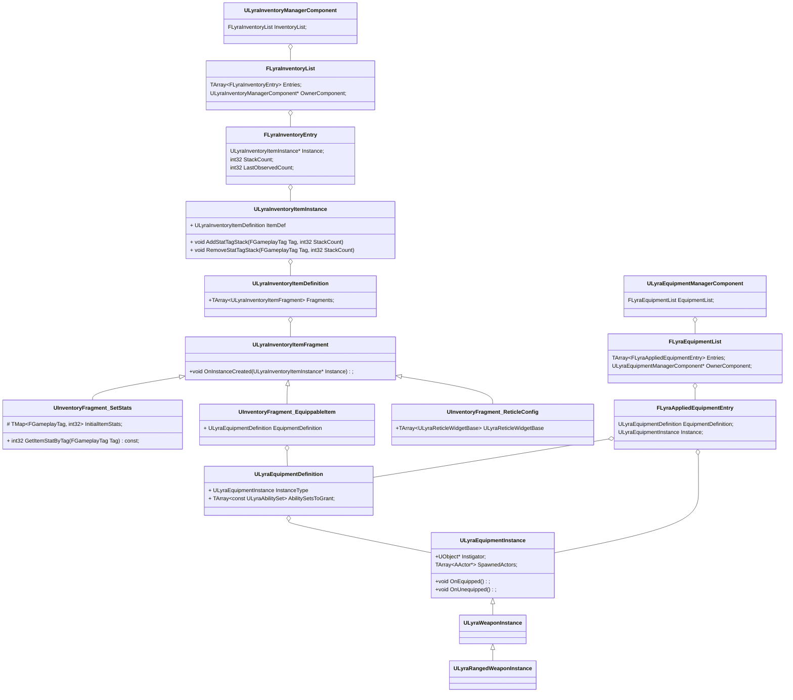
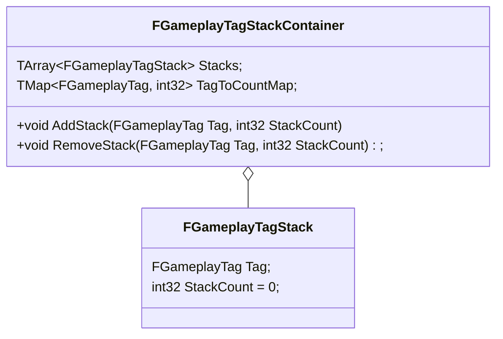

## 类图

```mermaid
classDiagram
class ULyraInventoryItemDefinition{
	+TArray~ULyraInventoryItemFragment~ Fragments;
}

class ULyraInventoryItemFragment{
	+void OnInstanceCreated(ULyraInventoryItemInstance* Instance);
}

class UInventoryFragment_SetStats{
	# TMap~FGameplayTag, int32~ InitialItemStats;
	+ int32 GetItemStatByTag(FGameplayTag Tag) const;
}

class UInventoryFragment_EquippableItem{
	+ ULyraEquipmentDefinition EquipmentDefinition
}

class UInventoryFragment_ReticleConfig{
	+TArray~ULyraReticleWidgetBase~ ULyraReticleWidgetBase
}

ULyraInventoryItemFragment<|--UInventoryFragment_SetStats
ULyraInventoryItemFragment<|--UInventoryFragment_EquippableItem
ULyraInventoryItemFragment<|--UInventoryFragment_ReticleConfig
ULyraInventoryItemDefinition o--ULyraInventoryItemFragment

class ULyraInventoryItemInstance{
	+ void AddStatTagStack(FGameplayTag Tag, int32 StackCount)
	+ void RemoveStatTagStack(FGameplayTag Tag, int32 StackCount)
	+ ULyraInventoryItemDefinition ItemDef
}

ULyraInventoryItemInstance o--ULyraInventoryItemDefinition

class ULyraEquipmentInstance{
	+UObject* Instigator;
	TArray~AActor*~ SpawnedActors;
	+void OnEquipped();
	+void OnUnequipped();
}

class ULyraEquipmentDefinition{
	+ ULyraEquipmentInstance InstanceType
	+ TArray~const ULyraAbilitySet~ AbilitySetsToGrant;
}

class ULyraWeaponInstance
class ULyraRangedWeaponInstance

ULyraEquipmentDefinition o--ULyraEquipmentInstance
ULyraEquipmentInstance<|--ULyraWeaponInstance
ULyraWeaponInstance<|--ULyraRangedWeaponInstance

UInventoryFragment_EquippableItem o--ULyraEquipmentDefinition

class FLyraAppliedEquipmentEntry{
	ULyraEquipmentDefinition EquipmentDefinition;
	ULyraEquipmentInstance Instance;
}

class FLyraEquipmentList{
	TArray~FLyraAppliedEquipmentEntry~ Entries;
	ULyraEquipmentManagerComponent* OwnerComponent;
}

class ULyraEquipmentManagerComponent{
	FLyraEquipmentList EquipmentList;
}

FLyraAppliedEquipmentEntry o--ULyraEquipmentDefinition
FLyraAppliedEquipmentEntry o--ULyraEquipmentInstance

FLyraEquipmentList o--FLyraAppliedEquipmentEntry
ULyraEquipmentManagerComponent o--FLyraEquipmentList

class FLyraInventoryEntry{
	ULyraInventoryItemInstance* Instance;
	int32 StackCount;
	int32 LastObservedCount;
}

class FLyraInventoryList{
	TArray~FLyraInventoryEntry~ Entries;
	ULyraInventoryManagerComponent* OwnerComponent;
}

class ULyraInventoryManagerComponent{
	FLyraInventoryList InventoryList;
}

FLyraInventoryEntry o-- ULyraInventoryItemInstance
FLyraInventoryList o--FLyraInventoryEntry
ULyraInventoryManagerComponent o--FLyraInventoryList

```

#### UInventoryFragment_SetStats

#### UInventoryFragment_EquippableItem

```mermaid
classDiagram
class FGameplayTagStack{
	FGameplayTag Tag;
	int32 StackCount = 0;
}
class FGameplayTagStackContainer{
	TArray~FGameplayTagStack~ Stacks;
	TMap~FGameplayTag, int32~ TagToCountMap;
	+void AddStack(FGameplayTag Tag, int32 StackCount)
	+void RemoveStack(FGameplayTag Tag, int32 StackCount);
}
FGameplayTagStackContainer o--FGameplayTagStack

```

------

------

