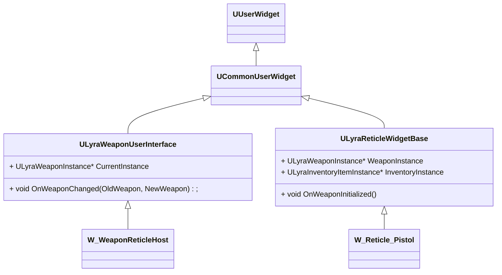

## UI相关



装备武器UI流程

```c++
void ULyraWeaponUserInterface::NativeTick(const FGeometry& MyGeometry, float InDeltaTime)
{
    // 找到Pawn身上的ULyraEquipmentManagerComponent获取当前WeaponInstance
    W_WeaponReticleHost::OnWeaponChanged(OldWeapon, CurrentInstance);
    {
        W_WeaponReticleHost::ClearExistingWidgets();
        AddChildOvelay
    }
}
```

界面UI添加流程

```c++

```

