## GAS架构设计

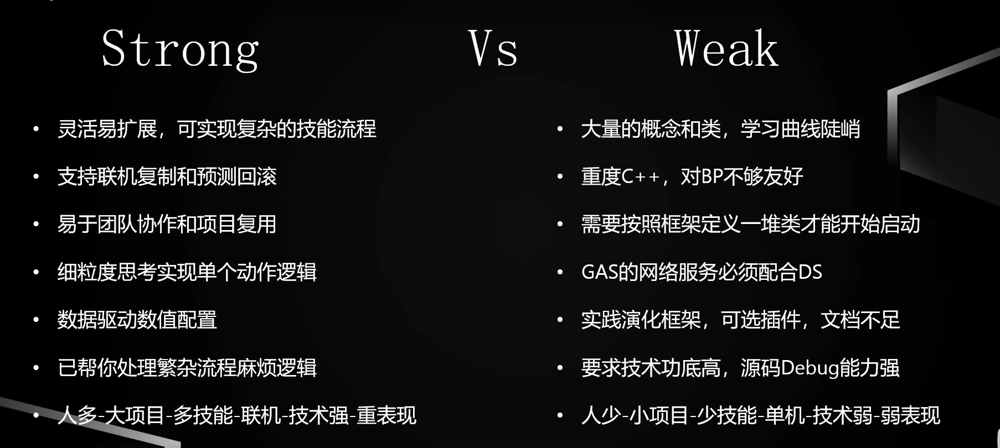

 将一个技能系统里可以变化的部分解耦出来独立的变化

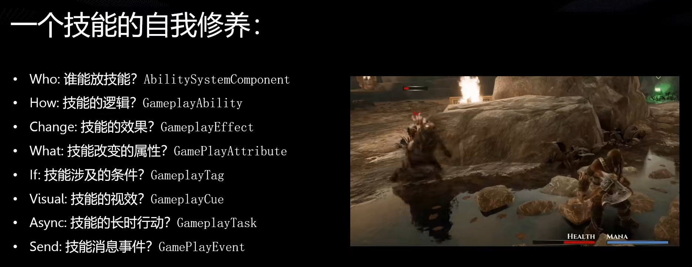

通过GameplayTag的判断和组合查询来生成各种条件判断

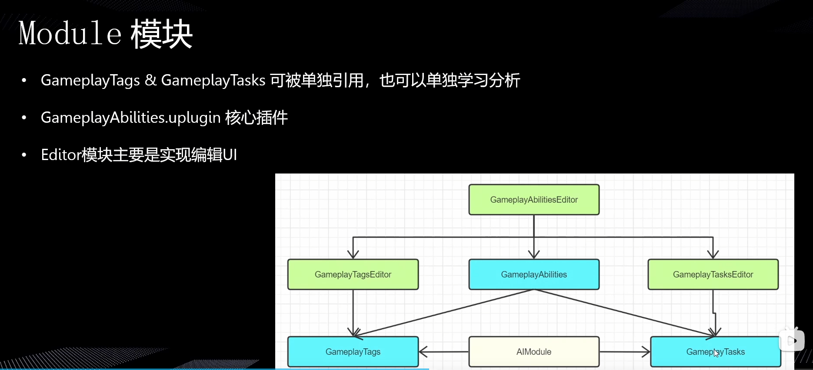

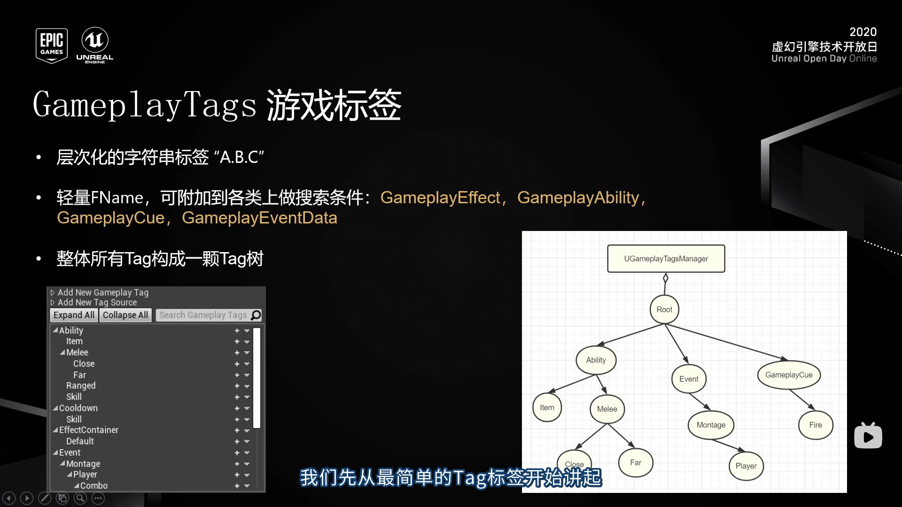

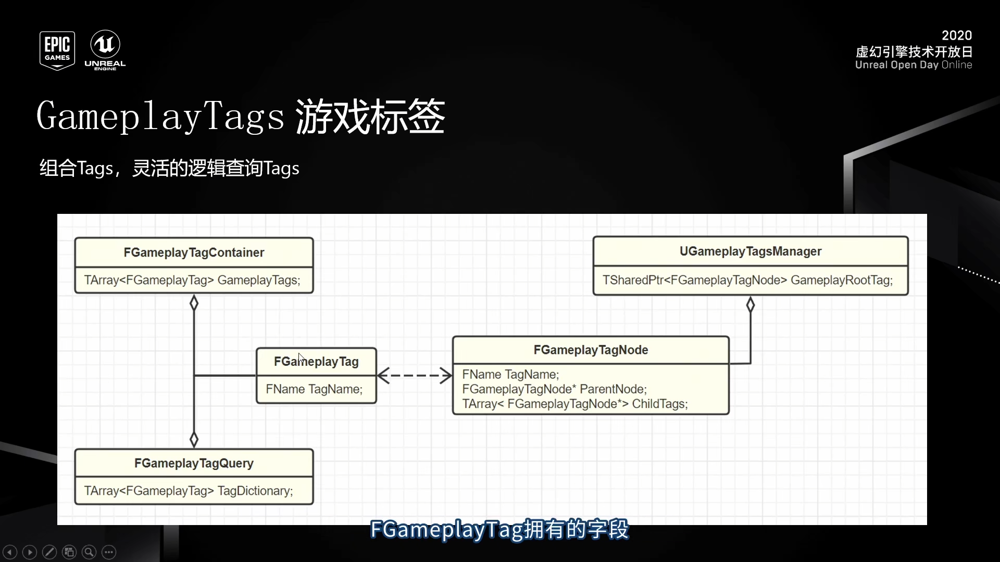

UE_DEFINE_GAMEPLAY_TAG定义Tag

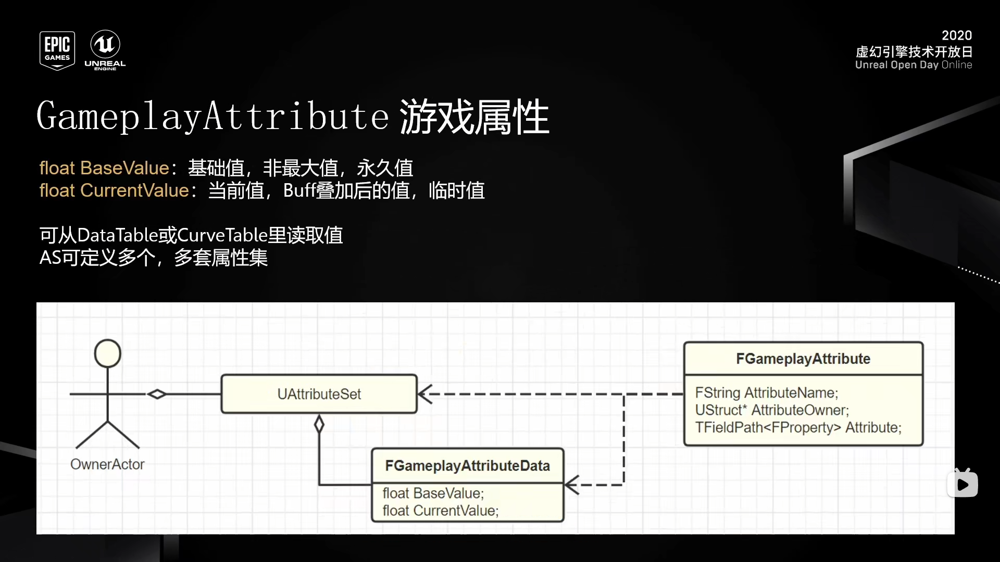

 

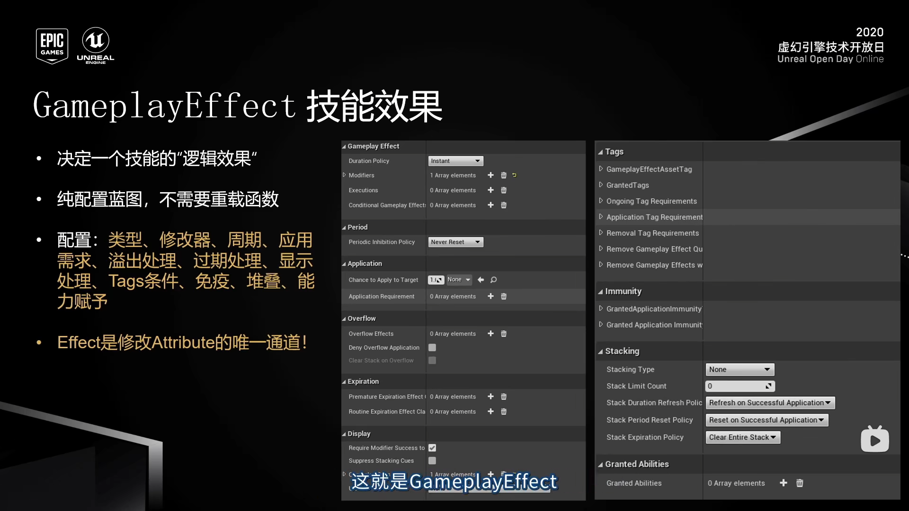

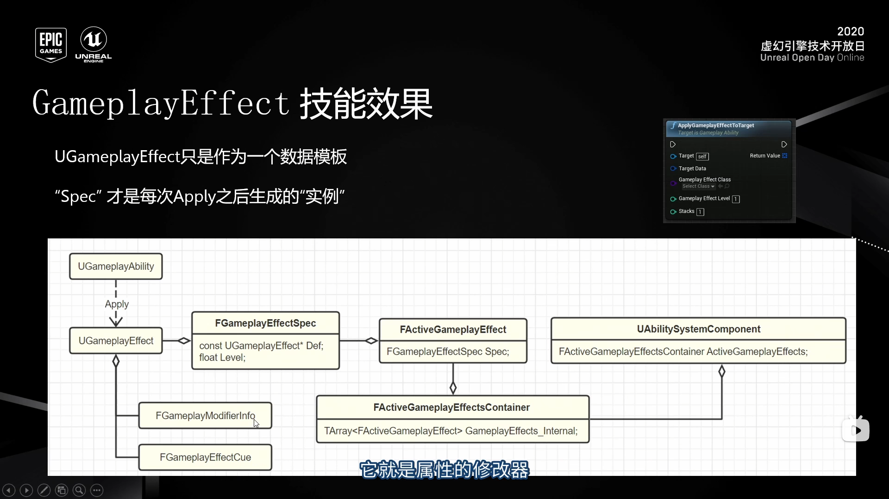

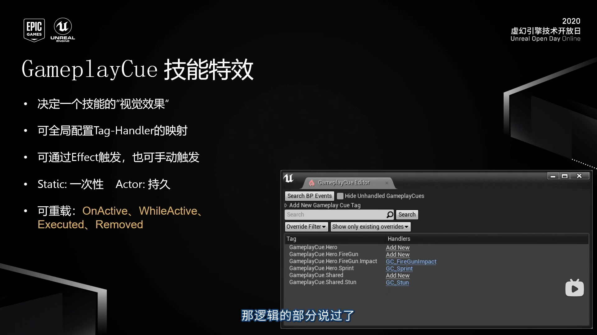 

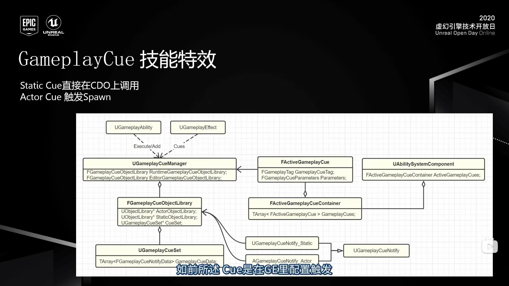 

通过GE或者GA调用Execute或Add触发，触发后的实例会保存到FGameplayCueObjectLibrary中，以便下次触发时节省时间

StatciCue不能保存动态的数据

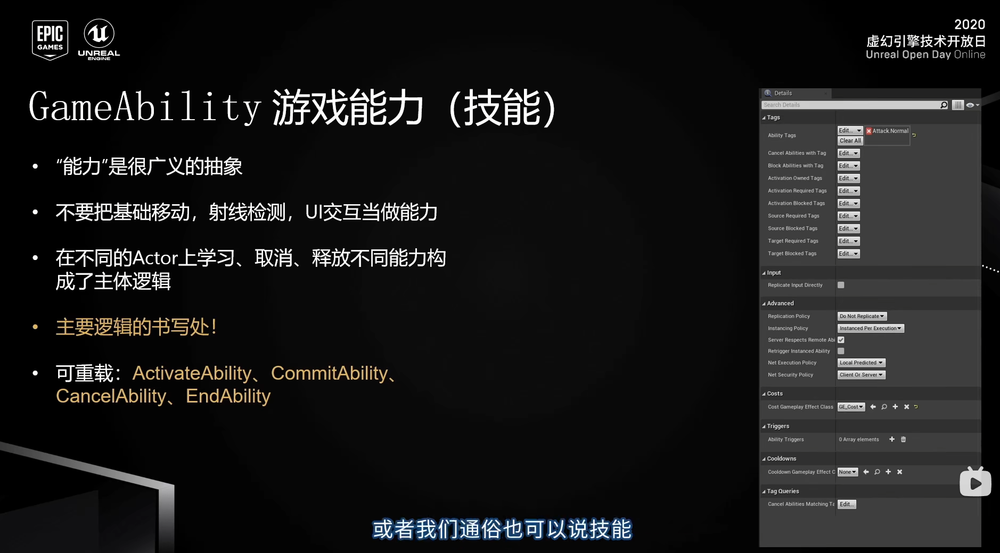

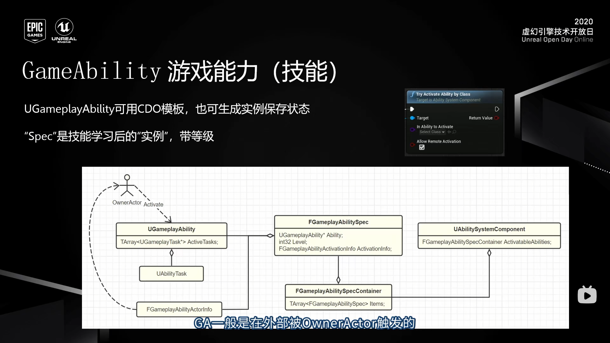

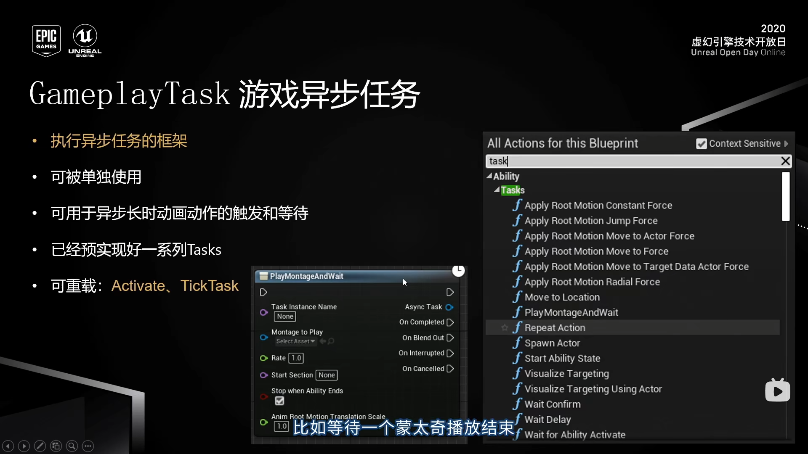 

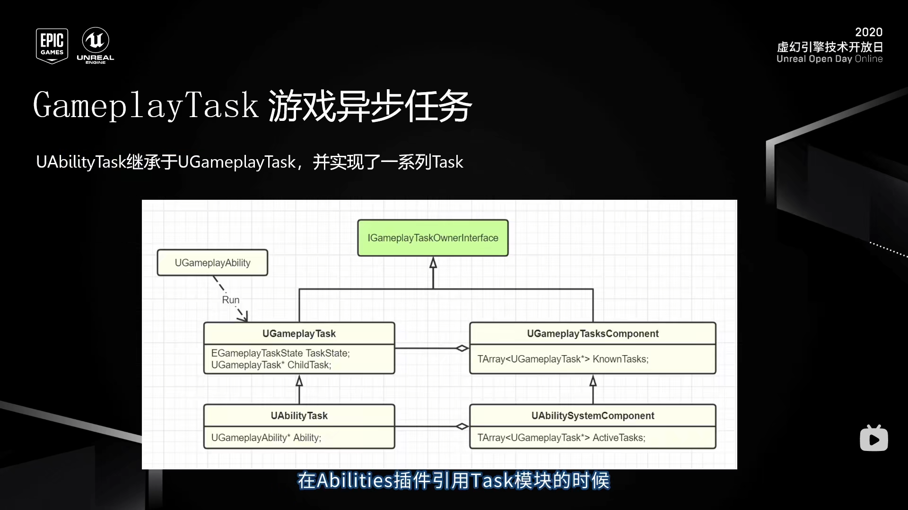

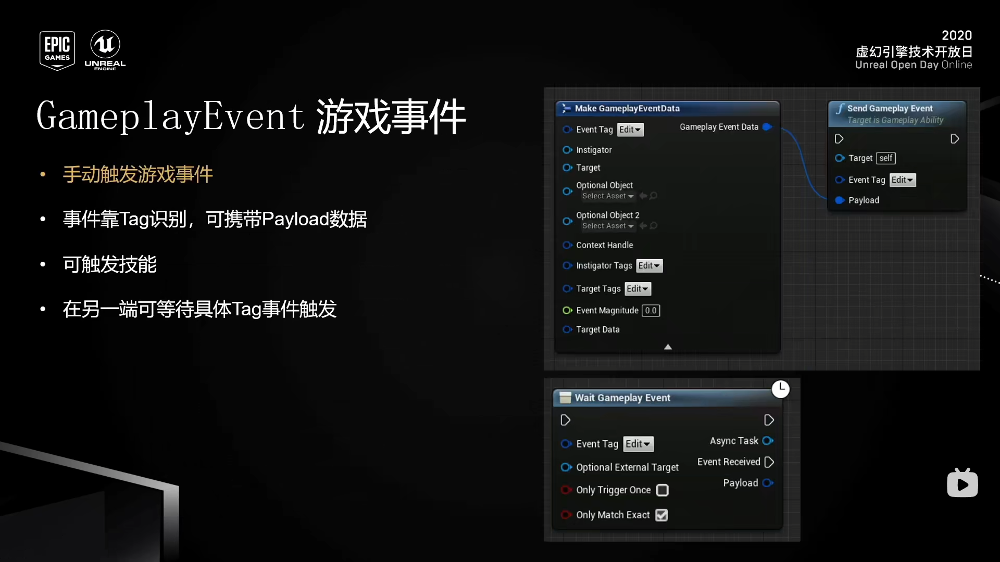

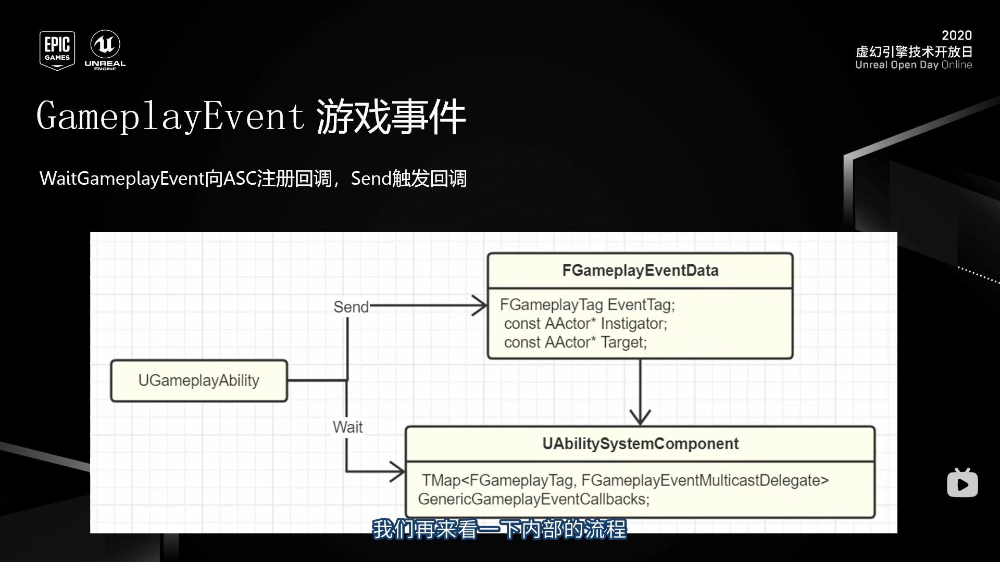

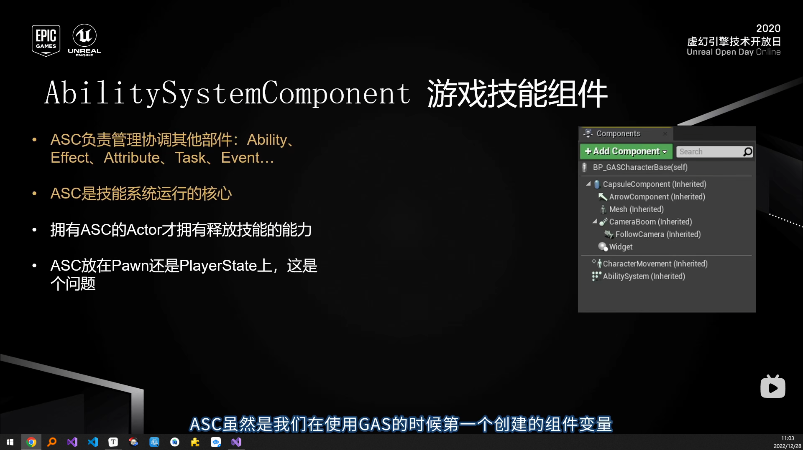

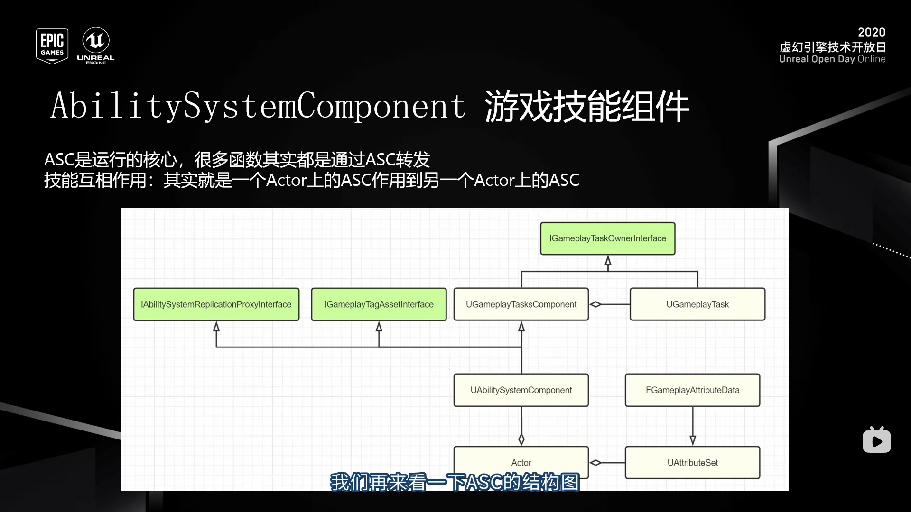

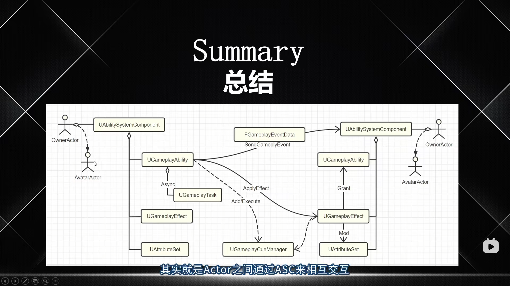