### Lyra初学者项目

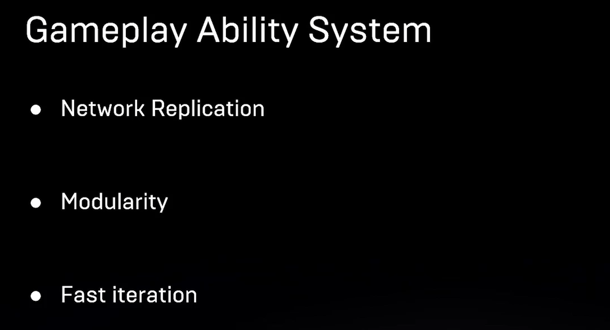

使用于DelicatedServer的项目，项目中有大量复杂的技能逻辑需求

- 提供了网络同步和预测功能
- 模块化(将游戏的功能拆分成不同的资产)
  - GA、GE、GC，并且提供了资产之间交互的能力
- 快速迭代
  - 蓝图

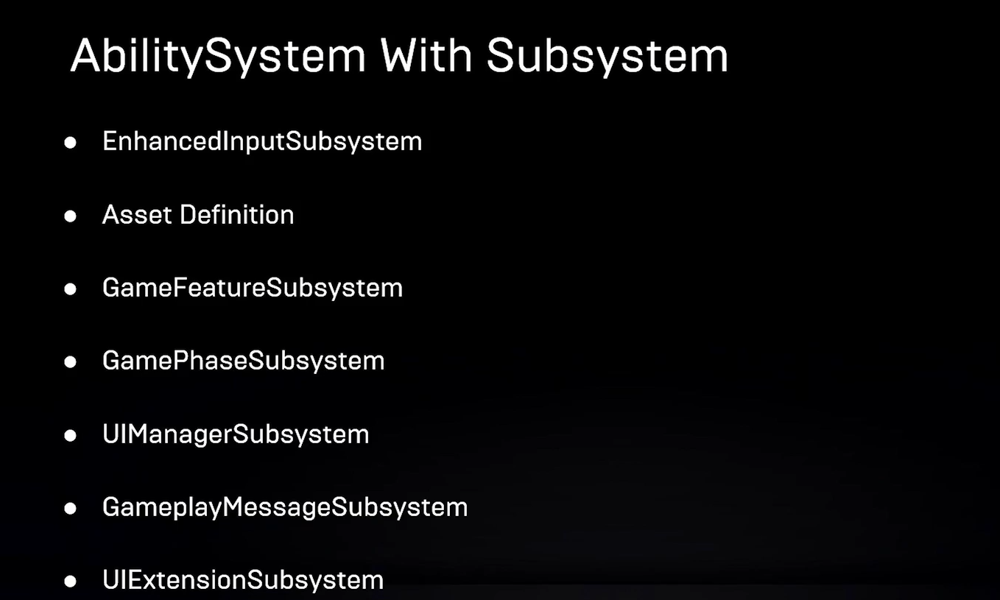

#### Lyra与InputSystem的交互

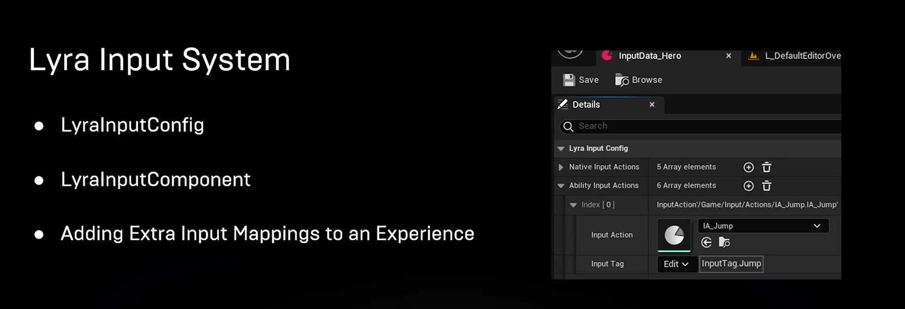

LyraInputConfig

- 资产文件
- 提供了输入Tag与IA的匹配
- 分为NativeInputAction和AbilityInputAction

LyraInputComponent

- 继承自EnhancedInputComponent
- 读取LyraInputConfig资产文件，绑定Tag与IA

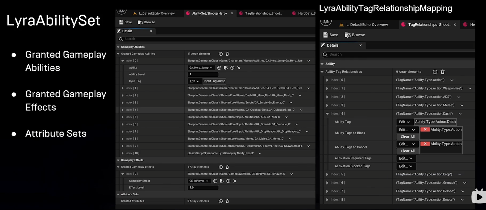

#### LyraAbilitySet

- 资产文件
- 提供了GA、GE和AttributeSet，用于初始化角色时使用

LyraAbilityTagRelationshipMapping

- 资产文件
- 提供GA和GE之间的互斥关系
- 优化工作流

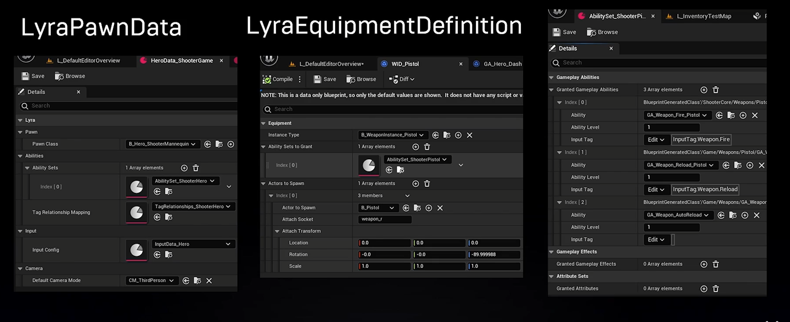

LyraPawnData

- 资产文件
- 记录了输入配置、初始技能集以及属性等资产文件的引用

LyraEquipmentDefinition

- 装备资产
- 赋予装备的属性和能力

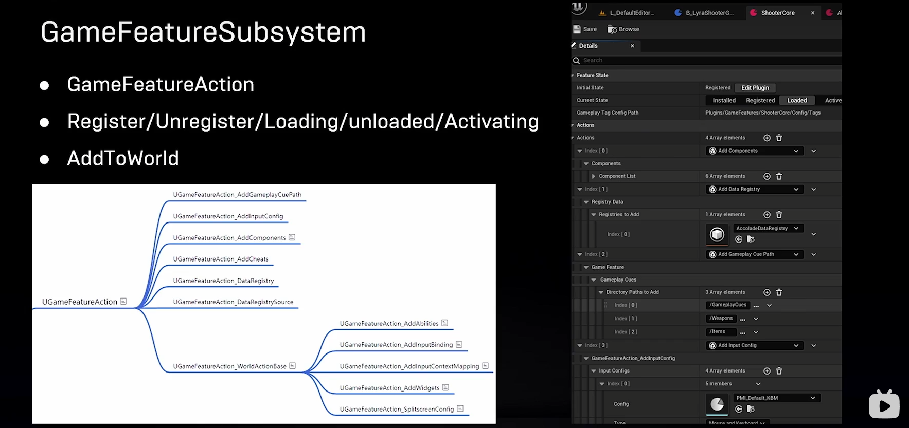

GameFeatureSubSystem

- 模块化动态加载资源
- 动态增删游戏功能

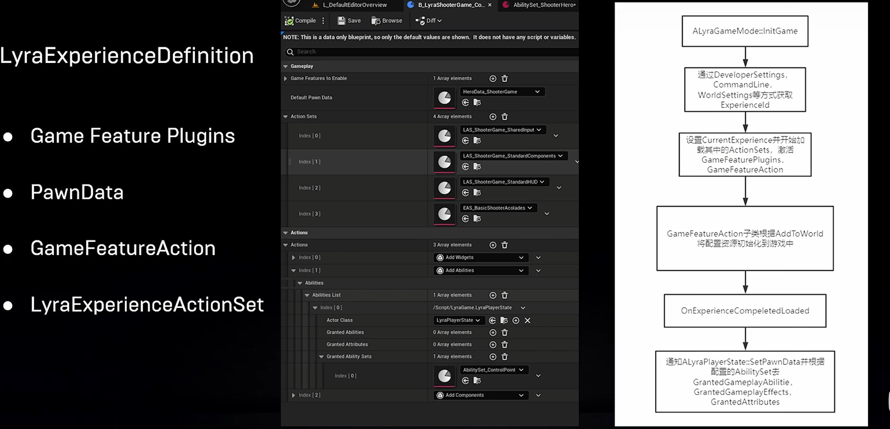

LyraExperienceDefinition

- 资产文件,记录了游戏的主要玩法
- 

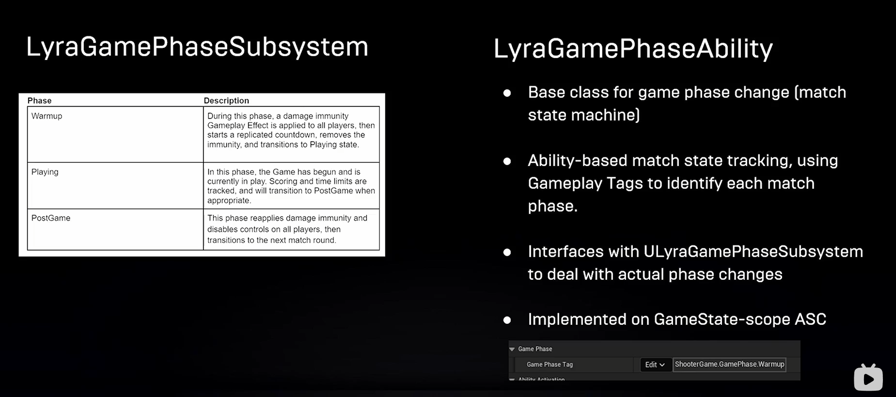

提供了游戏中分阶段的管理和切换功能，有服务端的GameState管理

LyraGamePhaseAbility主要提供了不同游戏阶段赋予玩家不同能力的功能

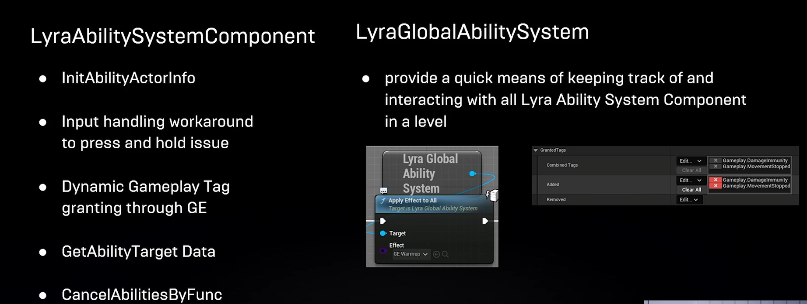

 每个角色的ASC初始化时都会注册到LyraGlobalAbilitySystem中，用于在不同游戏阶段为所有玩家增加GA和GE

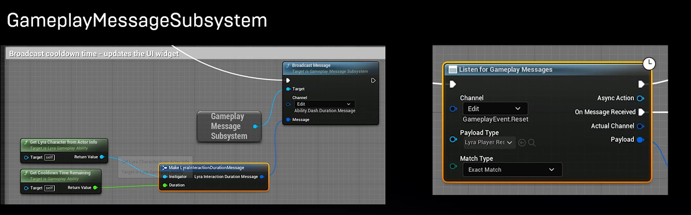

 蓝图间的通信

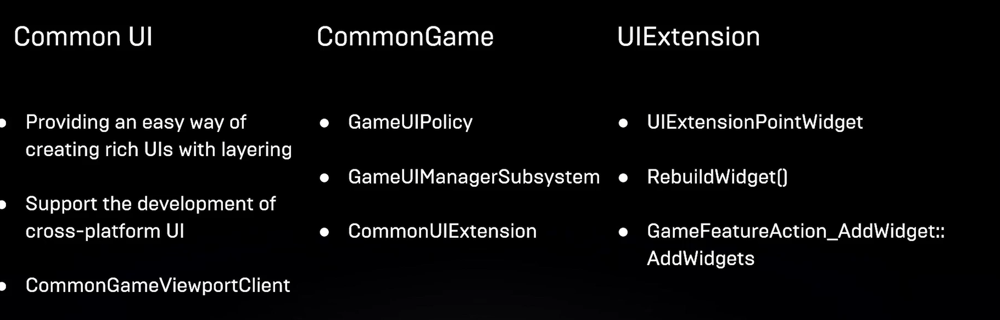

CommonUI支持跨平台的输入

原理：在CommonGameViewportClient中捕获InputRouting来确保只有特定的UI可以收到鼠标或者手柄的输入

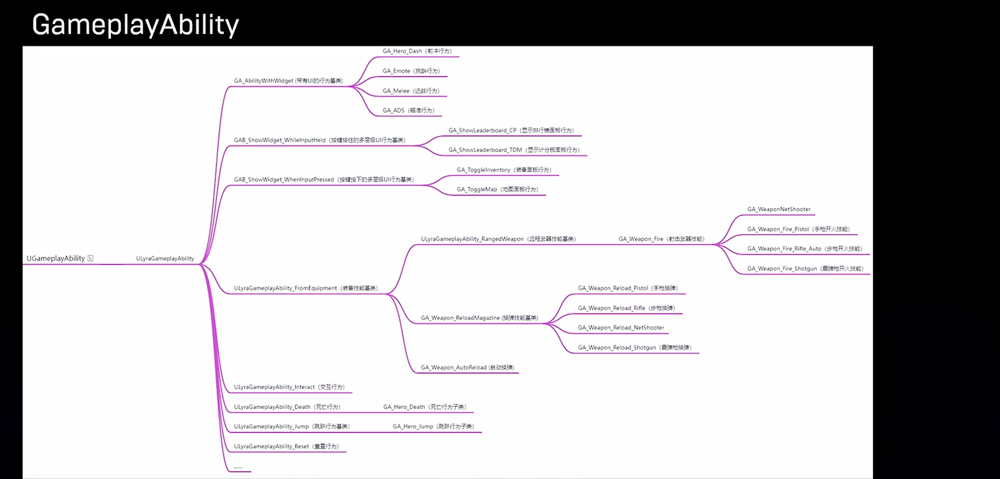

对GA的分类与扩展

 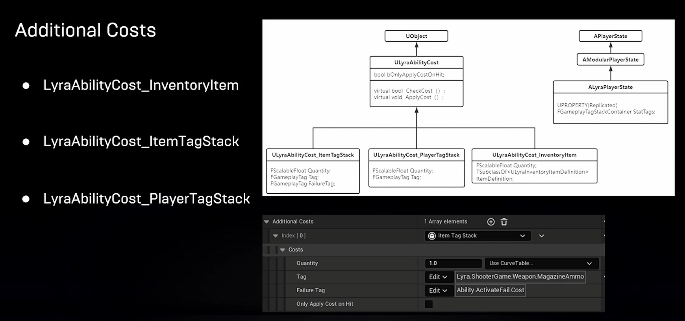

对于Cost和Cooldown，原生的GA属性中可以配置对应的GE，Lyra中GA单独配置了Addtional Costs用于道具或者子弹等物品的消耗，所以无需在GE中配置

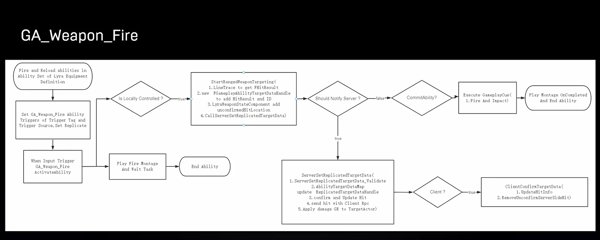

 

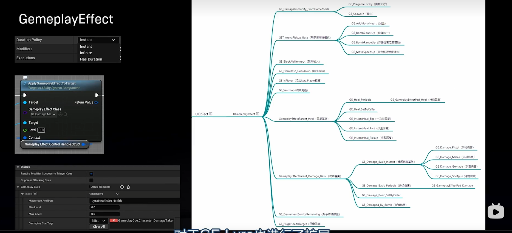

对GE的扩展

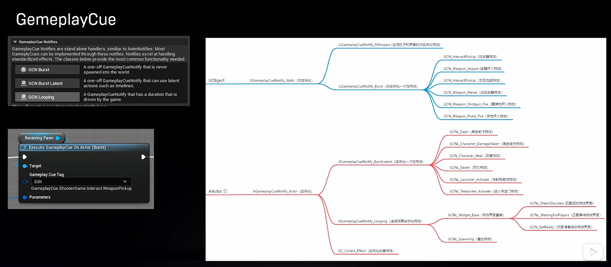

对GC的扩展

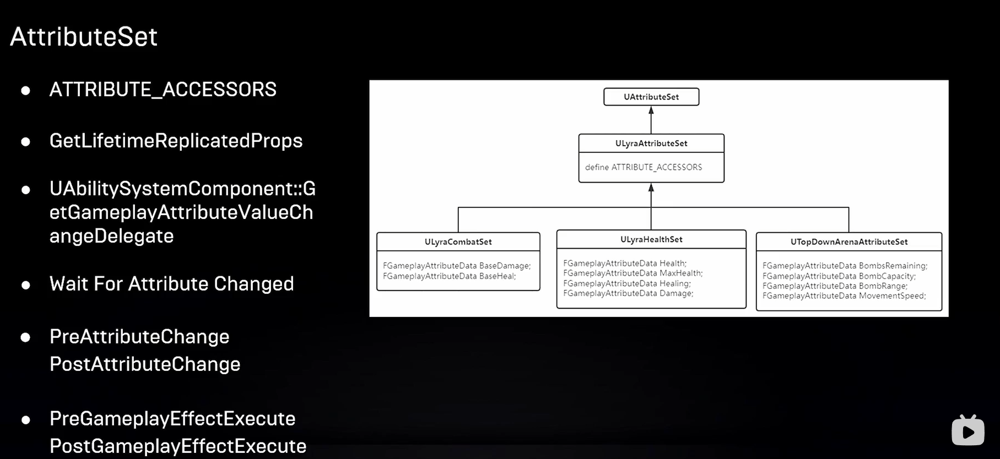

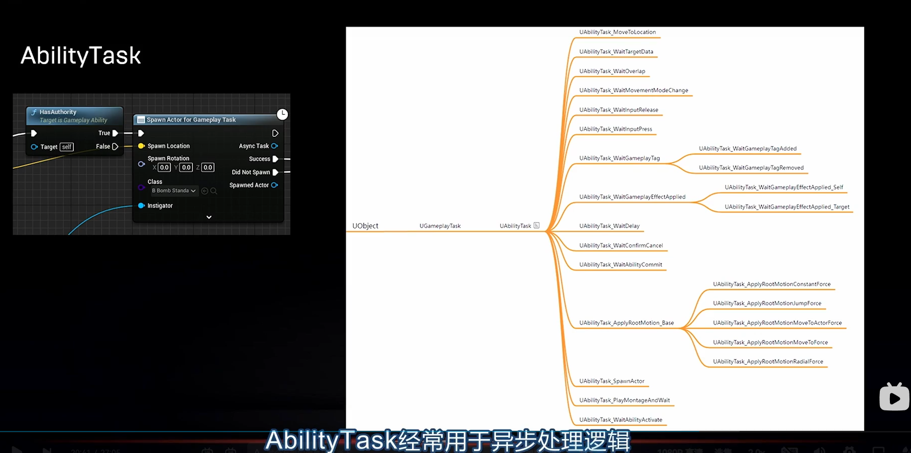

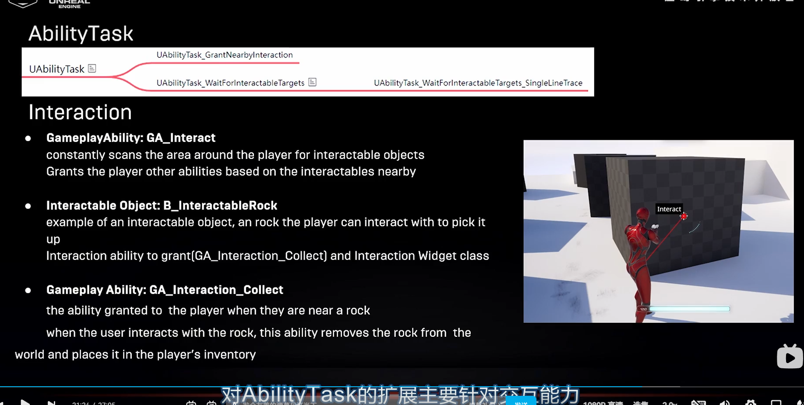

------

