# Multiplayer in Unreal Engine: How to Understand Network Replication

虚幻引擎最引人注目的功能之一是其内置的网络支持。借用美国汽车行业的一句话：对于虚幻，Multiplayer 是标准配置。在一个多人游戏中，您有同一个游戏的多个实例串联运行--这可能是同一台机器上的不同进程，或者是同一本地网络上的不同计算机，或者是不同大陆上的玩家通过互联网进行游戏。在任何情况下，这些不同的游戏实例必须相互交谈，并建立一个画面一致的共享世界。

在虚幻的网络模型中，玩家连接到一个服务器，而服务器维护世界的权威状态。当服务器上的东西发生变化时，这些变化将根据需要向下传播到客户端，这是一个叫做Replication过程的一部分。虚幻的Replication系统是一个一流的功能，它可以自然地与游戏代码集成。您可以很容易地开发一个多人游戏，而且您不需要管理客户端连接、打开套接字或发送数据包；您也不需要处理序列化、编码和字节顺序，或时间戳、重新排序和路由 - 您只需说 "我想要同步这个属性"，然后它就被同步了。Replication乍看起来相当复杂，但一旦你理解了基本概念，它就真的不难了。所以我想帮助您了解虚幻的Replication系统，它是如何工作的，以及如何使用它。

首先，让我们来谈谈net mode。net mode是World的一个属性，它可以是这四个值中的任何一个。你可以根据三个简单的问题来区分这些净模式。其一，游戏是否可玩？我们的GameInstance是否有一个LocalPlayer，我们是否处理该玩家的输入并将世界渲染到视口中？其次，我们是一个服务器吗？换句话说，我们的GameInstance是否拥有世界的经典、权威的副本，其中有一个GameMode Actor？ 最后，如果我们是服务器：我们是否对远程连接尝试开放？其他玩家可以加入并作为客户进行游戏吗？

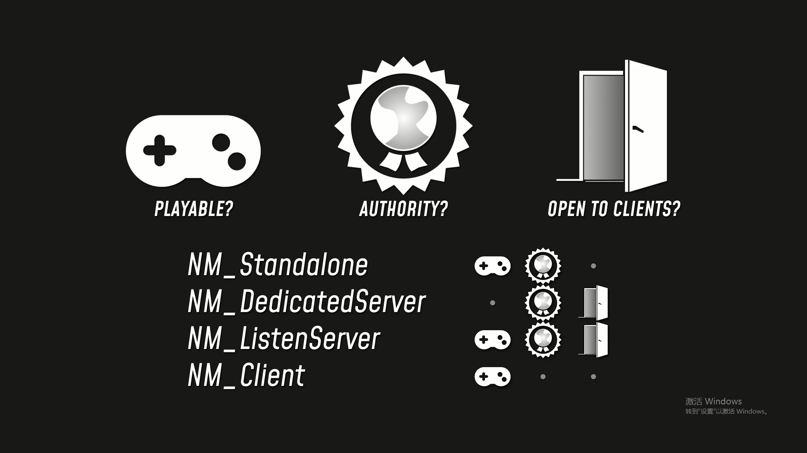正如我们在之前的视频中所看到的，当你启动你的游戏时，你会得到一个GameInstance对象，该对象与进程的生命周期相联系，然后游戏会浏览到一个URL--要么是一个服务器地址，要么是一个地图名称。这将导致游戏加载一张地图，从而得到一个世界，而世界的网络模式将根据你的游戏实例的启动方式而有所不同。如果你的游戏实例已经连接到一个远程服务器，那么它的世界将具有Client net mode。游戏对本地玩家来说是可玩的，但它是在服务器的要求下更新它的世界。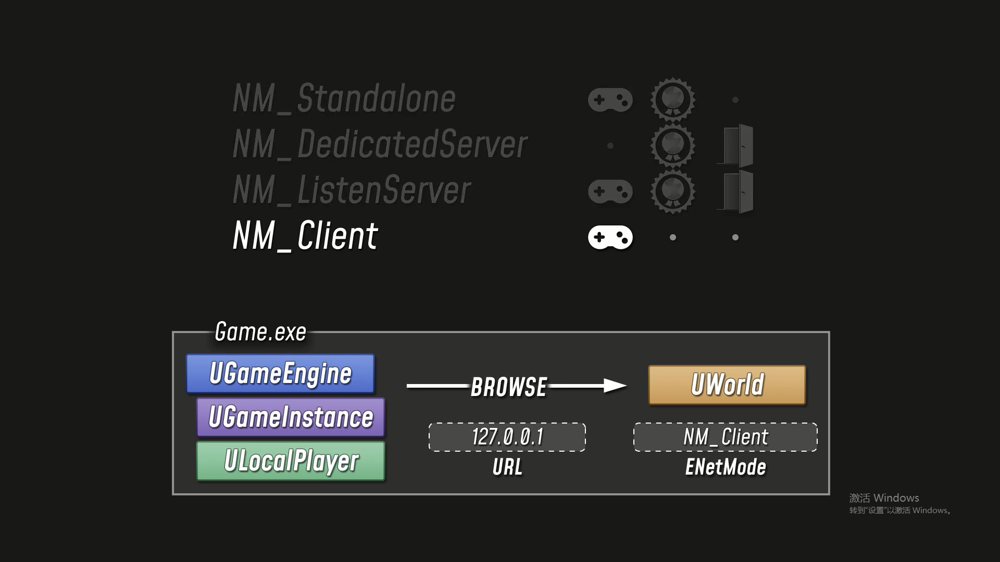如果你的游戏实例在本地加载了一个地图，那么世界的网络模式将是Standalone。实际上，你的单个游戏实例既是服务器又是客户端，但由于它是在单人游戏配置中运行的，它不对客户端开放连接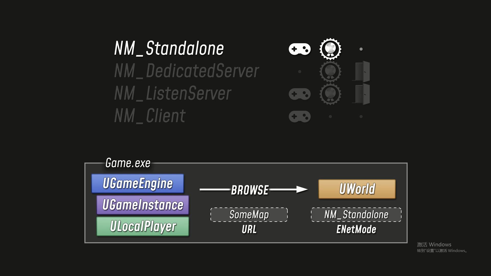。如果你在本地加载一个地图，但添加了监听选项，那么你将作为监听服务器运行。这基本上和单机是一样的，但是游戏的其他实例可以作为客户端连接。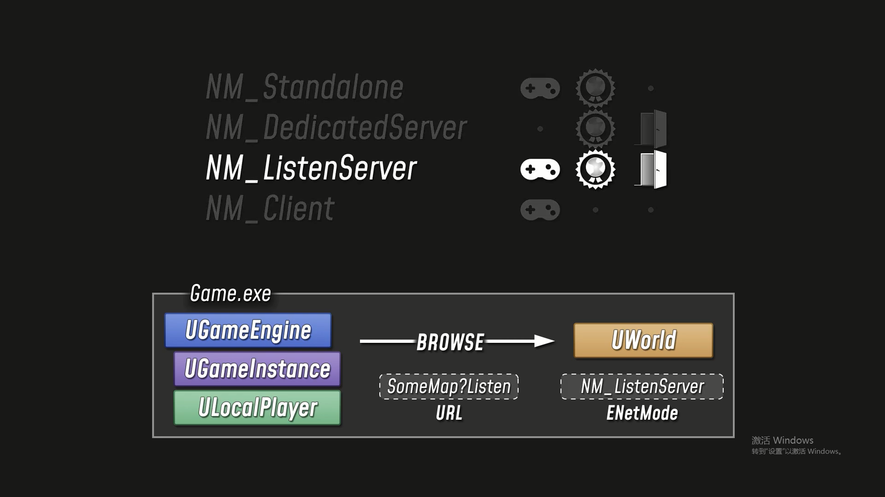最后，你可以运行一个专用服务器，这是一个没有LocalPlayer和视口的游戏实例：它只是一个纯服务器的控制台应用程序，玩家可以作为客户端连接到它。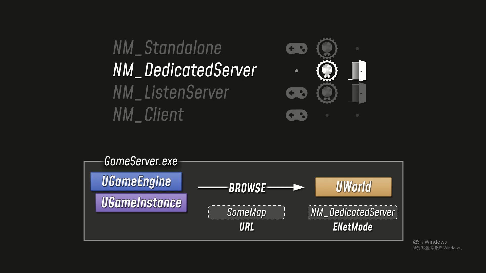
因此，一个虚幻游戏可以在三种不同的网络情况下运行。对于一个单人游戏，您有一个GameInstance，它的世界是以独立模式运行的。对于一个多人游戏，您有多个进程，每个进程都有自己的GameInstance和自己的世界副本。其中一个进程是ListenServer或DedicatedServer，其余的是Client。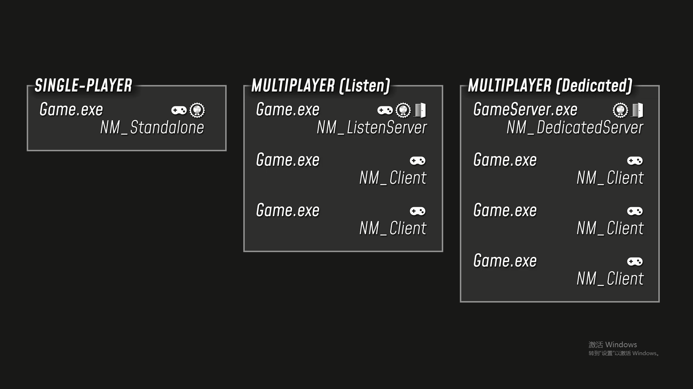

因此，这就是我们如何让自己首先进入一个多人游戏。
一旦我们运行了一个多人游戏，虚幻的Replication系统就会在幕后工作，以确保所有这些不同的游戏实例都是同步的：它们都建立了自己的共享世界的画面，而Replication系统则确保它们都同意在该世界中发生的事情。为了实现这一点，Replication系统依赖于三个重要的类。NetDriver, NetConnection 和 Channel。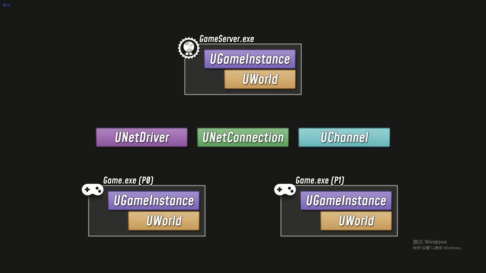
在这个例子中，我们有一个专用服务器和两个客户端。这三个进程中的每一个都有自己的引擎对象。当我们启动服务器时，它创建一个NetDriver，并开始监听来自远程进程的消息。当我们启动一个客户端时，它创建了自己的NetDriver，向服务器发送连接请求。一旦服务器和客户端的NetDriver取得联系，就会在每个NetDriver中建立一个NetConnection。服务器对每个连接的远程播放器有一个NetConnection。每个客户端都有一个NetConnection，代表它与服务器的连接。在每个NetConnection中，有许多不同的Channels。一般来说，一个NetConnection会有一个ControlChannel和一个VoiceChannel，然后每个连接会有一系列的ActorChannels(连接上每个Actor都有一个Channel)。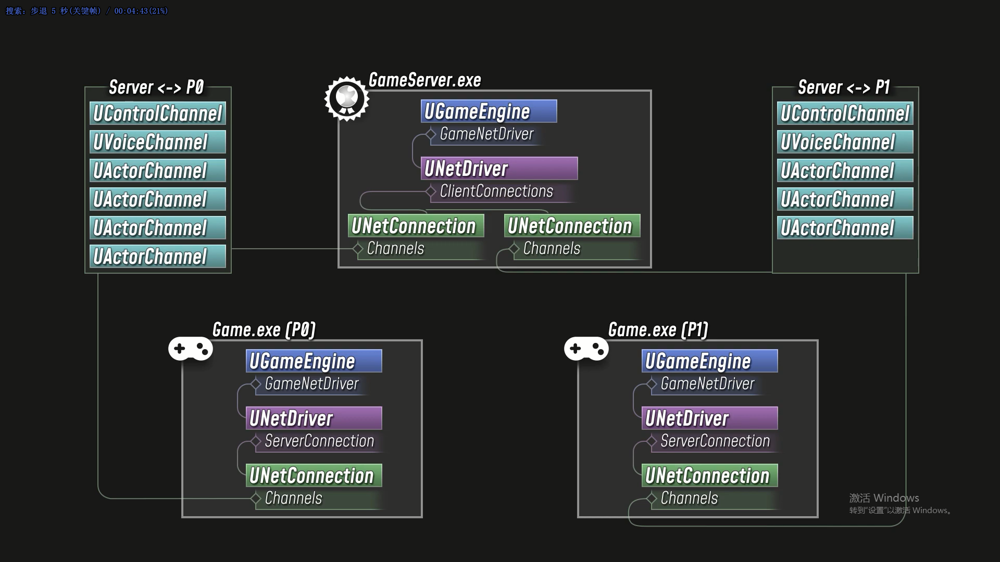
这说明了复制系统的一个关键事实：即复制发生在Actors的层面上。如果你需要一个Actor在网络上保持同步，那么你就把这个Actor配置为有资格进行复制。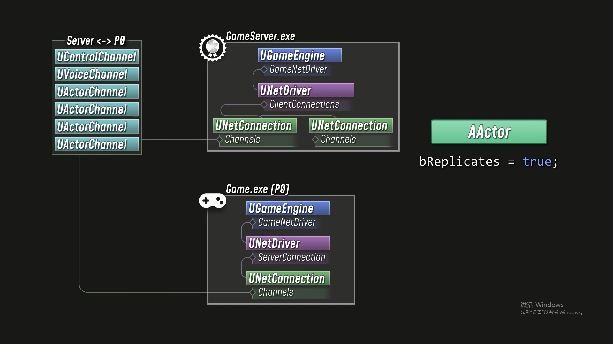当一个有资格被复制的Actor被认为与某个特定的玩家相关时，服务器将在该玩家的NetConnection中打开一个ActorChannel，服务器和客户端将使用该通道来交换关于该Actor的信息。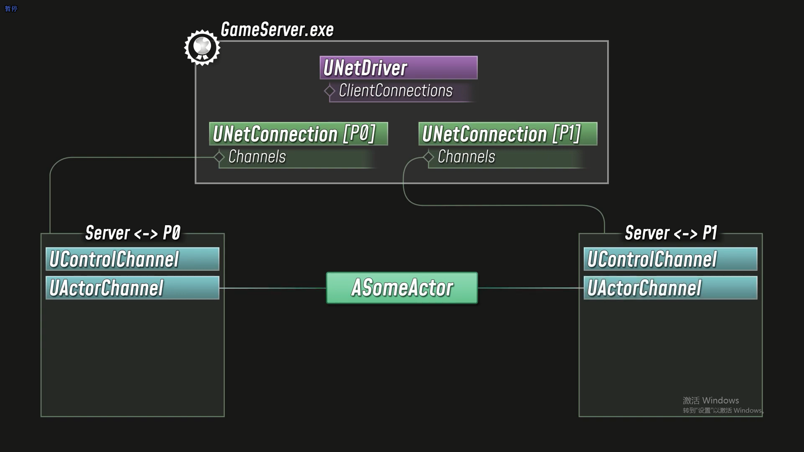
如果一个Actor被复制到客户端，有三件重要的事情会因此而发生。首先，Actor的生命周期在服务器和客户端之间保持同步。如果服务器产生了一个复制的Actor，客户端将被通知，以便它可以产生自己的副本。如果Actor在服务器上被销毁，它也会自动在客户端被销毁。 然后是复制的属性。如果一个Actor有一个被标记为复制的属性，那么当这个属性在服务器上被改变时，新的值将被传播到客户端。最后，还有RPCs：远程过程调用。如果你指定一个函数为多播RPC，那么当你在服务器上调用该函数时，服务器将向该Actor当前被复制的每个客户端发送一条消息，表明客户端应该在其Actor的副本上调用该函数。你也可以声明客户端和服务器RPC，它让你在服务器和拥有该Actor的单个客户端之间来回发送消息。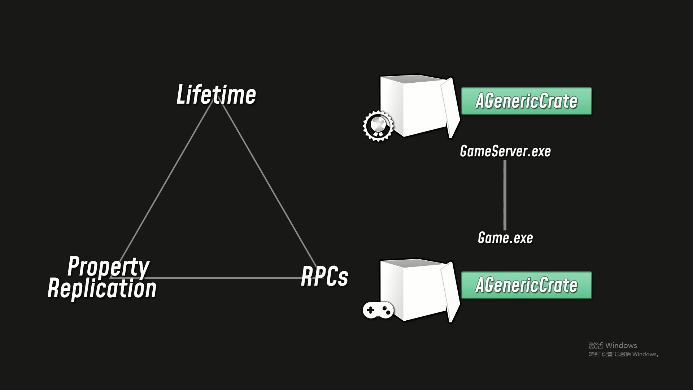

Ownership 是Actor复制的另一个重要概念。每个Actor都可以有另一个Actor被指定为其所有者。通常情况下，你在生成时设置Owner，但你也可以在运行时调用SetOwner。当涉及到所有权时，PlayerController类具有特殊的重要性。基本上，我们的每个NetConnections都代表一个玩家，一旦玩家完全登录到游戏中，它就有一个与之相关的PlayerControllerActor。从服务器的角度来看，该连接拥有该PlayerController，并延伸到该连接拥有任何可以追溯到PlayerController的Actor。PlayerController自动拥有他们所拥有的Pawn。因此，我们假设每个PlayerController都有一个Pawn，而每个Pawn都产生了一个它所拥有的WeaponActor。服务器可以查看这些武器Actor中的任何一个，沿着它的所有者引用链回到PlayerController，并找出该武器Actor属于一个特定的客户端连接。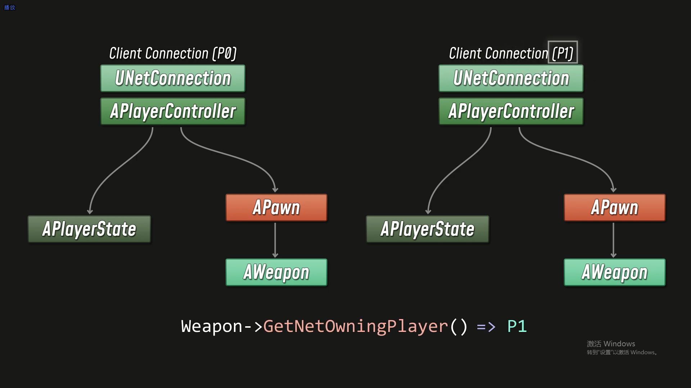

所以，让我们更仔细地看看你如何配置一个Actor来进行复制。为了使一个Actor能够被考虑进行复制，它需要把它的bReplicates标志设置为真。通常情况下，你只需要在构造函数中设置这个值，或者对于蓝图来说，你可以在类的默认值中勾选 "复制 "的选项。但你也可以在运行时打开或关闭复制功能。因此，长话短说，如果一个Actor启用了bReplicates标志，那么它就有资格进行复制：服务器可以在任何给定的NetConnection中打开一个ActorChannel，以便将该Actor复制到相应的客户端。

一个Actor的相关度决定了哪些连接会发生，以及在什么时候发生。当一个Actor有资格被复制时，每隔一段时间，服务器的网络驱动就会根据每个客户端的连接检查该Actor，以确定它是否与该客户端相关。有些Actor是bAlwaysRelevant：这意味着只要它们有资格被复制，服务器就会在任何时候向所有客户端复制它们。例如，GameState和PlayerStateActor总是相关的。所有权在相关性中起着重要作用。一个由特定玩家拥有（或唆使）的Actor将总是被认为与相应的客户端有关。一些Actor，比如PlayerControllers，被配置为只与它们的所有者相关，所以它们永远不会复制到非所有者的客户端。你也可以配置一个Actor，让它从它的所有者那里继承相关性。如果这些特殊的标志都没有被设置，而且相关的客户端并不拥有该Actor。那么默认的行为是这样的：如果该Actor是隐藏的，并且它的根组件已经禁用了碰撞，那么它将不会被认为是相关的。否则，相关度是基于与玩家的距离，该距离对应于客户端的连接。如果从Actor到玩家的距离的平方小于NetCullDistanceSquared，那么该Actor就与该玩家相关。这些规则不是硬编码的：你可以覆盖任何Actor类的IsNetRelevantFor函数来提供你自己的自定义规则。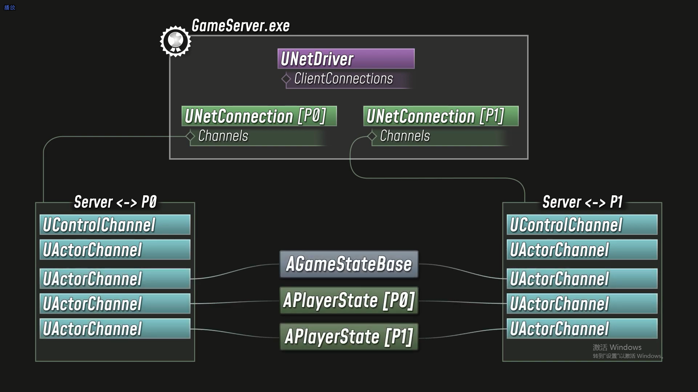

一旦一个Actor被复制，它的更新频率和优先级将决定服务器向与该Actor相关的客户端发送更新的频率。设置NetUpdateFrequency将决定服务器每秒检查Actor多少次，如果有什么变化，可能会向客户端发送新的数据。请记住，现实世界的网络有极其多变的延迟，带宽很快就会成为一个限制因素，所以即使你的Actor被设置为每秒更新60次，你也不会在另一端看到完全流畅的结果。

服务器的NetDriver采用了一些简单的负载平衡，以减轻带宽的饱和度。在任何时候，NetDriver的带宽都是有限的，所以它根据优先级对相关Actor进行排序，然后运行网络更新，直到用完它的可用带宽。离玩家较近的Actor会有较高的优先权，有一段时间没有更新的Actor也会有较高的优先权，所以每个Actor最终都会排在优先权列表的前面。设置一个Actor的NetPriority属性将对该权重应用一个额外的比例，所以，例如，你可以规定一个重要的Actor应该比其他情况下多更新5次。

这种定期的、带宽有限的网络更新过程主要适用于复制的属性。如果你有一个高优先级的消息，你想立即通过网络发送，那就是RPC的作用。任何UFUNCTION都可以被指定为Client、Server或NetMulticast，使其成为一个RPC。
如果你从服务器上调用一个Client RPC，那么该函数的实现将在拥有的客户端上运行。
如果你从拥有的客户端调用一个Server RPC，那么该函数的实现将在服务器上运行。
如果你从服务器上调用一个NetMulticast RPC，那么函数的实现将在任何地方运行：在服务器上，然后在所有客户端上。
与服务器和客户端RPC不同，相关性是NetMulticast RPC的一个因素，因为非拥有的客户端可能没有一个开放的Actor通道：在这种情况下，客户端根本不会收到RPC。这意味着你不应该依靠多播RPC来向客户复制持久的状态变化。

RPCs可以被声明为Reliable 或 Unreliable。 Unreliable的RPCs在带宽饱和的情况下会被丢弃，它们不能保证到达，因此它们也不能保证按顺序到达。Reliable 的RPCs保证到达，在一个Actor内，Reliable 的RPCs保证按照它们被调用的顺序到达。如果你的函数调用对游戏玩法至关重要，那么这种可靠性是必要的，但如果过度使用，就会加剧带宽饱和度并且在数据包丢失的情况下会导致瓶颈。
在C++中，你的函数的实际主体需要用 "_Implementation"的后缀来定义。这是在远程进程上实际运行的函数，而你在本地调用的函数是一个自动生成的thunk，它通过网络发送相应的消息。服务器RPC也可以被声明为"WithValidation"，在这种情况下，你需要实现一个相应的 "__Validate"函数，该函数接受所有相同的参数，并返回一个布尔值，表明这些值是否值得信任。这是一种作弊检测手段，适用于服务器以影响游戏性的方式使用从客户端发送的数据的情况。只要记住，如果服务器RPC验证失败，发送该RPC的客户端将被踢出游戏。所以RPC是立即发送的，而且它们可以是可靠的--这使得它们在某些复制的属性可以相对有限的情况下很有用。

服务器RPC是通过自有连接从客户端获取数据到服务器的唯一途径，所以它们有自己的位置。但总的来说，RPC通常被保留给高优先级、时间紧迫的网络代码。例如，引擎的Actor运动系统大量使用RPC来来回发送位置更新，因为运动预测和校正需要最新的信息，而且延迟要尽可能小。
对于其他一切，只要你能做到，你就应该依靠复制的属性。
属性复制是虚幻的复制系统的主力军，而且我们已经讨论过的负载平衡和优先级功能使它的可扩展性大大增强。而RPC是即时的，属性复制的关键词是最终。如果你在服务器上改变一个复制的属性，你可以指望所有的客户端最终与服务器同步。如果一个Actor在服务器上发生了变化，而玩家离得太远，与之无关，那么这个变化仍然会同步，最终，一旦该Actor再次与该客户端相关，它就会收到更新的属性值。
属性复制也尊重更新频率和带宽限制，无论如何。你可以在服务器上每一帧都改变一个复制的属性，而客户端将在它恰好被更新时得到最新的值。服务器没有义务去发送每一个中间值。
要为一个属性启用复制，你可以添加Replicated指定器。在C++中，您需要采取额外的步骤，在您的Actor的.cpp文件中定义一个GetLifetimeReplicatedProps函数：您也需要在那里包含UnrealNetwork.h。这个函数是您指定哪些属性应该被复制，以及在什么条件下复制的地方。在最简单的情况下，您只是想让一个属性在任何时候都被复制到所有的客户端，您可以通过在DOREPLIFETIME宏中命名该属性来实现。但你也可以指定复制的条件。例如，你可能只需要把一个属性复制给拥有的客户，或者你可能只需要让非拥有的客户得到更新。或者你可能有一个属性在生成时被初始化，但在运行时从未改变。
如果你需要在复制的属性被更新时运行一些代码，那么你可以声明一个RepNotify函数并使用ReplicatedUsing指定器。任何时候，由于复制更新导致的值变化，指定的通知函数将在客户端被调用。
注意，在Blueprints中，在服务器上改变一个属性的值将自动在服务器上调用相关的RepNotify函数。在C++中不是这样的--如果你想让你的RepNotify逻辑在服务器以及客户端上运行，那么你要在更新属性值后手动调用RepNotify函数。

还有一个最后的概念，我们应该看一下：那就是Actor的network role。一个Actor可以有几个不同的role，但在大多数情况下，你只需要关心一个简单得多的问题：我对这个Actor是否有权限？ 每当你在Actor类中运行一些代码时，你都可以检查权限：如果你有权限，你对更新Actor的状态有最终决定权，这是因为游戏是在单人模式下运行的，或者你的代码是由服务器执行的，或者是因为该Actor只存在于客户端。如果你没有权限，你的代码是在客户端运行的，而Actor是从服务器上复制的。在这种情况下，客户端的Actor副本是服务器上权威版本的代理。
如果一个Actor没有权威，那么它的Role几乎总是SimulatedProxy。通常情况下，AutonomousProxy只有在我们谈论玩家的时候才会出现。一个PlayerController被复制到拥有的客户端是一个AutonomousProxy，而相关的Pawn是该客户端的一个AutonomousProxy。对于所有其他的客户端，Pawn被复制成一个SimulatedProxy。Autonomous 指的是客户端直接控制Actor的运动和行为，尽管它没有完全的权限。但除非你处理的是玩家Actor，否则通常只是一个二元问题：我是否有权限？如果你处理的是与玩家相关的代码，那么另一个重要的问题是玩家是否被locally controlled.。如果一个Pawn是本地控制的，那么这个Pawn就对应于你的代码所运行的GameInstance。如果不是，那就是一个远程客户端的玩家。

所以，一旦你脑子里有了所有这些概念，关于支持多人游戏最重要的事情就是它如何增加了你思考代码的复杂性。你可能认为程序员把所有的时间都花在狂打字上，就像电影里那样。但是作为一个程序员，你的很多时间都是在推理你的代码是如何执行的。而且，不管你有多聪明--你的大脑一次只能容纳几条信息，所以如果你不得不同时处理太多的事情，就很难写出好的、可维护的代码。

**很多技能和经验只是归结为知道如何以一种相对简单的推理形式设计和实现复杂的功能。**

支持多人游戏增加了一层你必须管理的复杂性。如果你有一个复制的Actor，那么你不仅要考虑这个类负责什么，它的每个成员函数做什么，你还必须考虑这些代码在哪里被执行，以及数据在不同时间如何在网络上流动。这种额外的复杂性一开始会让人感觉难以承受，但随着经验的积累，会越来越容易管理。因此，作为总结，这里有几个需要记住的提示。

首先，重要的是要记住，即使一个Actor被复制了，也不是每个部分都需要关注网络。如果你的Actor有一个静态的网格组件和一个动态的材质实例，那么这两个对象都不是网络感知的。你可以编写初始化和修改这些对象的函数，而不需要考虑网络问题。这些函数只是在每个游戏实例上独立运行--而你只需要把复制带入方程，以确保它们在游戏的所有实例中以一致的方式被调用。您的大部分游戏代码最终都将建立在虚幻游戏框架的基础上，该框架是为多人游戏设计的。当您重写这些类的成员函数来添加您自己的功能时，您要注意一个函数是被设计成只在服务器上运行、只在客户端上运行，还是在任何地方运行。使用断言可以使你的代码明显地看出它被设计为运行在什么地方，而且它对建立辅助函数的命名惯例也很有用，例如对那些只有在授权下才能调用的函数使用 "Auth "这样的前缀。

你可以把Actor的功能看作是一种因果流程图：在一端，你有启动事情的事件。在另一端，你有需要作为结果发生的状态变化。如果你有一些进程在网络上的不同地方开始和结束，这时你就需要使用某种形式的复制。如果进程起源于客户端，结束于服务器，那么你通常使用服务器RPC。如果一个进程起源于服务器并最终在客户端产生影响，那么你需要考虑在哪里将数据复制到客户端。你的代码需要留在服务器上，只要它是在更新权威的游戏状态，或者如果玩家通过查看或修改客户端的数据可以获得不公平的优势。但在那之后，你通常希望复制重建最终结果所需的最小数据集，并让客户端独立处理其余过程。

当你的代码需要支持网络时，它通常符合少数几个简单的情况之一。在你开始迷失在低级别的细节中之前，问问自己，你所处理的功能是否符合这四种情况。如果有些事情只需要在多人游戏的服务器上发生，也需要在单人游戏中发生，那么就把它放在HasAuthority检查后面。如果某件事只在作为远程客户端运行时需要，因此也不应该在单人游戏中运行，那么就检查你是否有权限。有些情况下，你想特别排除专用服务器：在这些情况下，检查IsRunningDedicatedServer。
还有，如果你有纯粹的客户端功能，它通常与一个Pawn或一个Controller绑定，所以你可以检查玩家是否locally controlled。

如果你正在寻找关于网络功能的更多信息，官方文档是一个很好的资源，如果你想要更多的技术细节，在引擎源码中有一些好的地方，你可以去探究一下。
特别是，NetDriver.h有一些关于复制系统如何工作的好信息，你可以在NetworkDriver.cpp中看到它的实现，以及一些有用的控制台变量。NetDriver只是引擎级的基类：用于游戏网络驱动的实际实现被称为IpNetDriver，它和IpConnection一起在OnlineSubsystemUtils插件中实现。如果你想搞清楚这个视频中的简单例子项目，你可以从GitHub上克隆它并查看修改历史，它的注释相当详尽。除此之外，如果你想看一个更大、更正式的多人游戏的例子，我建议你去看看ShooterGame的例子项目。
