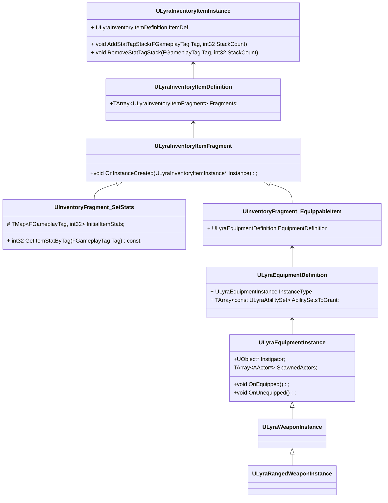
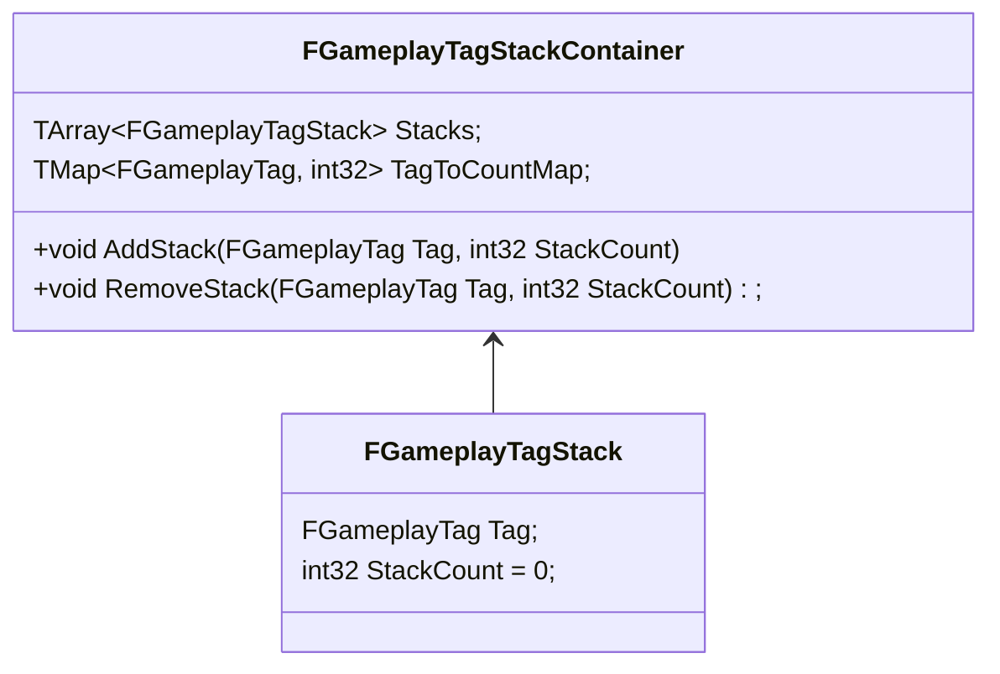

## 类图

```mermaid
classDiagram
class ULyraInventoryItemDefinition{
	+TArray~ULyraInventoryItemFragment~ Fragments;
}

class ULyraInventoryItemFragment{
	+void OnInstanceCreated(ULyraInventoryItemInstance* Instance);
}

class UInventoryFragment_SetStats{
	# TMap~FGameplayTag, int32~ InitialItemStats;
	+ int32 GetItemStatByTag(FGameplayTag Tag) const;
}

class UInventoryFragment_EquippableItem{
	+ ULyraEquipmentDefinition EquipmentDefinition
}

ULyraInventoryItemFragment<|--UInventoryFragment_SetStats
ULyraInventoryItemFragment<|--UInventoryFragment_EquippableItem
ULyraInventoryItemDefinition<--ULyraInventoryItemFragment

class ULyraInventoryItemInstance{
	+ void AddStatTagStack(FGameplayTag Tag, int32 StackCount)
	+ void RemoveStatTagStack(FGameplayTag Tag, int32 StackCount)
	+ ULyraInventoryItemDefinition ItemDef
}

ULyraInventoryItemInstance<--ULyraInventoryItemDefinition

class ULyraEquipmentInstance{
	+UObject* Instigator;
	TArray~AActor*~ SpawnedActors;
	+void OnEquipped();
	+void OnUnequipped();
}

class ULyraEquipmentDefinition{
	+ ULyraEquipmentInstance InstanceType
	+ TArray~const ULyraAbilitySet~ AbilitySetsToGrant;
}

class ULyraWeaponInstance
class ULyraRangedWeaponInstance

ULyraEquipmentDefinition<--ULyraEquipmentInstance
ULyraEquipmentInstance<|--ULyraWeaponInstance
ULyraWeaponInstance<|--ULyraRangedWeaponInstance

UInventoryFragment_EquippableItem<--ULyraEquipmentDefinition
```

#### UInventoryFragment_SetStats

#### UInventoryFragment_EquippableItem

```mermaid
classDiagram
class FGameplayTagStack{
	FGameplayTag Tag;
	int32 StackCount = 0;
}
class FGameplayTagStackContainer{
	TArray~FGameplayTagStack~ Stacks;
	TMap~FGameplayTag, int32~ TagToCountMap;
	+void AddStack(FGameplayTag Tag, int32 StackCount)
	+void RemoveStack(FGameplayTag Tag, int32 StackCount);
}
FGameplayTagStackContainer<--FGameplayTagStack

```

------

------

